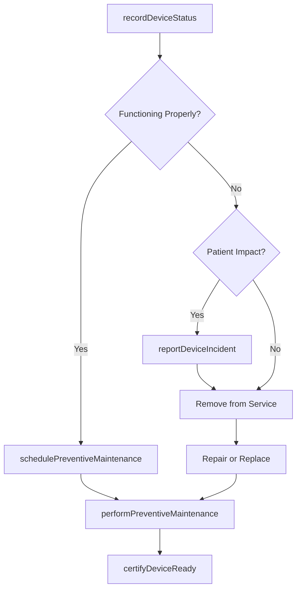
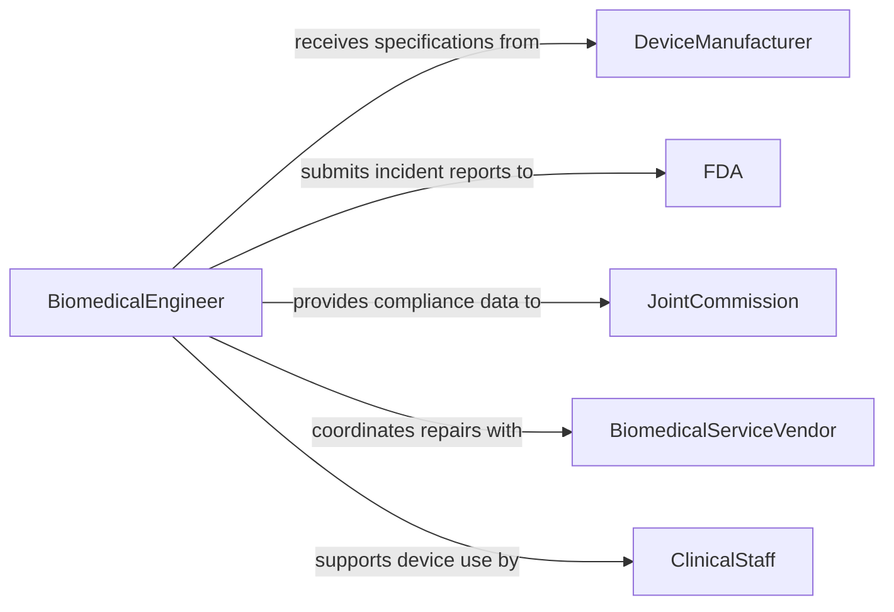

# Monitor Medical Equipment Ensure Proper

> Business-as-Code definition for monitoring medical equipment to ensure proper functioning during patient care. Covers device performance tracking, alarm management, preventive maintenance scheduling, and FDA compliance for medical devices.

## Overview

Monitoring medical equipment involves continuously tracking the performance and operational status of clinical devices such as ventilators, infusion pumps, patient monitors, imaging systems, and surgical instruments to ensure safe and effective functioning during patient care. This definition provides actions for recording device status, managing clinical alarms, scheduling preventive maintenance, tracking device recalls, and maintaining compliance with FDA medical device regulations and Joint Commission equipment management standards.

## Actors

| Actor | Description |
|-------|-------------|
| DeviceManufacturer | OEM providing specifications, firmware updates, and recall notices |
| FDA | Federal authority regulating medical device safety and reporting |
| JointCommission | Accreditation body with equipment management standards |
| BiomedicalServiceVendor | Third-party provider of medical equipment repair and calibration |
| ClinicalStaff | Healthcare practitioners using equipment during patient care |

## Roles

| Role | Description |
|------|-------------|
| BiomedicalEngineer | Oversees the medical equipment management program |
| BiomedicalTechnician | Performs inspections, calibrations, and repairs on medical devices |
| ClinicalEngineer | Evaluates device performance and manages technology integration |
| NursingStaff | Uses medical equipment at the bedside and reports issues |
| RiskManager | Tracks device-related incidents and manages FDA reporting |

## Entities

| Entity | Description |
|--------|-------------|
| MedicalDevice | A clinical device or instrument used in patient care |
| DeviceStatus | The current operational condition of a medical device |
| ClinicalAlarm | An alert generated by a medical device indicating a condition |
| PreventiveMaintenance | A scheduled inspection and service to maintain device performance |
| DeviceIncident | An event where a device malfunction may have affected patient care |
| RecallNotice | A manufacturer or FDA notice requiring device action |

## Actions

| Action | Description |
|--------|-------------|
| recordDeviceStatus | Log the current operational condition of a medical device |
| respondToAlarm | Acknowledge and act on a clinical device alarm |
| schedulePreventiveMaintenance | Plan a routine inspection and service for a device |
| performPreventiveMaintenance | Execute scheduled maintenance and functional testing |
| reportDeviceIncident | Document a device malfunction that may have impacted patient care |
| processRecall | Evaluate and act on a device recall notice |
| certifyDeviceReady | Confirm a device is safe and functional for clinical use |

## Events

| Event | Description |
|-------|-------------|
| deviceStatusRecorded | The operational condition of a device has been logged |
| alarmResponded | A clinical device alarm has been acknowledged and addressed |
| preventiveMaintenanceScheduled | A routine service has been planned for a device |
| preventiveMaintenanceCompleted | Scheduled maintenance and testing have been performed |
| deviceIncidentReported | A device malfunction impacting care has been documented |
| recallProcessed | A device recall notice has been evaluated and acted upon |
| deviceCertifiedReady | A device has been confirmed safe for clinical use |

## Searches

| Search | Description |
|--------|-------------|
| findDevices | List medical devices by type, department, or status |
| getMaintenanceSchedule | Retrieve upcoming preventive maintenance due dates |
| getDeviceIncidents | Find device incidents by type, severity, or date range |
| getAlarmHistory | Retrieve alarm records by device, type, or time period |

## Workflow



## Actor Relationships



## Usage

### Calling Actions

```typescript
import { monitorMedicalEquipmentEnsureProper } from '@headlessly/monitor-medical-equipment-ensure-proper'

const devices = monitorMedicalEquipmentEnsureProper()

// Record device status during rounds
await devices.recordDeviceStatus({
  deviceId: 'VENT-ICU-012',
  deviceType: 'mechanical-ventilator',
  status: 'operational',
  location: 'ICU-Bed-7',
  readings: { tidalVolume: 450, peep: 5, fio2: 40 }
})

// Schedule preventive maintenance
await devices.schedulePreventiveMaintenance({
  deviceId: 'INFUSION-PUMP-045',
  maintenanceType: 'annual-inspection',
  dueDate: '2026-05-01',
  assignTo: 'biomed-tech-ramirez'
})

// Report a device incident
await devices.reportDeviceIncident({
  deviceId: 'MONITOR-TELE-023',
  incidentType: 'false-alarm',
  description: 'Telemetry monitor generating repeated false asystole alarms on patient movement',
  patientImpact: 'alarm-fatigue-risk',
  severity: 'moderate'
})
```

### Event-Driven Automation

```typescript
// Auto-remove device from service on critical incident
devices.deviceIncidentReported(async ({ deviceId, severity, patientImpact }) => {
  if (severity === 'critical') {
    await devices.recordDeviceStatus({
      deviceId,
      status: 'out-of-service',
      reason: 'critical-incident-investigation'
    })
    await notify({
      to: ['biomedical-engineer', 'risk-manager'],
      message: `Critical device incident: ${deviceId} removed from service`
    })
  }
})

// Notify when preventive maintenance is overdue
devices.preventiveMaintenanceScheduled(async ({ deviceId, dueDate }) => {
  await scheduleReminder({
    deviceId,
    reminderDate: dueDate,
    message: `Preventive maintenance overdue for ${deviceId} - remove from service if not completed`
  })
})
```
