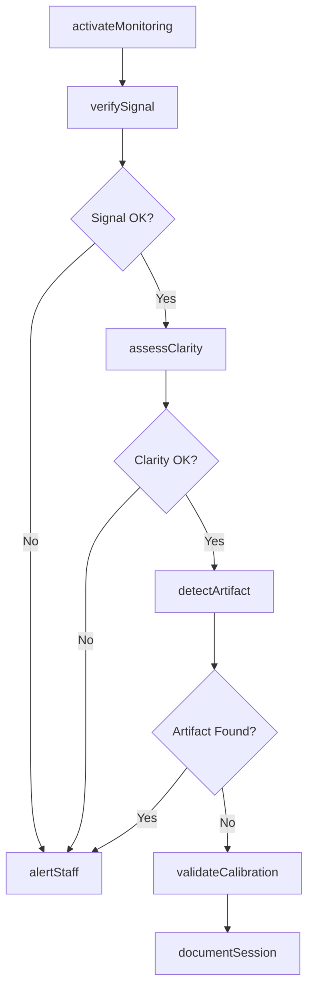
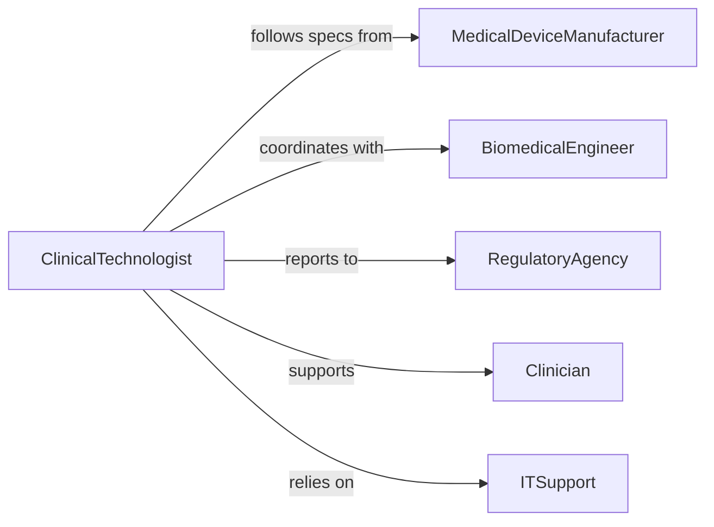

# Monitor Video Displays Medical Equipment

> Business-as-Code definition for continuous monitoring of medical equipment video displays to ensure accurate visualization, signal quality, and patient safety compliance.

## Overview

Medical equipment video display monitoring involves real-time observation of imaging systems, vital sign monitors, surgical displays, and diagnostic screens to ensure accurate data visualization and proper equipment functioning. This definition provides actions for display monitoring workflows, events for automated alerting on display anomalies, and searches for retrieving display performance data.

## Actors

| Actor | Description |
|-------|-------------|
| MedicalDeviceManufacturer | Provides equipment specifications and calibration standards |
| BiomedicalEngineer | Services and calibrates medical display equipment |
| RegulatoryAgency | Enforces medical device safety and quality standards |
| Clinician | Uses displays for patient diagnosis and monitoring |
| ITSupport | Maintains display systems and connectivity infrastructure |
| QualityAssuranceTeam | Audits display accuracy and compliance |

## Roles

| Role | Description |
|------|-------------|
| ClinicalTechnologist | Operates and monitors medical imaging equipment |
| BiomedicalTechnician | Maintains and repairs display systems |
| QualityManager | Ensures display accuracy meets clinical standards |
| PatientSafetyOfficer | Monitors compliance with safety protocols |

## Entities

| Entity | Description |
|--------|-------------|
| MedicalDisplay | Video screen showing patient data or diagnostic images |
| SignalQuality | Measurement of display clarity and data fidelity |
| CalibrationRecord | Documentation of display accuracy verification |
| DisplayAlert | Notification of display malfunction or quality issue |
| PatientSession | Period during which display is used for patient care |
| ComplianceReport | Documentation of regulatory adherence |

## Actions

| Action | Description |
|--------|-------------|
| activateMonitoring | Begin tracking display performance and signal quality |
| verifySignal | Check input signal integrity and resolution |
| assessClarity | Evaluate display brightness, contrast, and sharpness |
| detectArtifact | Identify visual anomalies or display errors |
| validateCalibration | Confirm display meets accuracy standards |
| alertStaff | Notify clinical team of display issues |
| documentSession | Record display usage for quality assurance |

## Events

| Event | Description |
|-------|-------------|
| monitoringActivated | Display monitoring has been initiated |
| signalVerified | Input signal quality has been confirmed |
| clarityAssessed | Display visual quality evaluation is complete |
| artifactDetected | Visual anomaly or error has been identified |
| calibrationValidated | Display accuracy has been verified |
| staffAlerted | Clinical team has been notified of display issue |
| sessionDocumented | Display usage has been recorded |

## Searches

| Search | Description |
|--------|-------------|
| findDisplays | List medical displays by location, type, or status |
| getSignalQuality | Retrieve current or historical signal metrics |
| getCalibrations | Find calibration records by display or date |
| getAlerts | Retrieve active or historical display alerts |

## Workflow



## Actor Relationships



## Usage

### Calling Actions

```typescript
import { monitorVideoDisplaysMedicalEquipment } from '@headlessly/monitor-video-displays-medical-equipment'

const monitor = monitorVideoDisplaysMedicalEquipment()

// Activate monitoring for an imaging display
await monitor.activateMonitoring({
  displayId: 'ct-scanner-display-1',
  equipmentType: 'computed-tomography',
  patientSessionId: 'session-789',
  checkInterval: 5000 // ms
})

// Verify signal and assess clarity
const signal = await monitor.verifySignal({
  displayId: 'ct-scanner-display-1',
  expectedResolution: '1920x1080',
  expectedRefreshRate: 60
})

const clarity = await monitor.assessClarity({
  displayId: 'ct-scanner-display-1',
  minBrightness: 300,
  minContrast: 400
})
```

### Event-Driven Automation

```typescript
// Alert staff immediately on artifact detection
monitor.artifactDetected(async ({ displayId, artifactType, severity }) => {
  if (severity === 'critical') {
    await monitor.alertStaff({
      displayId,
      message: `Critical display artifact: ${artifactType}`,
      notifyRoles: ['clinician', 'biomedical-technician']
    })
  }
})

// Document all patient sessions for compliance
monitor.monitoringActivated(async ({ displayId, patientSessionId }) => {
  await monitor.documentSession({
    displayId,
    patientSessionId,
    startTime: new Date(),
    complianceFields: ['signal-quality', 'calibration-status']
  })
})
```
