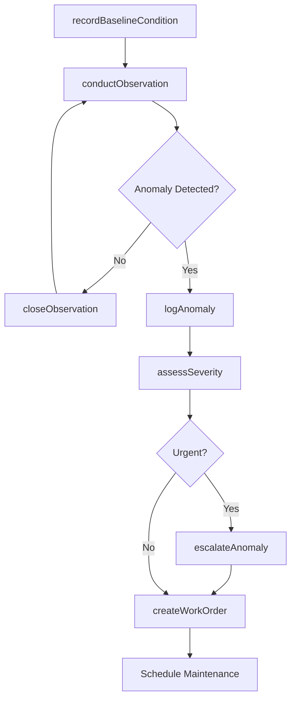
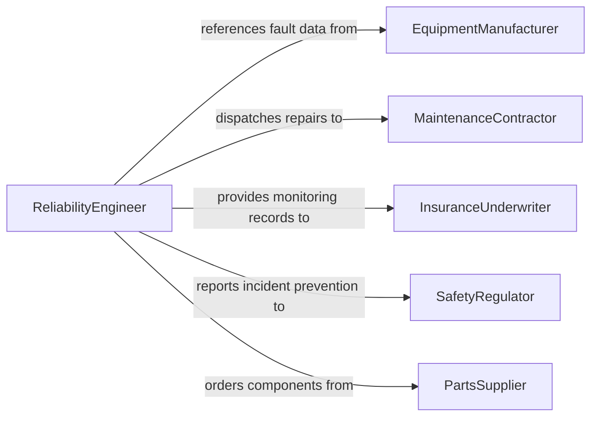

# Observe Equipment Operation Detect Potential

> Business-as-Code definition for observing equipment during operation to detect potential problems before failures occur. Covers visual monitoring, vibration analysis, thermal imaging, and early warning detection.

## Overview

Observing equipment in operation to detect potential problems involves systematic visual and sensor-based monitoring of machinery, mechanical systems, and industrial equipment during normal operations. This includes watching for unusual vibrations, sounds, temperatures, fluid leaks, and performance degradation that could indicate developing faults. This definition provides actions for conducting equipment observations, logging anomalies, triggering preventive maintenance, and tracking observation patterns over time.

## Actors

| Actor | Description |
|-------|-------------|
| EquipmentManufacturer | OEM providing technical specifications and fault indicators |
| MaintenanceContractor | External service provider for specialized equipment repairs |
| InsuranceUnderwriter | Insurer requiring evidence of proactive equipment monitoring |
| SafetyRegulator | Authority mandating equipment monitoring and incident prevention |
| PartsSupplier | Vendor providing replacement components for equipment maintenance |

## Roles

| Role | Description |
|------|-------------|
| EquipmentOperator | Operates machinery and provides first-line observations |
| MaintenanceTechnician | Investigates reported anomalies and performs repairs |
| ReliabilityEngineer | Analyzes observation data to predict and prevent equipment failures |
| ShiftSupervisor | Oversees equipment operations and escalates observed problems |
| PredictiveMaintenanceAnalyst | Uses sensor data and trend analysis to forecast equipment issues |

## Entities

| Entity | Description |
|--------|-------------|
| Equipment | A machine or system being observed during operation |
| Observation | A recorded instance of watching equipment and noting conditions |
| Anomaly | An unusual condition detected that may indicate a developing problem |
| WorkOrder | A maintenance request generated from an observation finding |
| EquipmentLog | A historical record of observations and conditions for an asset |
| FaultIndicator | A known symptom or pattern associated with a specific equipment failure |

## Actions

| Action | Description |
|--------|-------------|
| conductObservation | Perform a systematic watch of equipment during operation |
| logAnomaly | Record an unusual condition detected during observation |
| assessSeverity | Evaluate the urgency and potential impact of a detected anomaly |
| createWorkOrder | Generate a maintenance request for an identified problem |
| escalateAnomaly | Raise an urgent equipment issue to maintenance and management |
| recordBaselineCondition | Document normal operating parameters for future comparison |
| closeObservation | Finalize an observation session with documented findings |

## Events

| Event | Description |
|-------|-------------|
| observationConducted | An equipment observation session has been completed |
| anomalyLogged | An unusual operating condition has been recorded |
| severityAssessed | The urgency of a detected anomaly has been evaluated |
| workOrderCreated | A maintenance request has been generated from an observation |
| anomalyEscalated | An urgent equipment problem has been raised to management |
| baselineRecorded | Normal operating conditions have been documented |
| observationClosed | An observation session has been finalized |

## Searches

| Search | Description |
|--------|-------------|
| findObservations | List observations by equipment, date range, or findings |
| getAnomalies | Retrieve anomalies by equipment, severity, or resolution status |
| getEquipmentHistory | Find historical observations and conditions for a specific asset |
| getWorkOrders | List maintenance work orders generated from observations |

## Workflow



## Actor Relationships



## Usage

### Calling Actions

```typescript
import { observeEquipmentOperationDetectPotential } from '@headlessly/observe-equipment-operation-detect-potential'

const equipment = observeEquipmentOperationDetectPotential()

// Conduct a routine equipment observation
const observation = await equipment.conductObservation({
  equipmentId: 'CNC-MILL-007',
  operatorId: 'operator-martinez',
  checkpoints: ['vibration-level', 'fluid-levels', 'temperature', 'noise-pattern', 'chip-formation']
})

// Log an anomaly detected during observation
await equipment.logAnomaly({
  observationId: observation.id,
  equipmentId: 'CNC-MILL-007',
  type: 'unusual-vibration',
  description: 'Intermittent high-frequency vibration during spindle acceleration above 8000 RPM',
  faultIndicator: 'bearing-wear'
})

// Assess severity and create work order
await equipment.assessSeverity({
  anomalyId: 'ANOM-2026-0195',
  severity: 'moderate',
  estimatedTimeToFailure: '2-4 weeks'
})
```

### Event-Driven Automation

```typescript
// Auto-escalate critical anomalies
equipment.anomalyLogged(async ({ equipmentId, type, severity }) => {
  if (severity === 'critical') {
    await equipment.escalateAnomaly({
      equipmentId,
      type,
      notifyRoles: ['ShiftSupervisor', 'MaintenanceTechnician']
    })
  }
})

// Auto-generate work order for any confirmed anomaly
equipment.severityAssessed(async ({ anomalyId, severity, equipmentId }) => {
  await equipment.createWorkOrder({
    anomalyId,
    equipmentId,
    priority: severity === 'high' ? 'urgent' : 'normal',
    type: 'preventive-maintenance'
  })
})
```
