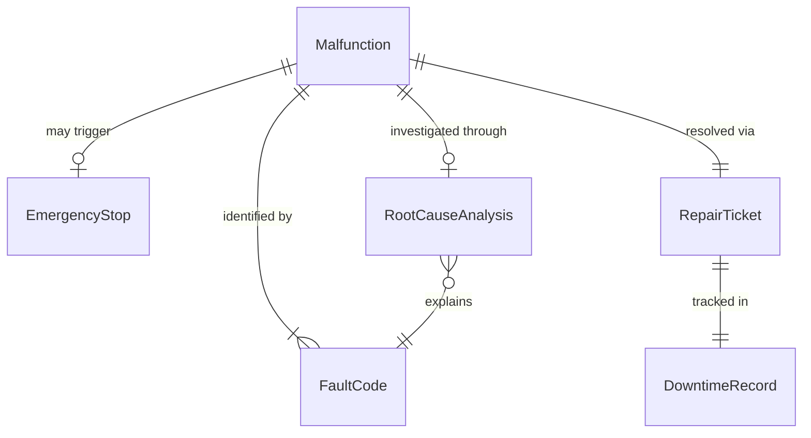
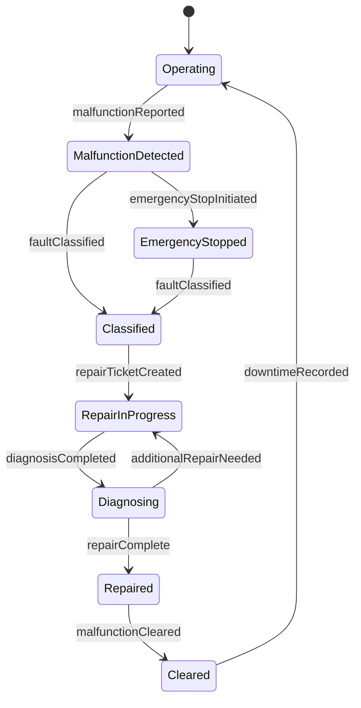
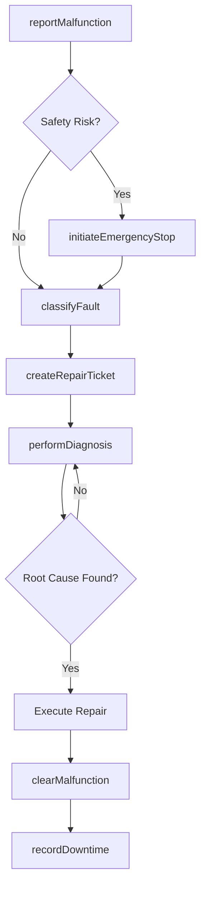
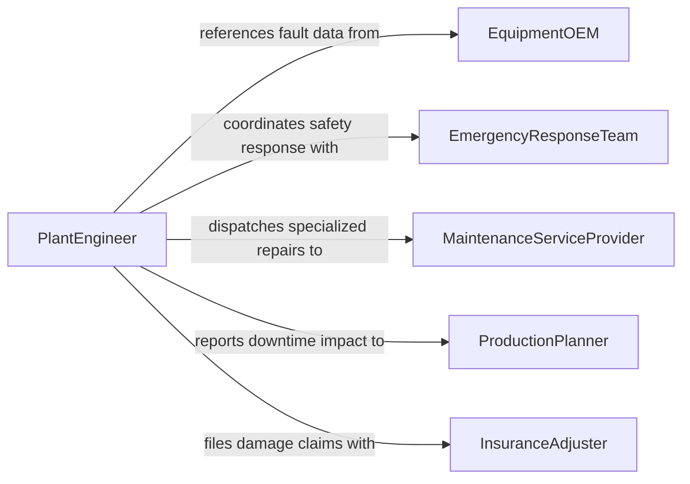

# Watch Operating Equipment Detect Malfunctions

> Business-as-Code definition for watching operating equipment to detect active malfunctions. Covers real-time fault detection, emergency shutdown procedures, malfunction classification, and rapid response coordination.

## Overview

Watching operating equipment to detect malfunctions involves real-time monitoring of machinery during active use to identify faults as they occur, including mechanical failures, electrical faults, hydraulic leaks, and control system errors. Unlike predictive observation, this activity focuses on detecting active problems that require immediate response. This definition provides actions for logging malfunctions, initiating emergency stops, classifying fault types, and coordinating rapid repair responses to minimize downtime and prevent safety incidents.

## Actors

| Actor | Description |
|-------|-------------|
| EquipmentOEM | Original equipment manufacturer providing fault codes and repair guidance |
| EmergencyResponseTeam | On-site team responding to equipment-related safety emergencies |
| MaintenanceServiceProvider | External contractor for specialized equipment repairs |
| ProductionPlanner | Scheduler who must be notified of equipment downtime impacts |
| InsuranceAdjuster | Claims representative assessing equipment damage and losses |

## Roles

| Role | Description |
|------|-------------|
| MachineOperator | Operates equipment and is first to detect active malfunctions |
| MaintenanceMechanic | Diagnoses and repairs equipment malfunctions |
| ElectricalTechnician | Addresses electrical and control system faults |
| PlantEngineer | Oversees equipment reliability and major malfunction response |
| SafetyOfficer | Ensures malfunction response follows safety protocols |

## Entities

| Entity | Description |
|--------|-------------|
| Malfunction | An active equipment fault requiring immediate attention |
| FaultCode | A diagnostic code indicating the type and location of a malfunction |
| EmergencyStop | An immediate equipment shutdown initiated due to a malfunction |
| RepairTicket | A work order for diagnosing and repairing a detected malfunction |
| DowntimeRecord | A log of equipment unavailability caused by a malfunction |
| RootCauseAnalysis | An investigation into the underlying cause of a malfunction |

## Actions

| Action | Description |
|--------|-------------|
| reportMalfunction | Log an active equipment fault with initial observations |
| initiateEmergencyStop | Trigger an immediate equipment shutdown for safety |
| classifyFault | Categorize the malfunction by type, system, and severity |
| createRepairTicket | Generate a work order for malfunction diagnosis and repair |
| performDiagnosis | Investigate the malfunction to determine root cause |
| recordDowntime | Log equipment unavailability start and end times |
| clearMalfunction | Confirm the malfunction is resolved and equipment is safe to restart |

## Events

| Event | Description |
|-------|-------------|
| malfunctionReported | An active equipment fault has been logged |
| emergencyStopInitiated | An immediate equipment shutdown has been triggered |
| faultClassified | A malfunction has been categorized by type and severity |
| repairTicketCreated | A work order has been generated for the malfunction |
| diagnosisCompleted | Root cause investigation has been finalized |
| downtimeRecorded | Equipment unavailability has been logged |
| malfunctionCleared | The fault has been resolved and equipment cleared for restart |

## Searches

| Search | Description |
|--------|-------------|
| findMalfunctions | List malfunctions by equipment, date range, or status |
| getFaultCodes | Retrieve fault codes by equipment type or system |
| getRepairTickets | Find repair tickets by priority, assignee, or status |
| getDowntimeHistory | Retrieve equipment downtime records by asset or period |

## Entity Relationships



## State Diagram



## Workflow



## Actor Relationships



## Usage

### Calling Actions

```typescript
import { watchOperatingEquipmentDetectMalfunctions } from '@headlessly/watch-operating-equipment-detect-malfunctions'

const equipment = watchOperatingEquipmentDetectMalfunctions()

// Report an active malfunction
const malfunction = await equipment.reportMalfunction({
  equipmentId: 'PRESS-LINE-03',
  operatorId: 'operator-johnson',
  description: 'Hydraulic press not holding pressure at bottom of stroke, visible fluid leak at cylinder seal',
  faultCode: 'HYD-P-LOSS-04',
  severity: 'high'
})

// Initiate emergency stop if safety risk
await equipment.initiateEmergencyStop({
  equipmentId: 'PRESS-LINE-03',
  reason: 'Hydraulic pressure loss during active pressing cycle',
  initiatedBy: 'operator-johnson'
})

// Create a repair ticket
await equipment.createRepairTicket({
  malfunctionId: malfunction.id,
  priority: 'urgent',
  assignTo: 'hydraulic-maintenance-team',
  estimatedRepairHours: 4
})
```

### Event-Driven Automation

```typescript
// Auto-record downtime when emergency stop is triggered
equipment.emergencyStopInitiated(async ({ equipmentId, timestamp }) => {
  await equipment.recordDowntime({
    equipmentId,
    startTime: timestamp,
    reason: 'emergency-stop'
  })
  await notify({
    to: ['plant-engineer', 'production-planner'],
    message: `Emergency stop on ${equipmentId} - production halted`
  })
})

// Notify production planning when malfunction is cleared
equipment.malfunctionCleared(async ({ equipmentId, repairTicketId, downtimeHours }) => {
  await notify({
    to: 'production-planner',
    message: `${equipmentId} cleared for restart after ${downtimeHours}h downtime`
  })
})
```
