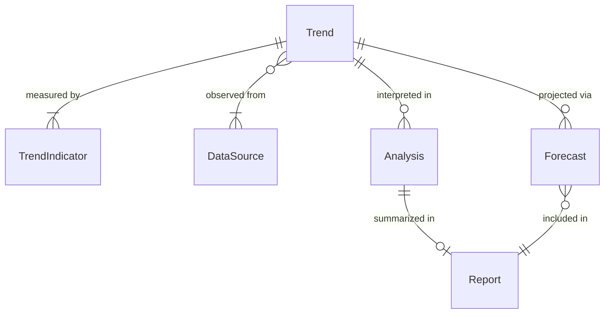
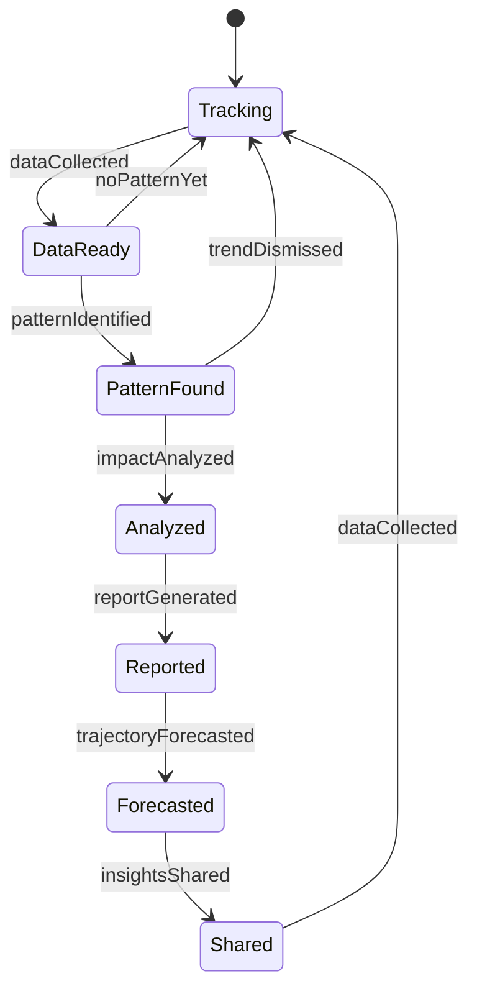
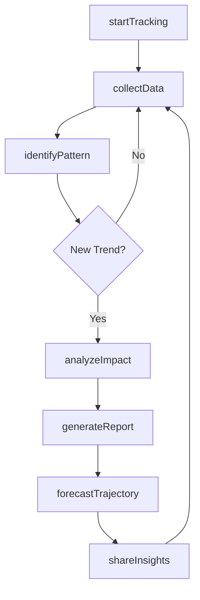
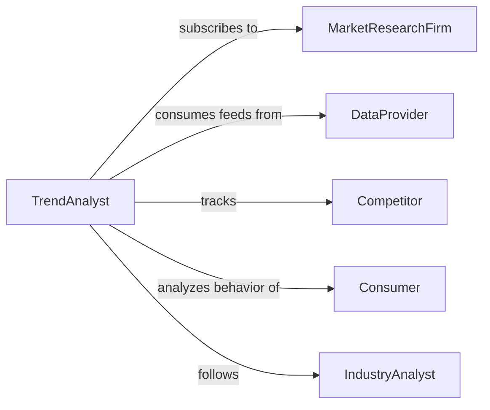

# Monitor Current Trends

> Business-as-Code definition for continuous tracking and analysis of market trends, consumer behavior, technology adoption, and industry developments to inform strategic decision-making.

## Overview

Current trends monitoring involves systematic observation of market dynamics, consumer preferences, competitive movements, and emerging patterns across industries. This definition provides actions for trend identification and analysis, events for automated reporting, and searches for retrieving trend intelligence and insights.

## Actors

| Actor | Description |
|-------|-------------|
| MarketResearchFirm | Provides industry reports and consumer insights |
| DataProvider | Supplies real-time market and social media data |
| Competitor | Industry peer whose actions influence market trends |
| Consumer | End user whose behavior reflects emerging patterns |
| IndustryAnalyst | Expert who publishes trend forecasts and commentary |
| TechnologyVendor | Provider of trend monitoring and analytics tools |

## Roles

| Role | Description |
|------|-------------|
| TrendAnalyst | Identifies and interprets market and consumer trends |
| StrategyDirector | Uses trend insights to inform business strategy |
| ProductManager | Applies trend data to product development decisions |
| MarketingManager | Aligns campaigns with current consumer preferences |

## Entities

| Entity | Description |
|--------|-------------|
| Trend | Observed pattern in market behavior or consumer preferences |
| DataSource | Channel providing trend-related information |
| TrendIndicator | Metric signaling emergence or strength of a trend |
| Analysis | Interpretation of trend data with business implications |
| Report | Structured summary of trend findings |
| Forecast | Projection of trend trajectory and impact |

## Actions

| Action | Description |
|--------|-------------|
| startTracking | Begin monitoring specific trends or categories |
| collectData | Gather information from multiple trend sources |
| identifyPattern | Recognize emerging or shifting trends |
| analyzeImpact | Assess business implications of identified trends |
| generateReport | Create summary of trend findings |
| forecastTrajectory | Project future direction and magnitude of trends |
| shareInsights | Distribute trend intelligence to stakeholders |

## Events

| Event | Description |
|-------|-------------|
| trackingStarted | Trend monitoring has been activated |
| dataCollected | Information from trend sources has been gathered |
| patternIdentified | New or shifting trend has been recognized |
| impactAnalyzed | Business implications have been assessed |
| reportGenerated | Trend summary has been created |
| trajectoryForecasted | Future trend projection is complete |
| insightsShared | Trend intelligence has been distributed |

## Searches

| Search | Description |
|--------|-------------|
| findTrends | List trends by category, industry, or timeframe |
| getIndicators | Retrieve metrics showing trend strength or velocity |
| getAnalyses | Find business impact assessments for trends |
| getForecasts | Retrieve projections of trend trajectories |

## Entity Relationships



## State Diagram



## Workflow



## Actor Relationships



## Usage

### Calling Actions

```typescript
import { monitorCurrentTrends } from '@headlessly/monitor-current-trends'

const trends = monitorCurrentTrends()

// Start tracking consumer technology trends
await trends.startTracking({
  categories: ['artificial-intelligence', 'mobile-commerce', 'sustainability'],
  sources: ['social-media', 'search-trends', 'competitor-activity'],
  updateFrequency: 'daily'
})

// Collect and analyze trend data
const data = await trends.collectData({
  categories: ['artificial-intelligence'],
  timeframe: 'last-30-days'
})

const patterns = await trends.identifyPattern({
  data,
  minSignalStrength: 0.7
})

const impact = await trends.analyzeImpact({
  trends: patterns,
  businessContext: 'product-roadmap'
})
```

### Event-Driven Automation

```typescript
// Auto-generate reports on pattern identification
trends.patternIdentified(async ({ trendId, category, strength }) => {
  if (strength > 0.8) {
    await trends.generateReport({
      trendId,
      includeCompetitorAnalysis: true,
      distributeTo: ['strategy-team', 'product-team']
    })
  }
})

// Share insights when reports are complete
trends.reportGenerated(async ({ reportId, category }) => {
  await trends.shareInsights({
    reportId,
    channels: ['email', 'dashboard'],
    recipients: getStakeholders(category)
  })
})
```
