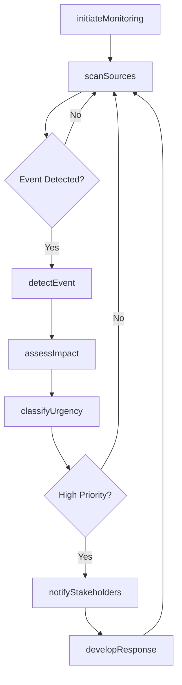
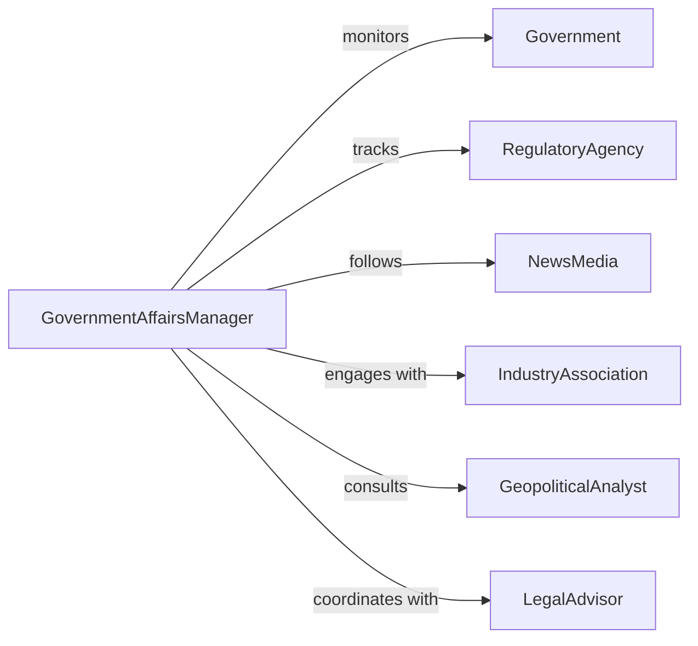

# Monitor External Affairs Events Affecting

> Business-as-Code definition for tracking external events including political developments, regulatory changes, economic shifts, and geopolitical incidents that impact business operations.

## Overview

External affairs monitoring involves systematic observation of political, regulatory, economic, and social events outside the organization that may affect operations, strategy, or risk posture. This definition provides actions for event tracking and impact assessment, events for automated alerting, and searches for retrieving external affairs intelligence.

## Actors

| Actor | Description |
|-------|-------------|
| Government | Issues regulations, policies, and official statements |
| RegulatoryAgency | Enforces compliance requirements and industry standards |
| NewsMedia | Reports on events and developments affecting business |
| IndustryAssociation | Provides sector-specific insights and advocacy |
| GeopoliticalAnalyst | Offers expert analysis of global events |
| LegalAdvisor | Interprets regulatory and compliance implications |

## Roles

| Role | Description |
|------|-------------|
| GovernmentAffairsManager | Tracks political and regulatory developments |
| RiskManager | Assesses operational impact of external events |
| ComplianceOfficer | Ensures adherence to new or changing regulations |
| ExecutiveLeadership | Makes strategic decisions based on external factors |

## Entities

| Entity | Description |
|--------|-------------|
| ExternalEvent | Political, regulatory, or economic occurrence |
| EventSource | Channel providing external affairs information |
| ImpactAssessment | Analysis of event consequences for the business |
| RegulatoryChange | New or modified legal or compliance requirement |
| Alert | Notification of significant external development |
| ResponsePlan | Strategy for addressing external event impact |

## Actions

| Action | Description |
|--------|-------------|
| initiateMonitoring | Begin tracking external affairs in specific domains |
| scanSources | Gather information from news, government, and expert channels |
| detectEvent | Identify significant external development |
| assessImpact | Evaluate operational consequences of event |
| classifyUrgency | Determine response priority and timeline |
| notifyStakeholders | Alert relevant teams of significant events |
| developResponse | Create plan for addressing event impact |

## Events

| Event | Description |
|-------|-------------|
| monitoringInitiated | External affairs tracking has been activated |
| sourcesScanned | Information channels have been reviewed |
| eventDetected | Significant external development has been identified |
| impactAssessed | Operational consequences have been evaluated |
| urgencyClassified | Response priority has been determined |
| stakeholdersNotified | Relevant teams have been alerted |
| responseDeveloped | Action plan has been created |

## Searches

| Search | Description |
|--------|-------------|
| findEvents | List external affairs events by type, region, or date |
| getImpactAssessments | Retrieve analyses of event consequences |
| getAlerts | Find active or historical notifications |
| getResponses | Retrieve action plans for external events |

## Workflow



## Actor Relationships



## Usage

### Calling Actions

```typescript
import { monitorExternalAffairsEventsAffecting } from '@headlessly/monitor-external-affairs-events-affecting'

const monitor = monitorExternalAffairsEventsAffecting()

// Initiate monitoring for regulatory and geopolitical events
await monitor.initiateMonitoring({
  domains: ['regulatory', 'geopolitical', 'economic'],
  regions: ['north-america', 'european-union', 'asia-pacific'],
  sources: ['government-feeds', 'news-apis', 'analyst-reports']
})

// Scan sources and detect events
const scan = await monitor.scanSources({
  domains: ['regulatory'],
  keywords: ['data-privacy', 'cybersecurity', 'financial-reporting']
})

const events = await monitor.detectEvent({
  scanResults: scan,
  significanceThreshold: 0.75
})

const assessment = await monitor.assessImpact({
  eventId: events[0].id,
  operationalAreas: ['supply-chain', 'compliance', 'finance']
})
```

### Event-Driven Automation

```typescript
// Notify stakeholders on high-urgency events
monitor.urgencyClassified(async ({ eventId, urgency, impactAreas }) => {
  if (urgency === 'high' || urgency === 'critical') {
    await monitor.notifyStakeholders({
      eventId,
      recipients: getStakeholders(impactAreas),
      channel: 'immediate-alert'
    })
  }
})

// Auto-develop response for regulatory changes
monitor.eventDetected(async ({ eventId, eventType }) => {
  if (eventType === 'regulatory-change') {
    await monitor.developResponse({
      eventId,
      includeComplianceReview: true,
      assignTo: 'legal-team'
    })
  }
})
```
