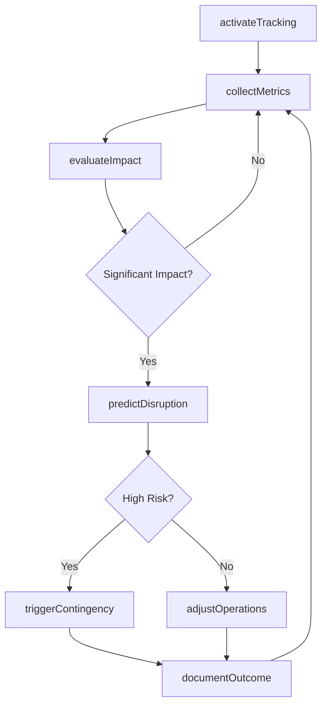
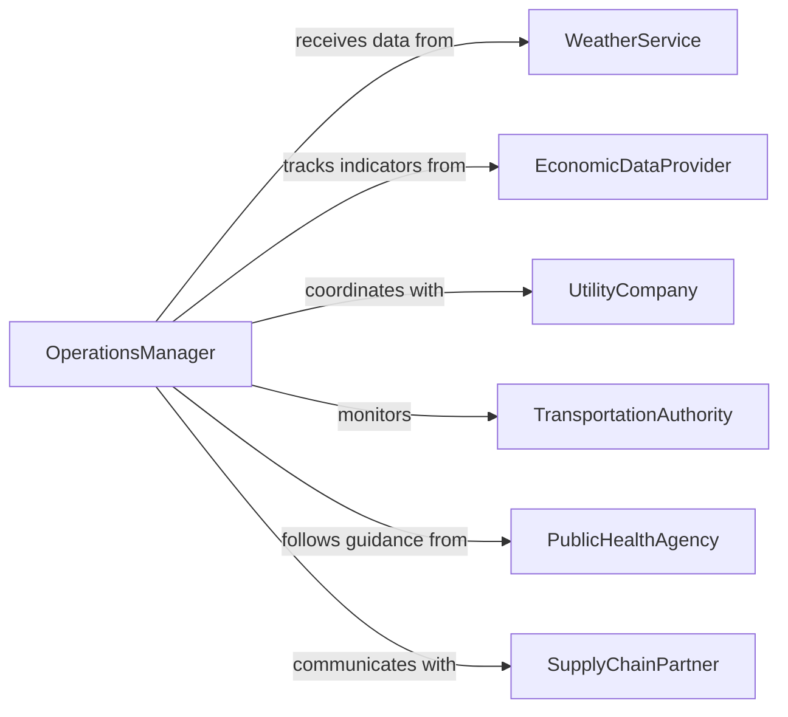

# Monitor External Factors Impacting Operations

> Business-as-Code definition for tracking external environmental, economic, social, and technological factors that directly influence operational performance and business continuity.

## Overview

External factors monitoring involves continuous observation of conditions outside the organization that affect production, logistics, workforce availability, costs, and operational efficiency. This definition provides actions for factor tracking and operational impact analysis, events for automated response triggering, and searches for retrieving factor data and forecasts.

## Actors

| Actor | Description |
|-------|-------------|
| WeatherService | Provides meteorological forecasts and alerts |
| EconomicDataProvider | Supplies labor market, inflation, and economic indicators |
| UtilityCompany | Manages electricity, water, and gas availability |
| TransportationAuthority | Controls infrastructure and logistics access |
| PublicHealthAgency | Issues health advisories and safety guidelines |
| SupplyChainPartner | Coordinates logistics and material availability |

## Roles

| Role | Description |
|------|-------------|
| OperationsManager | Oversees production and adjusts to external conditions |
| SupplyChainCoordinator | Manages logistics in response to external disruptions |
| RiskAnalyst | Assesses operational vulnerability to external factors |
| ContinuityPlanner | Develops response strategies for external impacts |

## Entities

| Entity | Description |
|--------|-------------|
| ExternalFactor | Condition outside the organization affecting operations |
| FactorMetric | Measurement of external condition severity or status |
| ImpactAssessment | Analysis of operational consequences |
| OperationalAlert | Notification of factor-driven operational risk |
| ContingencyPlan | Prepared response to external factor scenarios |
| Forecast | Prediction of future external factor conditions |

## Actions

| Action | Description |
|--------|-------------|
| activateTracking | Begin monitoring specific external factors |
| collectMetrics | Gather current data on external conditions |
| evaluateImpact | Assess operational consequences of factors |
| predictDisruption | Forecast likelihood of operational interruption |
| triggerContingency | Activate prepared response plan |
| adjustOperations | Modify production or logistics in response to factors |
| documentOutcome | Record actual impact for future planning |

## Events

| Event | Description |
|-------|-------------|
| trackingActivated | External factor monitoring has been initiated |
| metricsCollected | Current external condition data has been gathered |
| impactEvaluated | Operational consequences have been assessed |
| disruptionPredicted | Operational interruption forecast is complete |
| contingencyTriggered | Response plan has been activated |
| operationsAdjusted | Production or logistics have been modified |
| outcomeDocumented | Actual impact has been recorded |

## Searches

| Search | Description |
|--------|-------------|
| findFactors | List external factors by type, severity, or region |
| getMetrics | Retrieve current or historical factor measurements |
| getImpacts | Find operational consequence assessments |
| getForecasts | Retrieve predictions of future factor conditions |

## Workflow



## Actor Relationships



## Usage

### Calling Actions

```typescript
import { monitorExternalFactorsImpactingOperations } from '@headlessly/monitor-external-factors-impacting-operations'

const monitor = monitorExternalFactorsImpactingOperations()

// Activate tracking for weather and energy factors
await monitor.activateTracking({
  factors: ['weather', 'energy-availability', 'labor-market'],
  locations: ['facility-north', 'facility-south'],
  updateInterval: 1800000 // ms
})

// Collect metrics and evaluate impact
const metrics = await monitor.collectMetrics({
  factors: ['weather'],
  locations: ['facility-north']
})

const impact = await monitor.evaluateImpact({
  factorData: metrics,
  operationalContext: {
    currentShift: 'second',
    productionTargets: 5000,
    inventoryBuffer: 0.2
  }
})
```

### Event-Driven Automation

```typescript
// Trigger contingency plans for high-risk disruptions
monitor.disruptionPredicted(async ({ factorType, riskLevel, location }) => {
  if (riskLevel === 'high' || riskLevel === 'critical') {
    await monitor.triggerContingency({
      factorType,
      location,
      planType: getContingencyPlan(factorType)
    })
  }
})

// Adjust operations for moderate impacts
monitor.impactEvaluated(async ({ factorType, severity, location }) => {
  if (severity === 'moderate') {
    await monitor.adjustOperations({
      location,
      adjustments: {
        shiftSchedule: 'extended',
        productionRate: 0.8
      }
    })
  }
})
```
