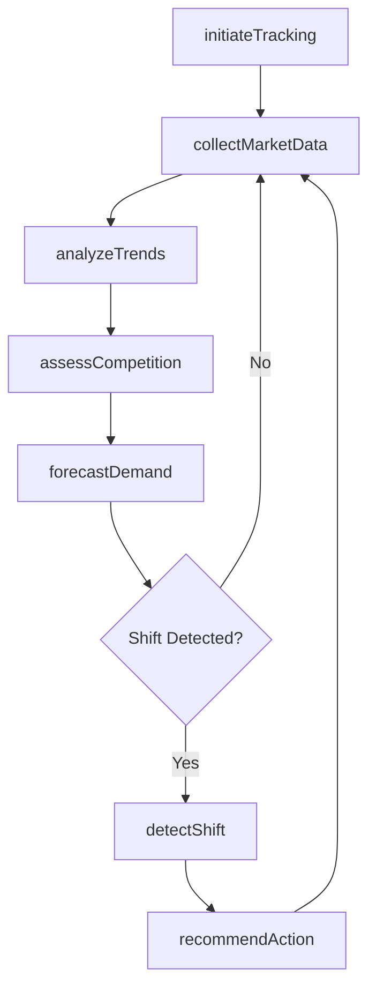
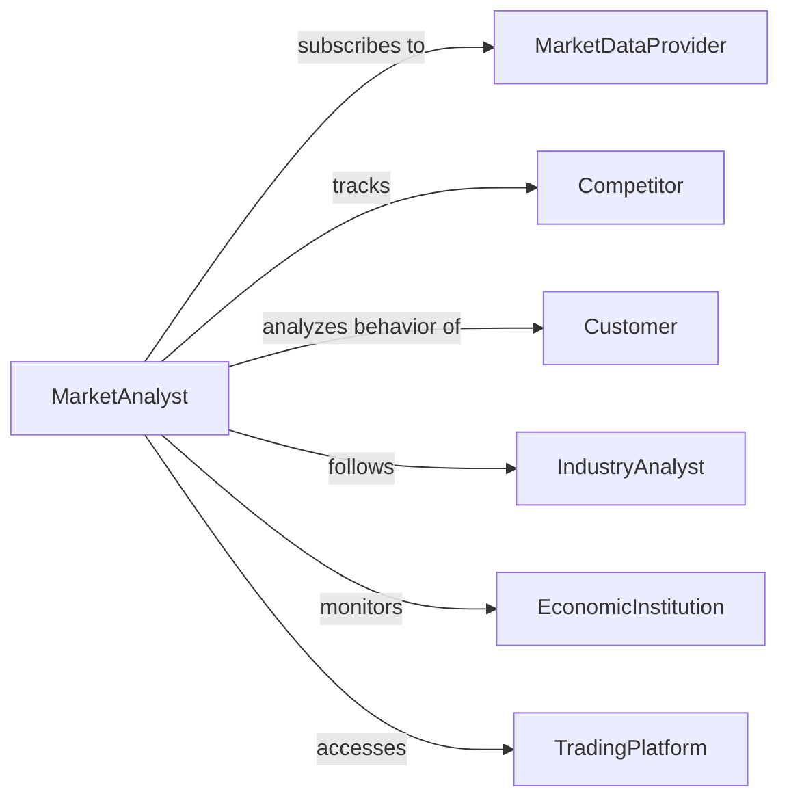

# Monitor Market Conditions Trends

> Business-as-Code definition for tracking market dynamics including demand patterns, pricing trends, competitive positioning, and economic indicators to inform strategic and tactical decisions.

## Overview

Market conditions monitoring involves systematic observation of supply and demand dynamics, pricing movements, competitive activity, and macroeconomic factors affecting business performance. This definition provides actions for market analysis and forecasting, events for automated alerting on market shifts, and searches for retrieving market intelligence and metrics.

## Actors

| Actor | Description |
|-------|-------------|
| MarketDataProvider | Supplies real-time pricing, volume, and market statistics |
| Competitor | Industry peer whose actions influence market conditions |
| Customer | Buyer whose demand patterns shape market dynamics |
| IndustryAnalyst | Expert who publishes market forecasts and commentary |
| EconomicInstitution | Government or research body providing economic indicators |
| TradingPlatform | Exchange or marketplace where transactions occur |

## Roles

| Role | Description |
|------|-------------|
| MarketAnalyst | Interprets market data and identifies conditions affecting business |
| PricingManager | Adjusts pricing strategy based on market conditions |
| SalesDirector | Aligns sales tactics with demand patterns |
| StrategyExecutive | Makes strategic decisions based on market outlook |

## Entities

| Entity | Description |
|--------|-------------|
| MarketCondition | Current state of supply, demand, or competitive environment |
| PricingTrend | Pattern in product or commodity prices over time |
| DemandSignal | Indicator of customer purchasing behavior |
| CompetitiveMove | Action taken by competitor affecting market position |
| EconomicIndicator | Macroeconomic metric influencing market performance |
| MarketForecast | Projection of future market conditions |

## Actions

| Action | Description |
|--------|-------------|
| initiateTracking | Begin monitoring specific market segments or indicators |
| collectMarketData | Gather pricing, volume, and competitive information |
| analyzeTrends | Identify patterns in market conditions over time |
| assessCompetition | Evaluate competitive positioning and actions |
| forecastDemand | Project future customer purchasing patterns |
| detectShift | Identify significant changes in market conditions |
| recommendAction | Suggest strategic or tactical responses to market conditions |

## Events

| Event | Description |
|-------|-------------|
| trackingInitiated | Market monitoring has been activated |
| marketDataCollected | Pricing and volume information has been gathered |
| trendsAnalyzed | Market pattern analysis is complete |
| competitionAssessed | Competitive evaluation is complete |
| demandForecasted | Future purchasing pattern projection is ready |
| shiftDetected | Significant market change has been identified |
| actionRecommended | Strategic or tactical response has been suggested |

## Searches

| Search | Description |
|--------|-------------|
| findConditions | List market conditions by segment, region, or timeframe |
| getTrends | Retrieve pricing or demand patterns over time |
| getCompetitiveMoves | Find recent competitor actions and positioning |
| getForecasts | Retrieve projections of future market conditions |

## Workflow



## Actor Relationships



## Usage

### Calling Actions

```typescript
import { monitorMarketConditionsTrends } from '@headlessly/monitor-market-conditions-trends'

const market = monitorMarketConditionsTrends()

// Initiate tracking for product category
await market.initiateTracking({
  segments: ['consumer-electronics', 'industrial-components'],
  regions: ['north-america', 'asia-pacific'],
  indicators: ['pricing', 'demand', 'inventory-levels'],
  frequency: 'hourly'
})

// Collect data and analyze trends
const data = await market.collectMarketData({
  segments: ['consumer-electronics'],
  sources: ['trading-platforms', 'competitor-pricing', 'search-trends']
})

const trends = await market.analyzeTrends({
  marketData: data,
  timeWindow: '90-days',
  metrics: ['price-elasticity', 'demand-volatility']
})

const forecast = await market.forecastDemand({
  trends,
  forecastPeriod: '6-months',
  confidence: 0.85
})
```

### Event-Driven Automation

```typescript
// Recommend action on significant market shift
market.shiftDetected(async ({ segment, shiftType, magnitude }) => {
  if (magnitude > 0.15) {
    await market.recommendAction({
      segment,
      shiftType,
      considerationAreas: ['pricing', 'inventory', 'promotions']
    })
  }
})

// Alert pricing team on competitor moves
market.competitionAssessed(async ({ competitorId, action, impact }) => {
  if (impact === 'high') {
    await notify({
      to: 'pricing-team',
      message: `Competitor ${competitorId} action: ${action}`,
      urgency: 'high'
    })
  }
})
```
