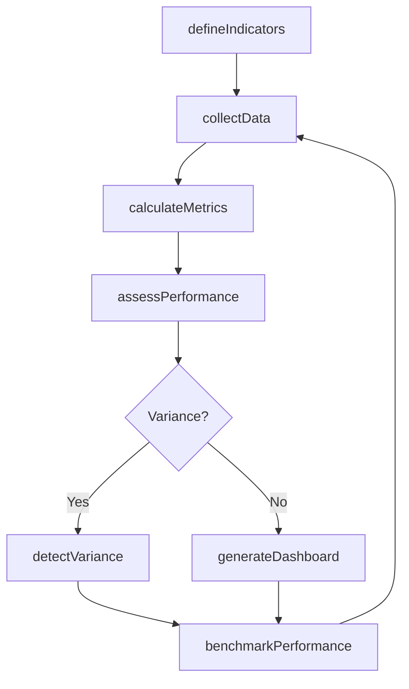
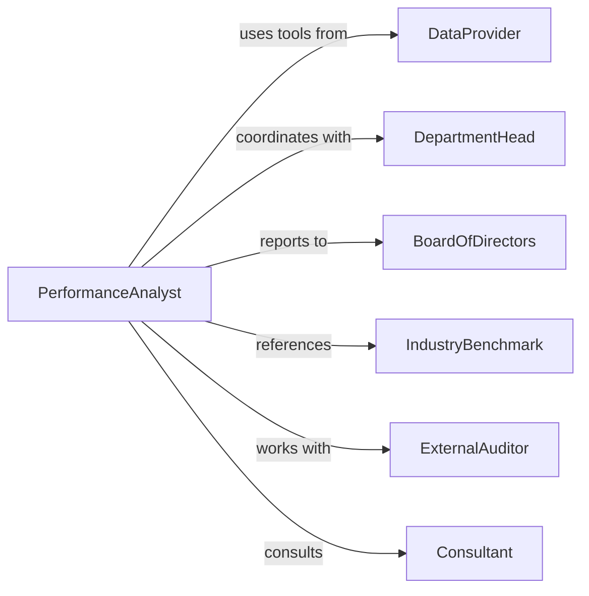

# Monitor Business Indicators

> Business-as-Code definition for tracking key performance indicators and metrics that reflect organizational health, operational efficiency, and strategic progress toward business objectives.

## Overview

Business indicators monitoring involves systematic measurement and analysis of operational, financial, and strategic metrics to assess performance and identify improvement opportunities. This definition provides actions for indicator tracking and analysis, events for automated alerting on threshold breaches, and searches for retrieving metrics and performance trends.

## Actors

| Actor | Description |
|-------|-------------|
| DataProvider | Supplies business intelligence and analytics platforms |
| DepartmentHead | Contributes operational data and context for indicators |
| BoardOfDirectors | Reviews high-level indicators for governance oversight |
| IndustryBenchmark | Provides comparative performance standards |
| ExternalAuditor | Validates accuracy and integrity of indicator data |
| Consultant | Offers expertise on indicator selection and interpretation |

## Roles

| Role | Description |
|------|-------------|
| PerformanceAnalyst | Tracks indicators and analyzes performance trends |
| ExecutiveLeadership | Uses indicator insights for strategic decision-making |
| OperationsManager | Monitors operational efficiency indicators |
| DashboardAdministrator | Maintains reporting systems and data feeds |

## Entities

| Entity | Description |
|--------|-------------|
| Indicator | Quantifiable metric reflecting business performance |
| Threshold | Boundary value triggering alerts or actions |
| Dashboard | Visual display of current indicator values |
| PerformanceTrend | Pattern in indicator values over time |
| Alert | Notification of indicator threshold breach |
| BenchmarkComparison | Assessment of performance relative to industry standards |

## Actions

| Action | Description |
|--------|-------------|
| defineIndicators | Establish metrics to track business performance |
| collectData | Gather current values for defined indicators |
| calculateMetrics | Compute derived indicators from raw data |
| assessPerformance | Evaluate current status against targets |
| detectVariance | Identify deviations from expected indicator values |
| generateDashboard | Create visual summary of indicator status |
| benchmarkPerformance | Compare indicators to industry or historical standards |

## Events

| Event | Description |
|-------|-------------|
| indicatorsDefined | Performance metrics have been established |
| dataCollected | Current indicator values have been gathered |
| metricsCalculated | Derived indicators have been computed |
| performanceAssessed | Status evaluation against targets is complete |
| varianceDetected | Deviation from expected values has been identified |
| dashboardGenerated | Visual performance summary has been created |
| performanceBenchmarked | Comparative analysis is complete |

## Searches

| Search | Description |
|--------|-------------|
| findIndicators | List indicators by category, department, or frequency |
| getMetrics | Retrieve current or historical indicator values |
| getVariances | Find indicators with significant deviations |
| getBenchmarks | Retrieve comparative performance assessments |

## Workflow



## Actor Relationships



## Usage

### Calling Actions

```typescript
import { monitorBusinessIndicators } from '@headlessly/monitor-business-indicators'

const indicators = monitorBusinessIndicators()

// Define key performance indicators
await indicators.defineIndicators({
  category: 'operational-efficiency',
  metrics: [
    { name: 'order-fulfillment-rate', target: 0.98, unit: 'percentage' },
    { name: 'customer-acquisition-cost', target: 75, unit: 'dollars' },
    { name: 'employee-productivity', target: 125, unit: 'units-per-hour' }
  ]
})

// Collect data and calculate metrics
const data = await indicators.collectData({
  category: 'operational-efficiency',
  period: 'daily'
})

const metrics = await indicators.calculateMetrics({
  rawData: data
})

const assessment = await indicators.assessPerformance({
  metrics,
  targets: 'defined',
  thresholdTolerance: 0.05
})
```

### Event-Driven Automation

```typescript
// Alert on significant variance detection
indicators.varianceDetected(async ({ indicatorName, actual, target, deviation }) => {
  if (Math.abs(deviation) > 0.1) {
    await notify({
      to: 'performance-team',
      message: `${indicatorName} variance: ${deviation * 100}% from target`,
      urgency: 'high'
    })
  }
})

// Auto-generate dashboards after assessment
indicators.performanceAssessed(async ({ category, period }) => {
  await indicators.generateDashboard({
    category,
    period,
    visualizations: ['trend-lines', 'comparison-bars', 'status-gauges']
  })
})
```
