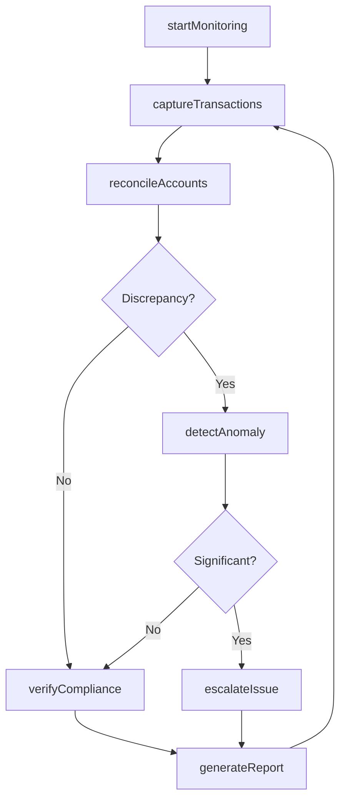
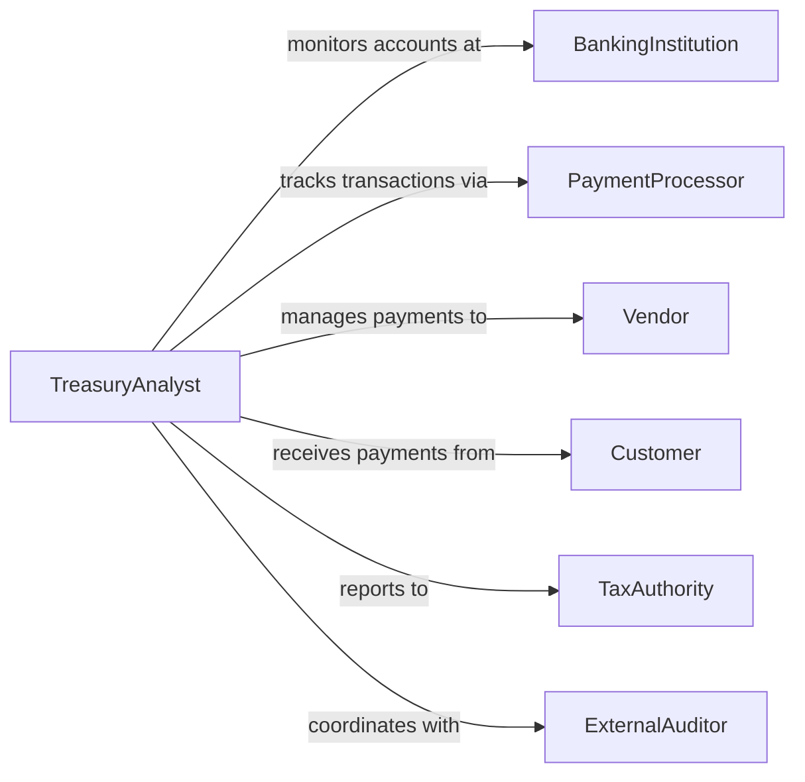

# Monitor Financial Activities

> Business-as-Code definition for tracking financial transactions, account activity, payment processing, and cash management to ensure accuracy, compliance, and operational control.

## Overview

Financial activities monitoring involves real-time observation and analysis of transactions, account balances, payment flows, and reconciliation processes to maintain financial integrity and detect irregularities. This definition provides actions for transaction tracking and analysis, events for automated alerting on anomalies, and searches for retrieving financial activity data.

## Actors

| Actor | Description |
|-------|-------------|
| BankingInstitution | Processes transactions and maintains accounts |
| PaymentProcessor | Facilitates payment collection and disbursement |
| Vendor | Receives payments for goods and services |
| Customer | Makes payments for products or services |
| TaxAuthority | Requires reporting of financial activities |
| ExternalAuditor | Reviews financial controls and transaction accuracy |

## Roles

| Role | Description |
|------|-------------|
| TreasuryAnalyst | Monitors cash positions and transaction flows |
| AccountsPayableClerk | Tracks vendor payments and disbursements |
| AccountsReceivableClerk | Monitors customer payments and collections |
| Controller | Oversees financial operations and reconciliation |

## Entities

| Entity | Description |
|--------|-------------|
| Transaction | Individual financial event such as payment or deposit |
| Account | Financial repository such as bank account or ledger |
| Reconciliation | Process matching transactions to account statements |
| PaymentFlow | Movement of funds between accounts or parties |
| ActivityAlert | Notification of unusual or suspicious financial activity |
| FinancialReport | Summary of financial activity for a period |

## Actions

| Action | Description |
|--------|-------------|
| startMonitoring | Begin tracking financial activities in specified accounts |
| captureTransactions | Record financial events as they occur |
| reconcileAccounts | Match transactions to bank statements and ledgers |
| detectAnomaly | Identify unusual patterns or suspicious activity |
| verifyCompliance | Confirm adherence to financial policies and regulations |
| generateReport | Create summary of financial activities for review |
| escalateIssue | Alert management to significant financial irregularities |

## Events

| Event | Description |
|-------|-------------|
| monitoringStarted | Financial activity tracking has been activated |
| transactionsCaptured | Financial events have been recorded |
| accountsReconciled | Transaction matching is complete |
| anomalyDetected | Unusual financial activity has been identified |
| complianceVerified | Regulatory adherence has been confirmed |
| reportGenerated | Financial activity summary has been created |
| issueEscalated | Management has been alerted to irregularity |

## Searches

| Search | Description |
|--------|-------------|
| findTransactions | List financial events by account, type, or date |
| getAccountBalances | Retrieve current or historical account positions |
| getAnomalies | Find flagged unusual or suspicious activities |
| getReconciliations | Retrieve account matching records |

## Workflow



## Actor Relationships



## Usage

### Calling Actions

```typescript
import { monitorFinancialActivities } from '@headlessly/monitor-financial-activities'

const monitor = monitorFinancialActivities()

// Start monitoring primary operating accounts
await monitor.startMonitoring({
  accounts: ['operating-checking', 'payroll-account', 'merchant-account'],
  captureInterval: 300000, // ms
  reconciliationFrequency: 'daily'
})

// Capture and reconcile transactions
const transactions = await monitor.captureTransactions({
  accounts: ['operating-checking'],
  timeframe: 'today'
})

const reconciliation = await monitor.reconcileAccounts({
  account: 'operating-checking',
  transactions,
  statementDate: '2026-02-05'
})
```

### Event-Driven Automation

```typescript
// Escalate significant anomalies immediately
monitor.anomalyDetected(async ({ transactionId, anomalyType, severity }) => {
  if (severity === 'high' || severity === 'critical') {
    await monitor.escalateIssue({
      transactionId,
      notifyRoles: ['controller', 'cfo'],
      urgency: 'immediate'
    })
  }
})

// Auto-generate daily financial activity reports
monitor.accountsReconciled(async ({ account, date }) => {
  if (isBusinessDayEnd(date)) {
    await monitor.generateReport({
      accounts: [account],
      period: 'daily',
      distributeTo: ['treasury-team', 'accounting']
    })
  }
})
```
