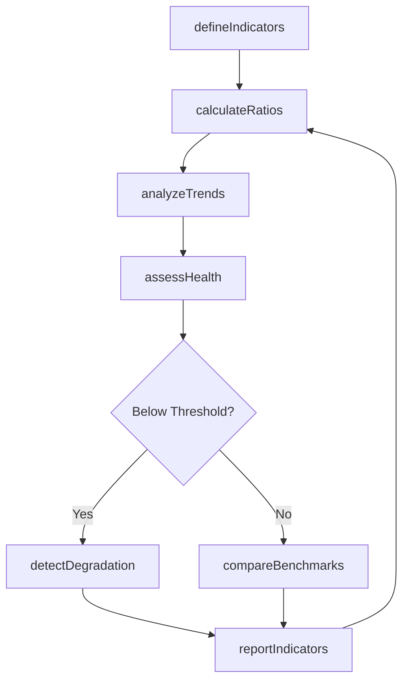
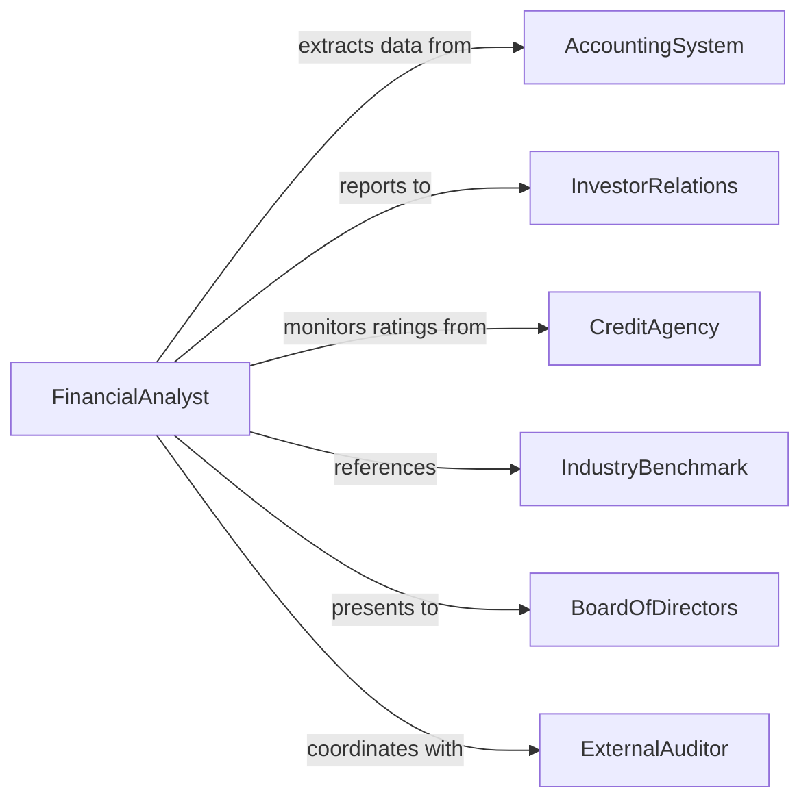

# Monitor Financial Indicators

> Business-as-Code definition for tracking key financial metrics including profitability ratios, liquidity measures, efficiency indicators, and leverage metrics to assess organizational financial health.

## Overview

Financial indicators monitoring involves systematic measurement and analysis of financial ratios, metrics, and benchmarks that reflect organizational performance, solvency, and operational efficiency. This definition provides actions for indicator calculation and trend analysis, events for automated alerting on threshold breaches, and searches for retrieving financial metrics and comparative data.

## Actors

| Actor | Description |
|-------|-------------|
| AccountingSystem | Provides financial statement data and transaction records |
| InvestorRelations | Communicates financial performance to shareholders |
| CreditAgency | Evaluates creditworthiness based on financial indicators |
| IndustryBenchmark | Supplies comparative financial performance standards |
| BoardOfDirectors | Reviews financial indicators for governance oversight |
| ExternalAuditor | Validates accuracy of financial indicator calculations |

## Roles

| Role | Description |
|------|-------------|
| FinancialAnalyst | Calculates indicators and analyzes financial trends |
| ChiefFinancialOfficer | Uses indicator insights for strategic financial decisions |
| TreasuryManager | Monitors liquidity and cash flow indicators |
| InvestorRelationsManager | Reports indicators to external stakeholders |

## Entities

| Entity | Description |
|--------|-------------|
| FinancialIndicator | Calculated metric reflecting financial performance or position |
| Ratio | Comparative measure of financial statement line items |
| Threshold | Boundary value indicating acceptable indicator range |
| Trend | Pattern in indicator values over time |
| Alert | Notification of indicator threshold breach or anomaly |
| BenchmarkComparison | Assessment of indicators relative to industry standards |

## Actions

| Action | Description |
|--------|-------------|
| defineIndicators | Establish financial metrics to track organizational health |
| calculateRatios | Compute financial indicators from statement data |
| analyzeTrends | Identify patterns in indicator values over time |
| assessHealth | Evaluate overall financial condition based on indicators |
| compareBenchmarks | Measure indicators against industry or peer standards |
| detectDegradation | Identify deteriorating financial performance |
| reportIndicators | Communicate financial metrics to stakeholders |

## Events

| Event | Description |
|-------|-------------|
| indicatorsDefined | Financial metrics have been established |
| ratiosCalculated | Financial indicators have been computed |
| trendsAnalyzed | Pattern analysis of indicators is complete |
| healthAssessed | Overall financial condition evaluation is complete |
| benchmarksCompared | Industry comparative analysis is complete |
| degradationDetected | Declining financial performance has been identified |
| indicatorsReported | Financial metrics have been communicated |

## Searches

| Search | Description |
|--------|-------------|
| findIndicators | List financial metrics by category or period |
| getRatios | Retrieve current or historical indicator values |
| getTrends | Find patterns in indicator values over time |
| getBenchmarks | Retrieve comparative industry performance data |

## Workflow



## Actor Relationships



## Usage

### Calling Actions

```typescript
import { monitorFinancialIndicators } from '@headlessly/monitor-financial-indicators'

const indicators = monitorFinancialIndicators()

// Define key financial indicators
await indicators.defineIndicators({
  categories: ['profitability', 'liquidity', 'efficiency', 'leverage'],
  metrics: [
    { name: 'gross-profit-margin', category: 'profitability', threshold: 0.35 },
    { name: 'current-ratio', category: 'liquidity', threshold: 1.5 },
    { name: 'asset-turnover', category: 'efficiency', threshold: 1.2 },
    { name: 'debt-to-equity', category: 'leverage', threshold: 1.0 }
  ]
})

// Calculate ratios and analyze trends
const ratios = await indicators.calculateRatios({
  period: 'Q4-2025',
  source: 'financial-statements'
})

const trends = await indicators.analyzeTrends({
  indicators: ratios,
  lookbackPeriods: 8,
  trendTypes: ['linear', 'moving-average']
})
```

### Event-Driven Automation

```typescript
// Alert on financial degradation
indicators.degradationDetected(async ({ indicatorName, currentValue, threshold, trend }) => {
  await notify({
    to: 'finance-leadership',
    message: `${indicatorName} degradation: ${currentValue} vs threshold ${threshold}`,
    urgency: 'high',
    includeTrendChart: true
  })
})

// Auto-report indicators quarterly
indicators.ratiosCalculated(async ({ period }) => {
  if (isQuarterEnd(period)) {
    await indicators.reportIndicators({
      period,
      recipients: ['board-of-directors', 'investor-relations'],
      format: 'executive-summary'
    })
  }
})
```
