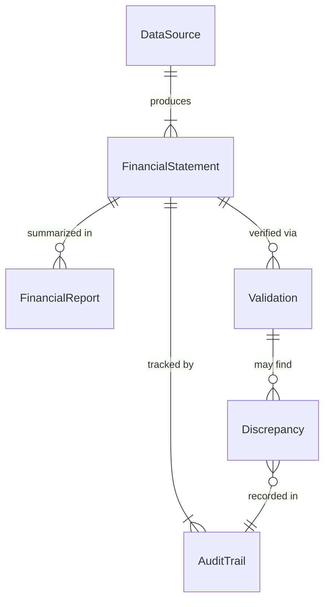
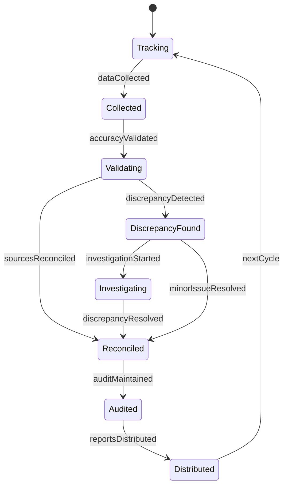
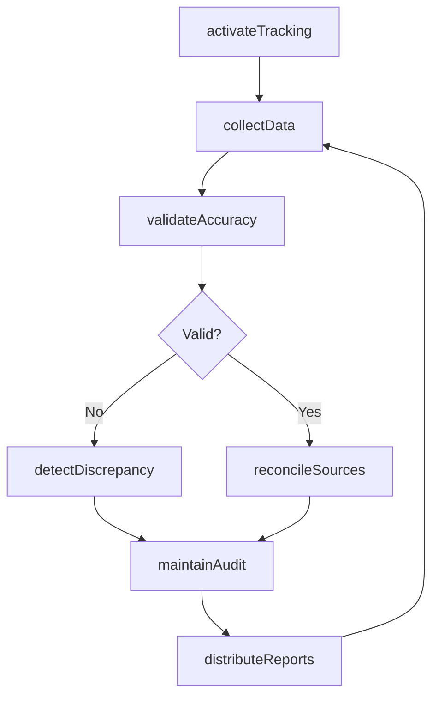
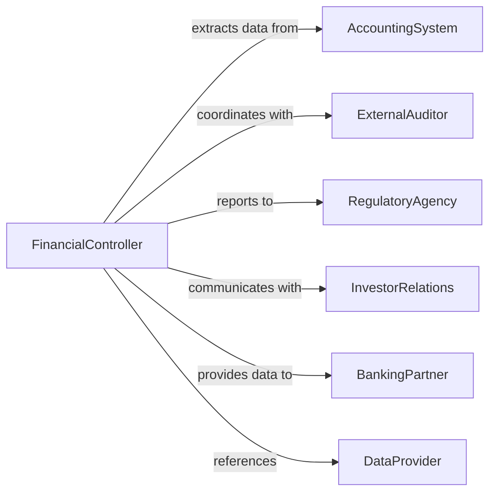

# Monitor Financial Information

> Business-as-Code definition for tracking financial data including statements, reports, budgets, and forecasts to ensure accuracy, timeliness, and informed decision-making.

## Overview

Financial information monitoring involves systematic review and validation of financial data sources, reports, and documentation to maintain data integrity and support strategic planning. This definition provides actions for information tracking and validation, events for automated alerting on data issues, and searches for retrieving financial information and audit trails.

## Actors

| Actor | Description |
|-------|-------------|
| AccountingSystem | Generates financial statements and transaction records |
| ExternalAuditor | Reviews and validates financial information accuracy |
| RegulatoryAgency | Requires submission of financial reports and disclosures |
| InvestorRelations | Communicates financial information to shareholders |
| BankingPartner | Receives financial information for credit and covenant monitoring |
| DataProvider | Supplies market data and comparative financial intelligence |

## Roles

| Role | Description |
|------|-------------|
| FinancialController | Oversees financial reporting and data accuracy |
| AccountingManager | Manages financial information systems and processes |
| ComplianceOfficer | Ensures financial reporting meets regulatory requirements |
| DataAnalyst | Validates financial data and investigates discrepancies |

## Entities

| Entity | Description |
|--------|-------------|
| FinancialStatement | Formal record such as balance sheet or income statement |
| FinancialReport | Structured summary of financial performance or position |
| DataSource | System or repository providing financial information |
| Validation | Process confirming accuracy and completeness of data |
| Discrepancy | Inconsistency or error in financial information |
| AuditTrail | Record of changes to financial data over time |

## Actions

| Action | Description |
|--------|-------------|
| activateTracking | Begin monitoring financial information sources |
| collectData | Gather financial information from multiple systems |
| validateAccuracy | Confirm correctness and completeness of financial data |
| reconcileSources | Match information across different data repositories |
| detectDiscrepancy | Identify inconsistencies or errors in financial data |
| maintainAudit | Record changes and access to financial information |
| distributeReports | Deliver financial information to authorized stakeholders |

## Events

| Event | Description |
|-------|-------------|
| trackingActivated | Financial information monitoring has been initiated |
| dataCollected | Financial information has been gathered from sources |
| accuracyValidated | Data correctness and completeness has been confirmed |
| sourcesReconciled | Information matching across repositories is complete |
| discrepancyDetected | Inconsistency or error has been identified |
| auditMaintained | Data change record has been updated |
| reportsDistributed | Financial information has been delivered to stakeholders |

## Searches

| Search | Description |
|--------|-------------|
| findStatements | List financial statements by type, period, or entity |
| getReports | Retrieve financial reports by category or date |
| getDiscrepancies | Find identified errors or inconsistencies |
| getAuditTrails | Retrieve change records for financial data |

## Entity Relationships



## State Diagram



## Workflow



## Actor Relationships



## Usage

### Calling Actions

```typescript
import { monitorFinancialInformation } from '@headlessly/monitor-financial-information'

const monitor = monitorFinancialInformation()

// Activate tracking for financial information sources
await monitor.activateTracking({
  sources: ['general-ledger', 'accounts-payable', 'accounts-receivable', 'payroll'],
  validationFrequency: 'daily',
  auditLogging: 'all-changes'
})

// Collect and validate financial data
const data = await monitor.collectData({
  sources: ['general-ledger'],
  period: '2026-01',
  accounts: 'all'
})

const validation = await monitor.validateAccuracy({
  data,
  rules: ['balance-check', 'period-consistency', 'account-mapping']
})
```

### Event-Driven Automation

```typescript
// Investigate discrepancies immediately
monitor.discrepancyDetected(async ({ sourceId, discrepancyType, amount }) => {
  if (Math.abs(amount) > 10000) {
    await notify({
      to: 'accounting-manager',
      message: `Financial discrepancy: ${discrepancyType} of ${amount}`,
      urgency: 'high'
    })
  }
})

// Auto-distribute reports on schedule
monitor.sourcesReconciled(async ({ period }) => {
  if (isMonthEnd(period)) {
    await monitor.distributeReports({
      period,
      reports: ['balance-sheet', 'income-statement', 'cash-flow'],
      recipients: ['executive-team', 'board-of-directors']
    })
  }
})
```
