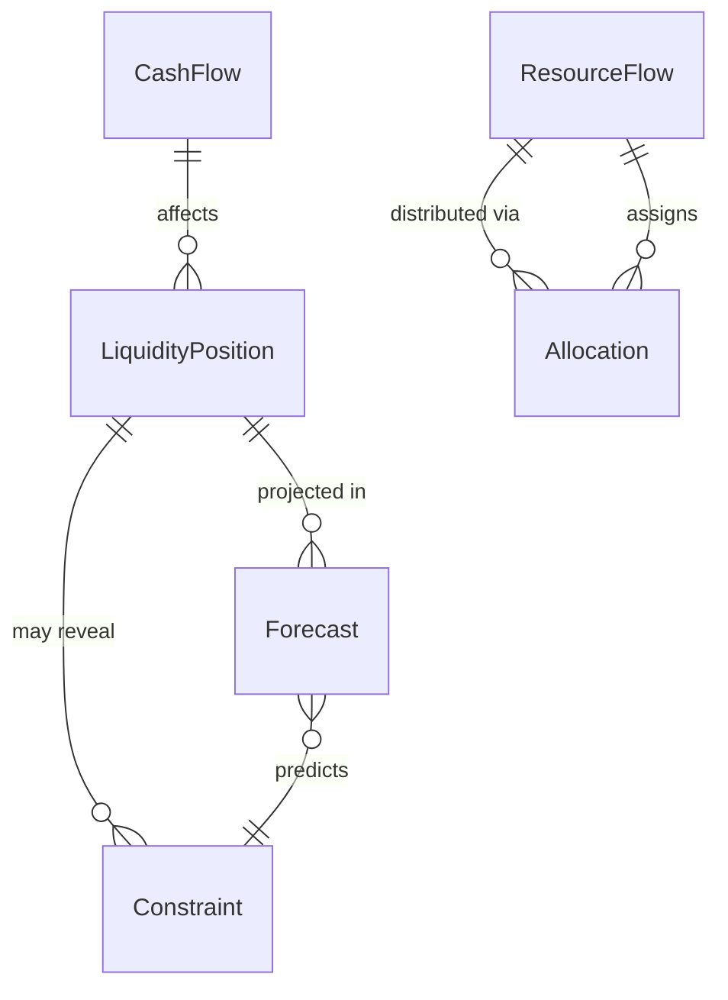
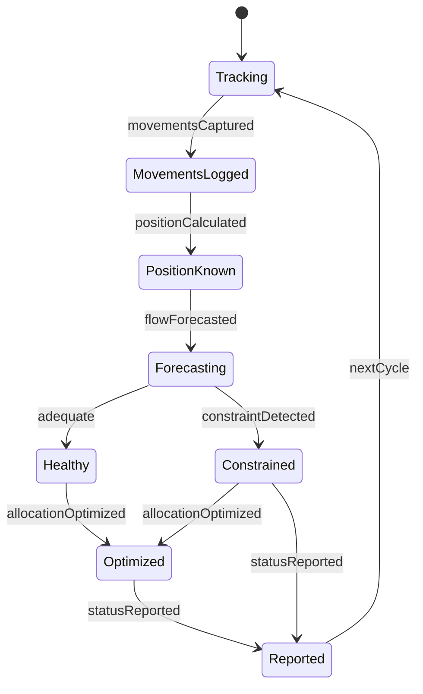
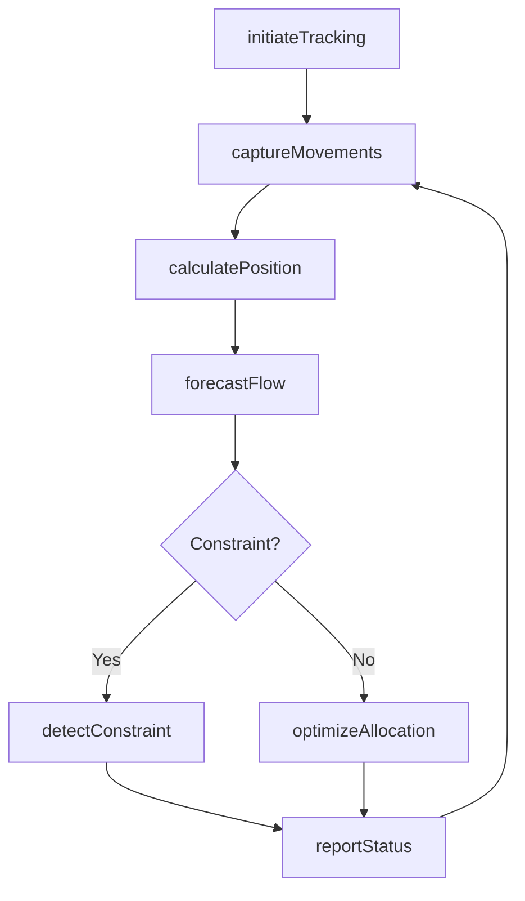
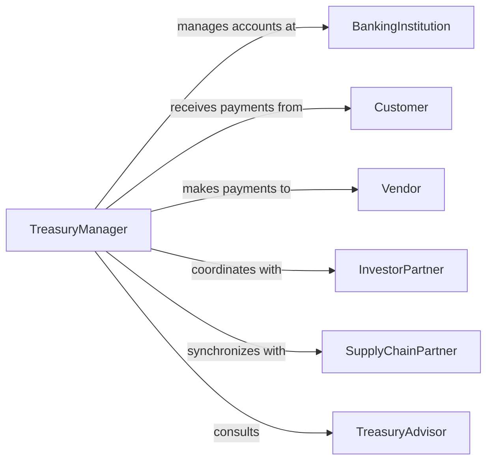

# Monitor Flow Cash Resources

> Business-as-Code definition for tracking the movement of cash, inventory, equipment, and other resources to ensure liquidity, operational efficiency, and resource optimization.

## Overview

Cash and resource flow monitoring involves real-time observation of inflows and outflows across accounts, facilities, and operational units to maintain adequate liquidity and resource availability. This definition provides actions for flow tracking and forecasting, events for automated alerting on constraints, and searches for retrieving flow data and projections.

## Actors

| Actor | Description |
|-------|-------------|
| BankingInstitution | Holds cash accounts and processes transactions |
| Customer | Provides cash inflows through payments |
| Vendor | Receives cash outflows for goods and services |
| InvestorPartner | Supplies capital or financing |
| SupplyChainPartner | Coordinates resource flows for operations |
| TreasuryAdvisor | Provides expertise on cash management strategies |

## Roles

| Role | Description |
|------|-------------|
| TreasuryManager | Oversees cash positions and resource allocation |
| CashFlowAnalyst | Forecasts cash movements and liquidity needs |
| OperationsPlanner | Coordinates resource flows to support production |
| ControllerDirector | Manages overall financial resource optimization |

## Entities

| Entity | Description |
|--------|-------------|
| CashFlow | Movement of cash into or out of accounts |
| ResourceFlow | Movement of inventory, equipment, or materials |
| LiquidityPosition | Current cash and near-cash asset availability |
| Forecast | Projection of future cash or resource movements |
| Constraint | Limitation in cash or resource availability |
| Allocation | Assignment of resources to specific uses or locations |

## Actions

| Action | Description |
|--------|-------------|
| initiateTracking | Begin monitoring cash and resource flows |
| captureMovements | Record individual cash or resource transactions |
| calculatePosition | Determine current liquidity and resource availability |
| forecastFlow | Project future cash or resource movements |
| detectConstraint | Identify shortfalls in cash or resource availability |
| optimizeAllocation | Adjust resource distribution for efficiency |
| reportStatus | Communicate current flow and position to stakeholders |

## Events

| Event | Description |
|-------|-------------|
| trackingInitiated | Cash and resource flow monitoring has been activated |
| movementsCaptured | Individual transactions have been recorded |
| positionCalculated | Current liquidity and availability has been determined |
| flowForecasted | Future movement projection is complete |
| constraintDetected | Shortfall in cash or resource availability identified |
| allocationOptimized | Resource distribution has been adjusted |
| statusReported | Flow and position information has been communicated |

## Searches

| Search | Description |
|--------|-------------|
| findFlows | List cash or resource movements by type, date, or account |
| getPositions | Retrieve current liquidity or resource availability |
| getForecasts | Find projections of future cash or resource flows |
| getConstraints | Retrieve identified shortfalls or limitations |

## Entity Relationships



## State Diagram



## Workflow



## Actor Relationships



## Usage

### Calling Actions

```typescript
import { monitorFlowCashResources } from '@headlessly/monitor-flow-cash-resources'

const monitor = monitorFlowCashResources()

// Initiate tracking for cash and inventory flows
await monitor.initiateTracking({
  resourceTypes: ['cash', 'raw-materials', 'finished-goods'],
  accounts: ['operating-account', 'payroll-account'],
  facilities: ['warehouse-east', 'warehouse-west'],
  captureInterval: 300000 // ms
})

// Capture movements and calculate position
const movements = await monitor.captureMovements({
  resourceType: 'cash',
  timeframe: 'today'
})

const position = await monitor.calculatePosition({
  resourceType: 'cash',
  includeCommitments: true
})

const forecast = await monitor.forecastFlow({
  resourceType: 'cash',
  horizon: '30-days',
  includeSeasonality: true
})
```

### Event-Driven Automation

```typescript
// Alert on liquidity constraints
monitor.constraintDetected(async ({ resourceType, shortfall, timeframe }) => {
  if (resourceType === 'cash' && shortfall > 100000) {
    await notify({
      to: 'treasury-team',
      message: `Cash constraint: ${shortfall} shortfall in ${timeframe}`,
      urgency: 'critical'
    })
  }
})

// Optimize allocation when position improves
monitor.positionCalculated(async ({ resourceType, availability }) => {
  if (resourceType === 'finished-goods' && availability > 1.5) {
    await monitor.optimizeAllocation({
      resourceType,
      strategy: 'redistribute-to-high-demand-regions'
    })
  }
})
```
