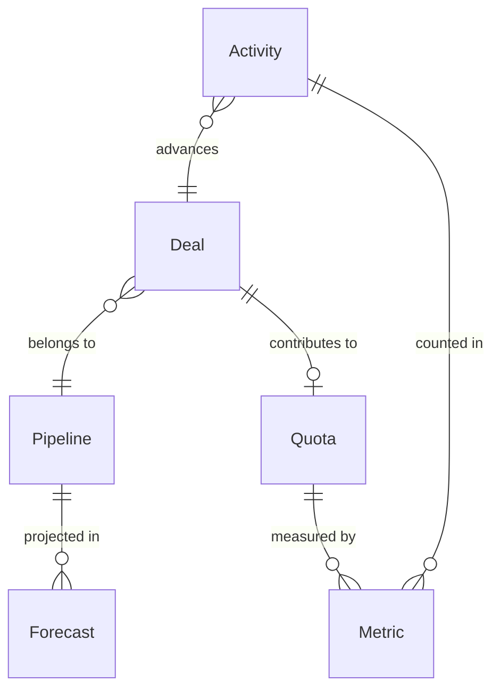
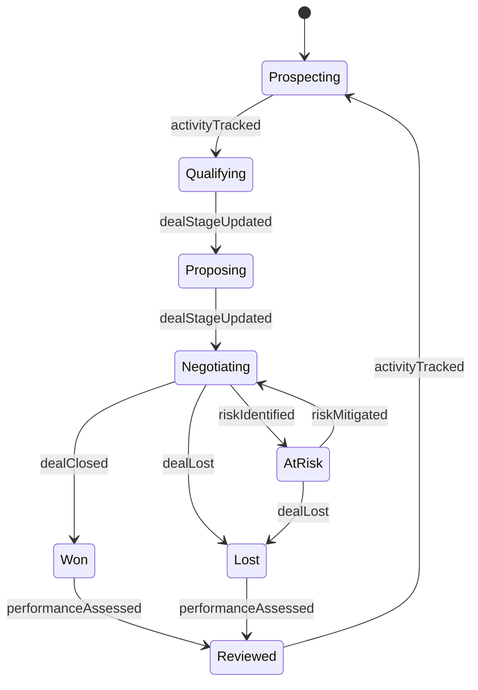
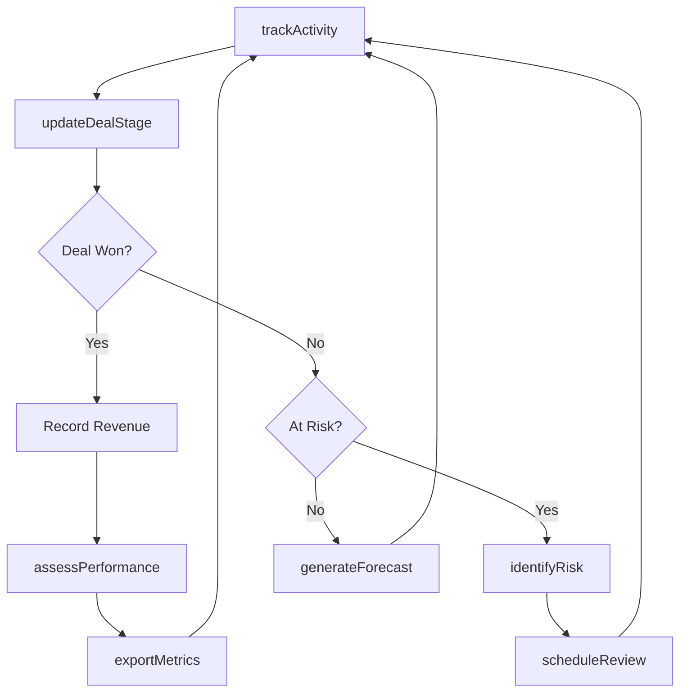
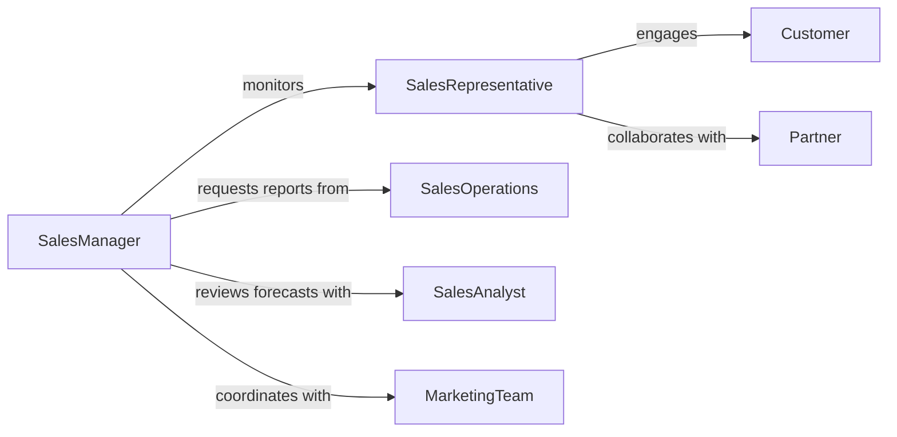

# Monitor Sales Activities

> Business-as-Code definition for sales activity monitoring. Tracks sales team performance, pipeline progression, and revenue generation in real-time.

## Overview

Sales activity monitoring involves tracking sales representative performance, deal progression, customer engagement, and revenue metrics. This definition provides actions for recording sales activities, events for pipeline automation, and searches for performance analysis. Organizations use this to ensure sales targets are met, identify coaching opportunities, and optimize sales processes.

## Actors

| Actor | Description |
|-------|-------------|
| SalesRepresentative | Executes sales activities and engages prospects |
| Customer | Engages with sales team and makes purchase decisions |
| SalesManager | Oversees team performance and provides coaching |
| MarketingTeam | Generates leads and supports sales enablement |
| FinanceTeam | Processes orders and tracks revenue recognition |
| Partner | Provides referrals or co-selling arrangements |

## Roles

| Role | Description |
|------|-------------|
| SalesOperations | Manages CRM systems and sales reporting |
| SalesAnalyst | Analyzes performance data and forecasts |
| TerritoryManager | Assigns accounts and manages territory coverage |
| Coach | Provides training and performance feedback |

## Entities

| Entity | Description |
|--------|-------------|
| Activity | A sales action such as call, email, or meeting |
| Deal | An opportunity in the sales pipeline |
| Quota | Sales target assigned to a representative |
| Forecast | Projected revenue for a period |
| Pipeline | Collection of deals in various stages |
| Metric | Quantitative measure of sales performance |

## Actions

| Action | Description |
|--------|-------------|
| trackActivity | Record a sales activity with details |
| updateDealStage | Move a deal to a new pipeline stage |
| assessPerformance | Evaluate rep performance against quota |
| generateForecast | Project revenue based on pipeline |
| identifyRisk | Flag deals at risk of being lost |
| scheduleReview | Set up coaching or performance review |
| exportMetrics | Generate performance reports and dashboards |

## Events

| Event | Description |
|-------|-------------|
| activityTracked | A sales activity has been logged |
| dealStageUpdated | A deal has moved to a new stage |
| performanceAssessed | Performance evaluation is complete |
| forecastGenerated | Revenue projection has been created |
| riskIdentified | A deal has been flagged as at-risk |
| quotaMissed | Sales target was not achieved |
| reviewScheduled | Performance review has been scheduled |

## Searches

| Search | Description |
|--------|-------------|
| findActivities | List sales activities by rep, type, or date |
| getPerformance | Retrieve performance metrics by rep or team |
| getPipeline | View current pipeline by stage or rep |
| getForecast | Get revenue forecast for a period |

## Entity Relationships



## State Diagram



## Workflow



## Actor Relationships



## Usage

### Calling Actions

```typescript
import { monitorSalesActivities } from '@headlessly/monitor-sales-activities'

const sales = monitorSalesActivities()

// Track a sales call
await sales.trackActivity({
  repId: 'rep-456',
  type: 'phone-call',
  dealId: 'deal-789',
  duration: 30,
  notes: 'Discussed pricing and implementation timeline'
})

// Update deal stage
await sales.updateDealStage({
  dealId: 'deal-789',
  stage: 'negotiation',
  probability: 75
})

// Assess quarterly performance
const performance = await sales.assessPerformance({
  repId: 'rep-456',
  period: 'Q1-2026'
})
```

### Event-Driven Automation

```typescript
// Alert manager when quota is missed
sales.quotaMissed(async ({ repId, period, quota, actual }) => {
  await sales.scheduleReview({
    repId,
    managerId: await getManager(repId),
    reason: 'quota-miss',
    urgency: 'high'
  })
})

// Auto-forecast on stage change
sales.dealStageUpdated(async ({ dealId }) => {
  const pipeline = await sales.getPipeline({ repId: deal.repId })
  await sales.generateForecast({ pipeline })
})
```
