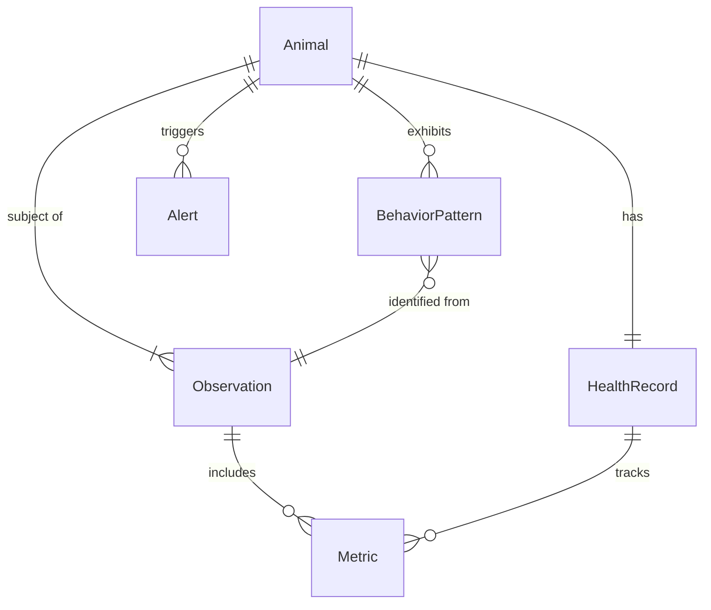
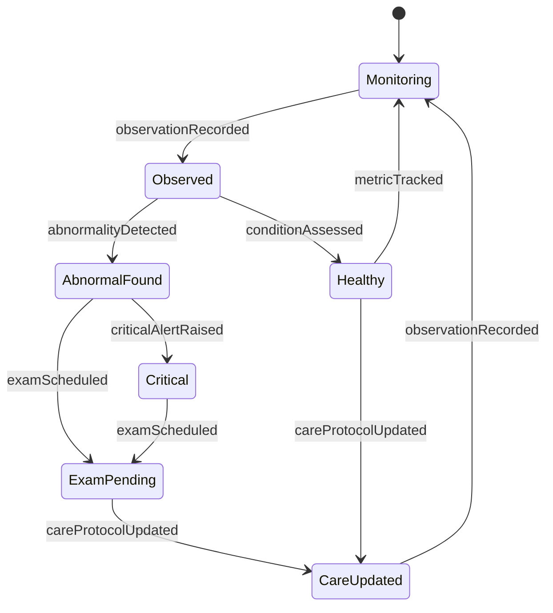
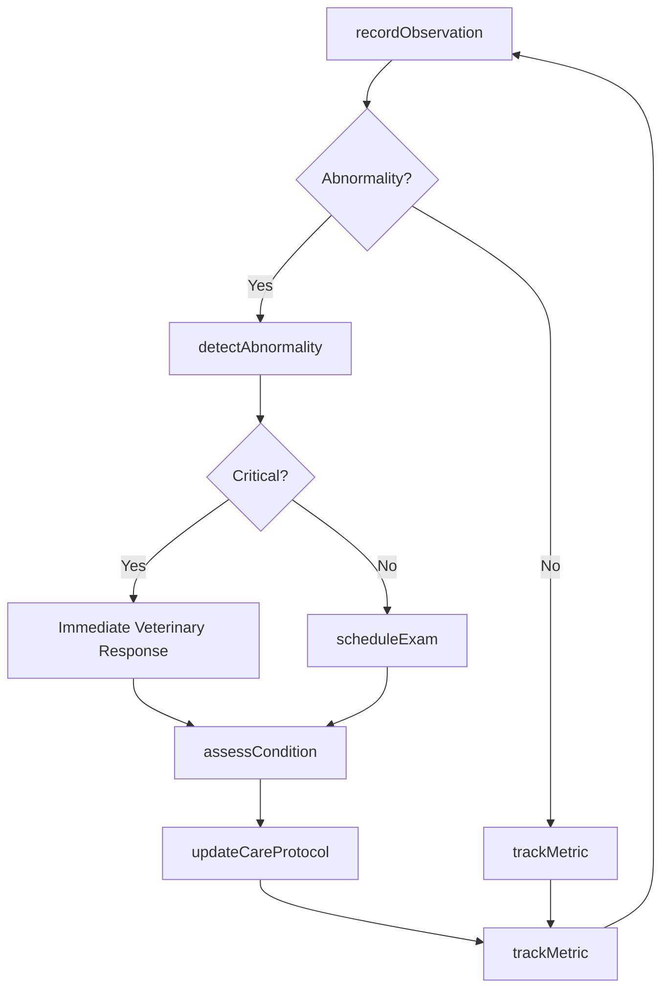
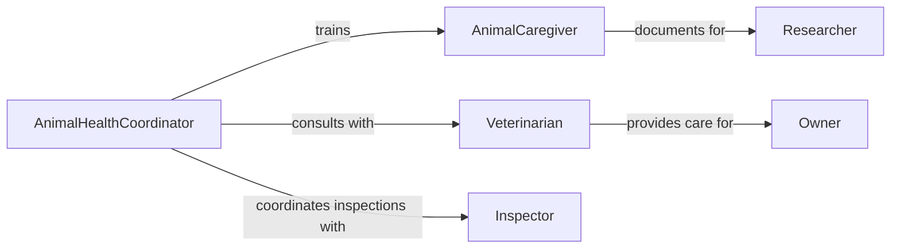

# Monitor Animal Behavior Condition

> Business-as-Code definition for animal behavior and condition monitoring. Tracks health indicators, behavioral patterns, and environmental factors for animals in care facilities, farms, or research settings.

## Overview

Animal behavior and condition monitoring involves systematic observation of animals to detect health issues, assess welfare, and ensure proper care. This definition provides actions for recording observations, events for alert automation, and searches for trend analysis. Used in veterinary clinics, animal shelters, farms, zoos, and research laboratories to maintain animal health and wellbeing.

## Actors

| Actor | Description |
|-------|-------------|
| Veterinarian | Diagnoses health issues and prescribes treatment |
| AnimalCaregiver | Provides daily care and documents observations |
| Owner | Makes care decisions and provides history |
| Researcher | Studies animal behavior for scientific purposes |
| Inspector | Audits facility compliance with animal welfare standards |
| Supplier | Provides feed, medication, and care supplies |

## Roles

| Role | Description |
|------|-------------|
| AnimalHealthCoordinator | Oversees monitoring programs and protocols |
| ObservationSpecialist | Trains staff on observation techniques |
| WelfareOfficer | Ensures compliance with animal welfare regulations |
| DataAnalyst | Analyzes behavioral and health trends |

## Entities

| Entity | Description |
|--------|-------------|
| Animal | Individual animal being monitored |
| Observation | Recorded behavior or condition assessment |
| HealthRecord | Medical history and treatment log |
| BehaviorPattern | Typical or abnormal behavioral indicators |
| Alert | Notification for condition requiring attention |
| Metric | Quantitative health or behavior measurement |

## Actions

| Action | Description |
|--------|-------------|
| recordObservation | Log a behavioral or physical observation |
| assessCondition | Evaluate overall animal health status |
| detectAbnormality | Identify deviations from normal behavior |
| scheduleExam | Arrange veterinary examination |
| updateCareProtocol | Modify feeding, housing, or treatment plan |
| trackMetric | Record quantitative measurements over time |
| generateReport | Create health and welfare summary |

## Events

| Event | Description |
|-------|-------------|
| observationRecorded | New observation has been documented |
| conditionAssessed | Health status evaluation is complete |
| abnormalityDetected | Abnormal behavior or condition identified |
| examScheduled | Veterinary examination has been arranged |
| careProtocolUpdated | Care plan has been modified |
| metricTracked | New measurement has been recorded |
| criticalAlertRaised | Urgent condition requires immediate attention |

## Searches

| Search | Description |
|--------|-------------|
| findAnimals | List animals by species, location, or status |
| getObservations | Retrieve observation history for an animal |
| getAlerts | Find active alerts by severity or type |
| getTrends | View health or behavior trends over time |

## Entity Relationships



## State Diagram



## Workflow



## Actor Relationships



## Usage

### Calling Actions

```typescript
import { monitorAnimalBehaviorCondition } from '@headlessly/monitor-animal-behavior-condition'

const monitoring = monitorAnimalBehaviorCondition()

// Record daily observation
await monitoring.recordObservation({
  animalId: 'dog-123',
  observer: 'caregiver-45',
  type: 'behavioral',
  notes: 'Reduced appetite, lethargic behavior noted',
  severity: 'moderate'
})

// Assess overall condition
const assessment = await monitoring.assessCondition({
  animalId: 'dog-123',
  includeHistory: true
})

// Track weight metric
await monitoring.trackMetric({
  animalId: 'dog-123',
  metric: 'weight',
  value: 28.5,
  unit: 'kg'
})
```

### Event-Driven Automation

```typescript
// Auto-schedule exam for abnormalities
monitoring.abnormalityDetected(async ({ animalId, severity }) => {
  if (severity === 'high' || severity === 'critical') {
    await monitoring.scheduleExam({
      animalId,
      priority: severity,
      requestedDate: new Date()
    })
  }
})

// Alert coordinator for critical conditions
monitoring.criticalAlertRaised(async ({ animalId, condition }) => {
  await notify({
    to: 'animal-health-coordinator',
    message: `Critical condition for ${animalId}: ${condition}`,
    channel: 'sms'
  })
})
```
