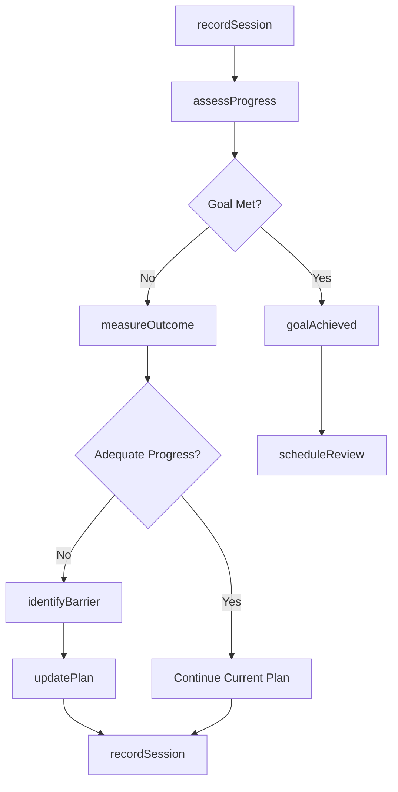
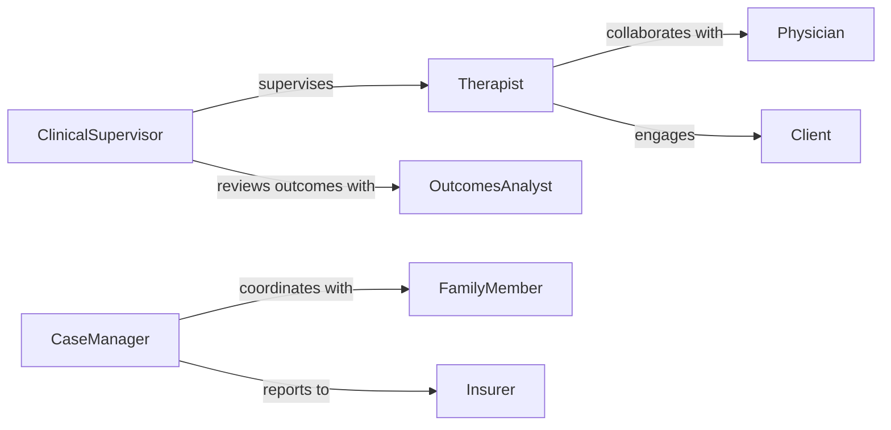

# Monitor Clients Evaluate Treatment Progress

> Business-as-Code definition for client treatment progress monitoring. Tracks therapeutic outcomes, adherence to treatment plans, and adjusts interventions based on measurable progress in clinical and therapeutic settings.

## Overview

Client treatment progress monitoring involves systematic evaluation of therapy outcomes, behavioral changes, and goal attainment for individuals receiving therapeutic services. This definition provides actions for tracking progress, events for intervention adjustments, and searches for outcomes analysis. Used in mental health clinics, physical therapy, substance abuse programs, and rehabilitation facilities to ensure effective treatment delivery.

## Actors

| Actor | Description |
|-------|-------------|
| Client | Receives treatment and participates in therapy |
| Therapist | Delivers treatment and evaluates progress |
| Physician | Prescribes medication and reviews medical status |
| CaseManager | Coordinates services and resources |
| FamilyMember | Provides support and collateral information |
| Insurer | Reviews progress for coverage authorization |

## Roles

| Role | Description |
|------|-------------|
| ClinicalSupervisor | Oversees treatment quality and outcomes |
| OutcomesAnalyst | Analyzes treatment effectiveness data |
| CareCoordinator | Manages transitions and referrals |
| PeerSupport | Provides lived experience perspective |

## Entities

| Entity | Description |
|--------|-------------|
| TreatmentPlan | Structured goals and interventions |
| ProgressNote | Documented session outcomes and observations |
| Assessment | Standardized evaluation of client status |
| Goal | Specific, measurable treatment objective |
| Intervention | Therapeutic technique or activity |
| Outcome | Measured result of treatment |

## Actions

| Action | Description |
|--------|-------------|
| recordSession | Document therapy session and observations |
| assessProgress | Evaluate goal attainment and status |
| updatePlan | Modify treatment approach based on progress |
| measureOutcome | Administer standardized assessment tools |
| identifyBarrier | Detect obstacles to treatment success |
| scheduleReview | Arrange progress review meeting |
| generateReport | Create summary for stakeholders |

## Events

| Event | Description |
|-------|-------------|
| sessionRecorded | Therapy session has been documented |
| progressAssessed | Progress evaluation is complete |
| planUpdated | Treatment plan has been modified |
| outcomeMeasured | Assessment results are available |
| barrierIdentified | Treatment obstacle has been detected |
| goalAchieved | Client has met a treatment objective |
| reviewScheduled | Progress review has been arranged |

## Searches

| Search | Description |
|--------|-------------|
| findClients | List clients by program, status, or therapist |
| getProgress | Retrieve progress history for a client |
| getOutcomes | View assessment results over time |
| getBarriers | Find common obstacles to treatment success |

## Workflow



## Actor Relationships



## Usage

### Calling Actions

```typescript
import { monitorClientsEvaluateTreatmentProgress } from '@headlessly/monitor-clients-evaluate-treatment-progress'

const progress = monitorClientsEvaluateTreatmentProgress()

// Record therapy session
await progress.recordSession({
  clientId: 'client-789',
  therapistId: 'therapist-45',
  duration: 50,
  interventions: ['CBT', 'exposure-therapy'],
  notes: 'Client demonstrated improved coping skills'
})

// Assess progress on goals
const assessment = await progress.assessProgress({
  clientId: 'client-789',
  period: 'monthly'
})

// Measure outcome with standardized tool
await progress.measureOutcome({
  clientId: 'client-789',
  instrument: 'PHQ-9',
  score: 8,
  interpretation: 'mild-depression'
})
```

### Event-Driven Automation

```typescript
// Update plan when barrier identified
progress.barrierIdentified(async ({ clientId, barrier }) => {
  await progress.updatePlan({
    clientId,
    modifications: [
      { type: 'add-intervention', value: getBarrierIntervention(barrier) }
    ]
  })
})

// Schedule review when goal achieved
progress.goalAchieved(async ({ clientId, goalId }) => {
  const remainingGoals = await progress.getProgress({ clientId })
  if (remainingGoals.length === 0) {
    await progress.scheduleReview({
      clientId,
      type: 'discharge-planning'
    })
  }
})
```
