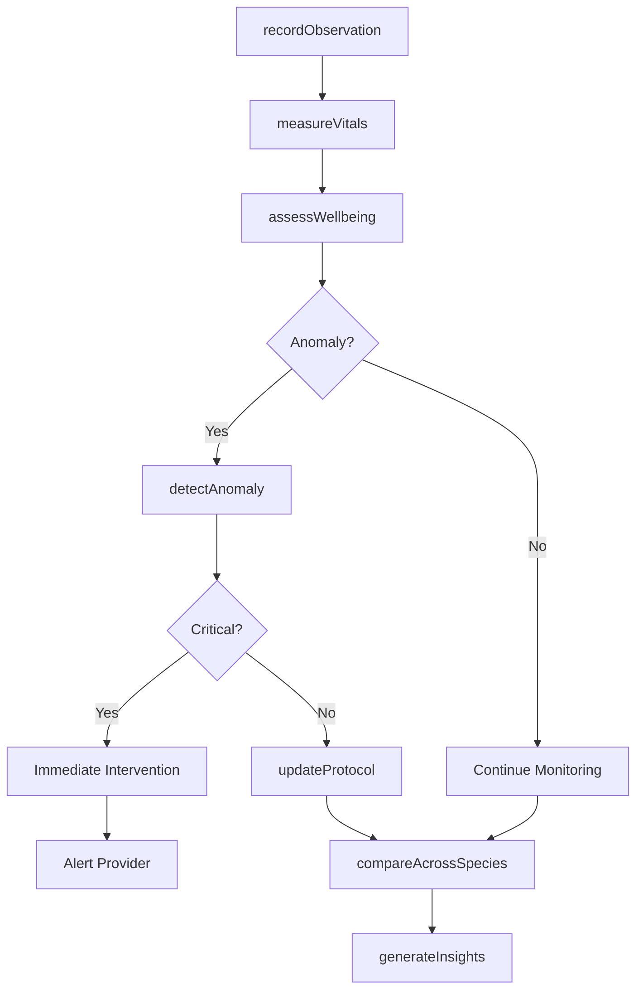
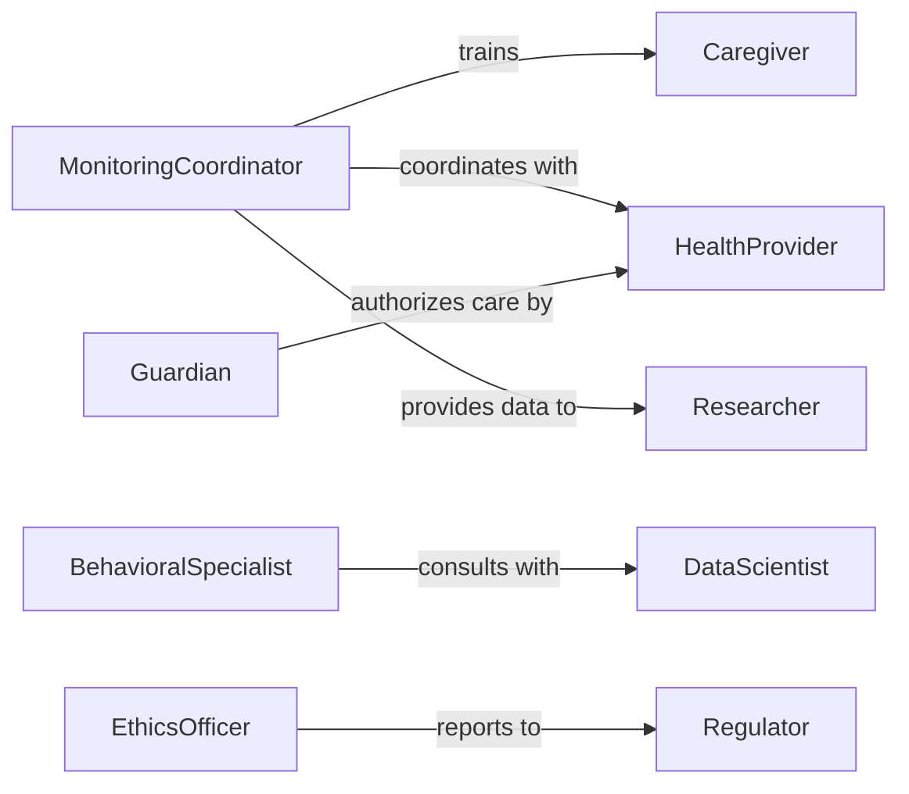

# Monitor Health Behavior People Animals

> Business-as-Code definition for health and behavior monitoring of people or animals. Provides unified tracking across species for research, care facilities, and wellness programs focused on behavioral health outcomes.

## Overview

Health and behavior monitoring for people and animals involves systematic observation, data collection, and analysis to detect changes in physical condition or behavioral patterns. This definition provides actions for multi-species monitoring, events for cross-domain alerts, and searches for comparative analysis. Used in comparative psychology research, One Health initiatives, behavioral health programs, and facilities that serve both human and animal populations.

## Actors

| Actor | Description |
|-------|-------------|
| HealthProvider | Delivers medical care and monitors health status |
| Subject | Individual person or animal being monitored |
| Researcher | Studies health and behavioral patterns |
| Caregiver | Provides daily care and documents observations |
| Guardian | Makes care decisions and provides consent |
| Regulator | Ensures compliance with ethical and welfare standards |

## Roles

| Role | Description |
|------|-------------|
| MonitoringCoordinator | Oversees observation protocols and data quality |
| BehavioralSpecialist | Interprets behavioral patterns and anomalies |
| DataScientist | Analyzes trends and develops predictive models |
| EthicsOfficer | Ensures ethical treatment and welfare compliance |

## Entities

| Entity | Description |
|--------|-------------|
| Subject | Individual being monitored with species classification |
| Observation | Recorded behavioral or health indicator |
| HealthMetric | Quantitative measurement of physical condition |
| BehaviorPattern | Documented sequence of actions or states |
| Alert | Notification of concerning condition or trend |
| StudyProtocol | Structured monitoring plan with objectives |

## Actions

| Action | Description |
|--------|-------------|
| recordObservation | Log behavioral or health observation |
| measureVitals | Capture physiological measurements |
| assessWellbeing | Evaluate overall health and welfare status |
| detectAnomaly | Identify deviations from normal patterns |
| compareAcrossSpecies | Analyze behavioral similarities or differences |
| updateProtocol | Modify monitoring procedures based on findings |
| generateInsights | Create analytical reports and predictions |

## Events

| Event | Description |
|-------|-------------|
| observationRecorded | New observation has been documented |
| vitalsMeasured | Physiological data has been captured |
| wellbeingAssessed | Health evaluation is complete |
| anomalyDetected | Abnormal pattern or condition identified |
| comparisonCompleted | Cross-species analysis has finished |
| protocolUpdated | Monitoring procedures have been modified |
| criticalConditionRaised | Urgent health or welfare concern detected |

## Searches

| Search | Description |
|--------|-------------|
| findSubjects | List monitored individuals by species or status |
| getObservations | Retrieve observation history for a subject |
| getTrends | View health or behavior trends over time |
| comparePatterns | Analyze behavioral patterns across subjects |

## Workflow



## Actor Relationships



## Usage

### Calling Actions

```typescript
import { monitorHealthBehaviorPeopleAnimals } from '@headlessly/monitor-health-behavior-people-animals'

const monitoring = monitorHealthBehaviorPeopleAnimals()

// Record observation for human subject
await monitoring.recordObservation({
  subjectId: 'human-456',
  species: 'human',
  type: 'behavioral',
  observation: 'Increased social engagement during group activity',
  context: 'therapy-session'
})

// Measure vitals for animal subject
await monitoring.measureVitals({
  subjectId: 'dog-789',
  species: 'canine',
  vitals: {
    heartRate: 85,
    temperature: 38.5,
    respiratoryRate: 22
  }
})

// Compare behavioral patterns across species
const comparison = await monitoring.compareAcrossSpecies({
  behavior: 'stress-response',
  species: ['human', 'canine', 'equine']
})
```

### Event-Driven Automation

```typescript
// Alert on critical condition regardless of species
monitoring.criticalConditionRaised(async ({ subjectId, species, condition }) => {
  await notify({
    to: await getProviderForSpecies(species),
    message: `Critical condition for ${species} subject ${subjectId}: ${condition}`,
    urgency: 'immediate'
  })
})

// Update protocol when anomalies detected across multiple subjects
monitoring.anomalyDetected(async ({ subjectId, pattern }) => {
  const similarAnomalies = await monitoring.getObservations({
    pattern,
    timeframe: 'week'
  })
  if (similarAnomalies.length > 3) {
    await monitoring.updateProtocol({
      change: 'increase-monitoring-frequency',
      reason: 'cluster-detected'
    })
  }
})
```
