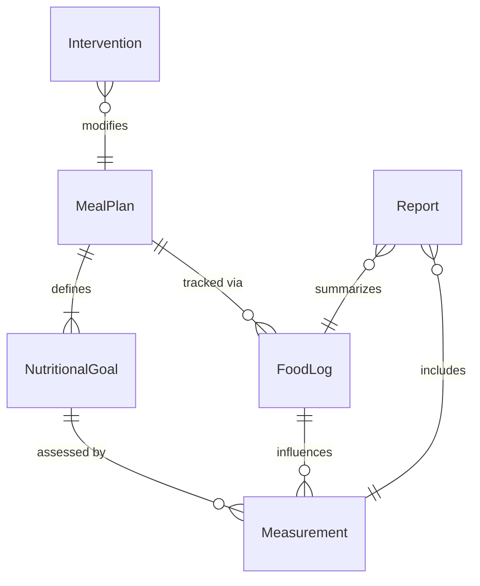
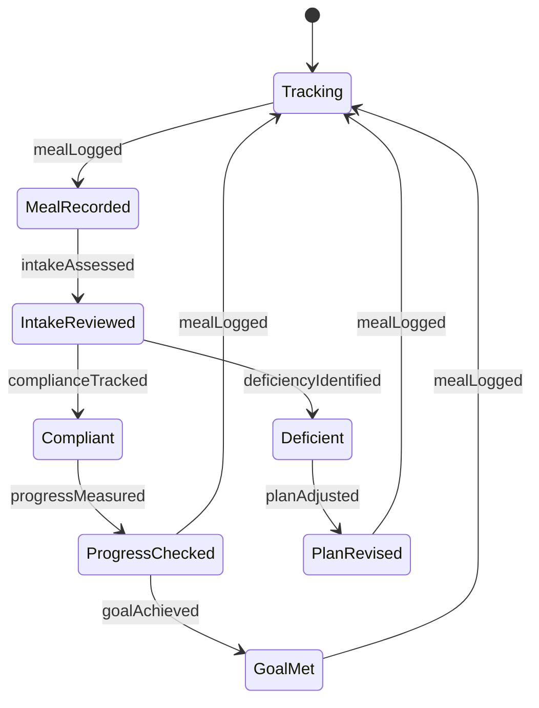
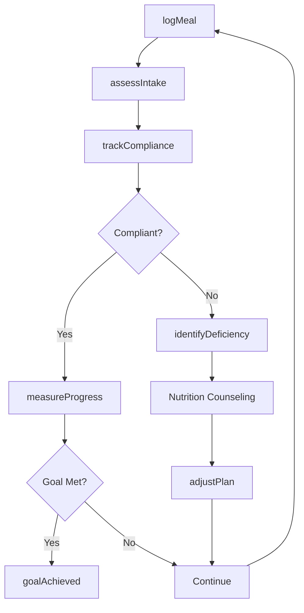
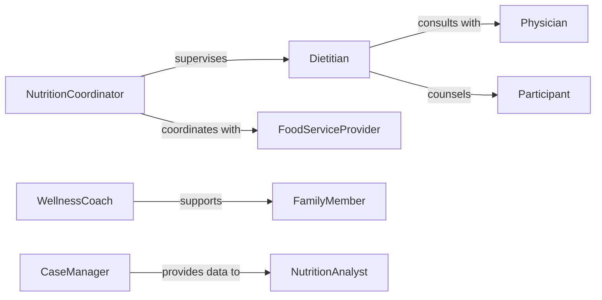

# Monitor Nutrition Related Activities Individuals

> Business-as-Code definition for nutrition activity monitoring. Tracks dietary intake, meal compliance, and nutritional status for individuals or groups in clinical, educational, or wellness settings.

## Overview

Nutrition activity monitoring involves tracking food consumption, dietary adherence, and nutritional outcomes for individuals receiving nutrition counseling, medical nutrition therapy, or participating in wellness programs. This definition provides actions for meal tracking, events for intervention triggers, and searches for dietary analysis. Used in hospitals, nursing homes, schools, wellness programs, and eating disorder treatment facilities.

## Actors

| Actor | Description |
|-------|-------------|
| Participant | Individual whose nutrition is being monitored |
| Dietitian | Provides nutrition counseling and meal planning |
| Physician | Prescribes medical nutrition therapy |
| FoodServiceProvider | Prepares and delivers meals |
| FamilyMember | Supports adherence and provides collateral information |
| CaseManager | Coordinates services and resources |

## Roles

| Role | Description |
|------|-------------|
| NutritionCoordinator | Oversees monitoring programs and compliance |
| NutritionAnalyst | Analyzes dietary data and identifies trends |
| MenuPlanner | Designs meals meeting nutritional requirements |
| WellnessCoach | Provides behavioral support for healthy eating |

## Entities

| Entity | Description |
|--------|-------------|
| MealPlan | Prescribed dietary requirements and schedule |
| FoodLog | Record of consumed foods and beverages |
| NutritionalGoal | Target intake levels for nutrients |
| Measurement | Weight, BMI, or other physical indicators |
| Intervention | Nutritional counseling or therapy session |
| Report | Summary of dietary compliance and outcomes |

## Actions

| Action | Description |
|--------|-------------|
| logMeal | Record food and beverage consumption |
| assessIntake | Evaluate nutritional adequacy of diet |
| trackCompliance | Monitor adherence to meal plan |
| measureProgress | Record weight and other physical metrics |
| identifyDeficiency | Detect inadequate nutrient intake |
| adjustPlan | Modify meal plan based on outcomes |
| generateReport | Create nutrition summary for stakeholders |

## Events

| Event | Description |
|-------|-------------|
| mealLogged | Food intake has been recorded |
| intakeAssessed | Nutritional analysis is complete |
| complianceTracked | Adherence evaluation has been performed |
| progressMeasured | Physical measurement has been recorded |
| deficiencyIdentified | Inadequate nutrient intake detected |
| planAdjusted | Meal plan has been modified |
| goalAchieved | Nutritional target has been met |

## Searches

| Search | Description |
|--------|-------------|
| findParticipants | List individuals by program or status |
| getMealLogs | Retrieve food intake history |
| getCompliance | View adherence rates by individual or group |
| getTrends | Analyze nutritional outcomes over time |

## Entity Relationships



## State Diagram



## Workflow



## Actor Relationships



## Usage

### Calling Actions

```typescript
import { monitorNutritionRelatedActivitiesIndividuals } from '@headlessly/monitor-nutrition-related-activities-individuals'

const nutrition = monitorNutritionRelatedActivitiesIndividuals()

// Log breakfast meal
await nutrition.logMeal({
  participantId: 'participant-123',
  mealType: 'breakfast',
  items: [
    { food: 'oatmeal', portion: '1 cup', calories: 150 },
    { food: 'banana', portion: '1 medium', calories: 105 },
    { food: 'milk', portion: '8 oz', calories: 120 }
  ],
  timestamp: new Date()
})

// Assess weekly intake
const assessment = await nutrition.assessIntake({
  participantId: 'participant-123',
  period: 'week',
  targets: ['calories', 'protein', 'fiber']
})

// Track compliance with meal plan
const compliance = await nutrition.trackCompliance({
  participantId: 'participant-123',
  period: 'month'
})
```

### Event-Driven Automation

```typescript
// Schedule counseling when deficiency identified
nutrition.deficiencyIdentified(async ({ participantId, nutrient, severity }) => {
  if (severity === 'high') {
    await scheduleIntervention({
      participantId,
      type: 'nutrition-counseling',
      priority: 'urgent',
      focus: nutrient
    })
  }
})

// Adjust plan when compliance low
nutrition.complianceTracked(async ({ participantId, rate }) => {
  if (rate < 0.7) {
    await nutrition.adjustPlan({
      participantId,
      adjustments: ['simplify-requirements', 'add-flexibility']
    })
  }
})
```
