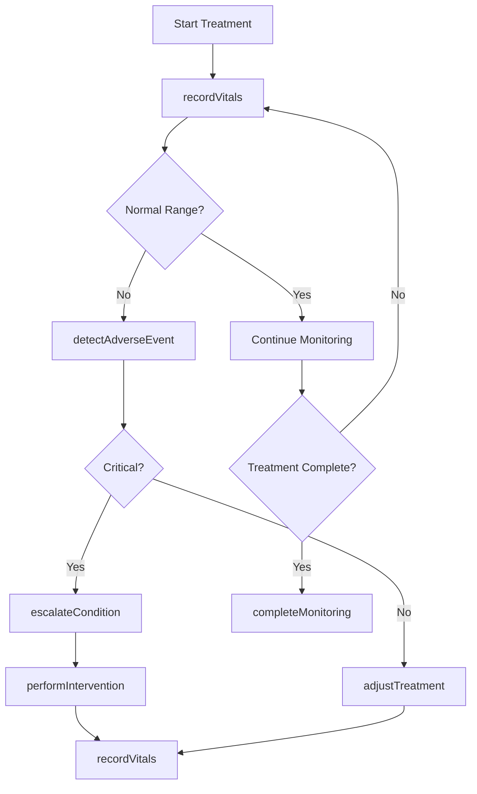
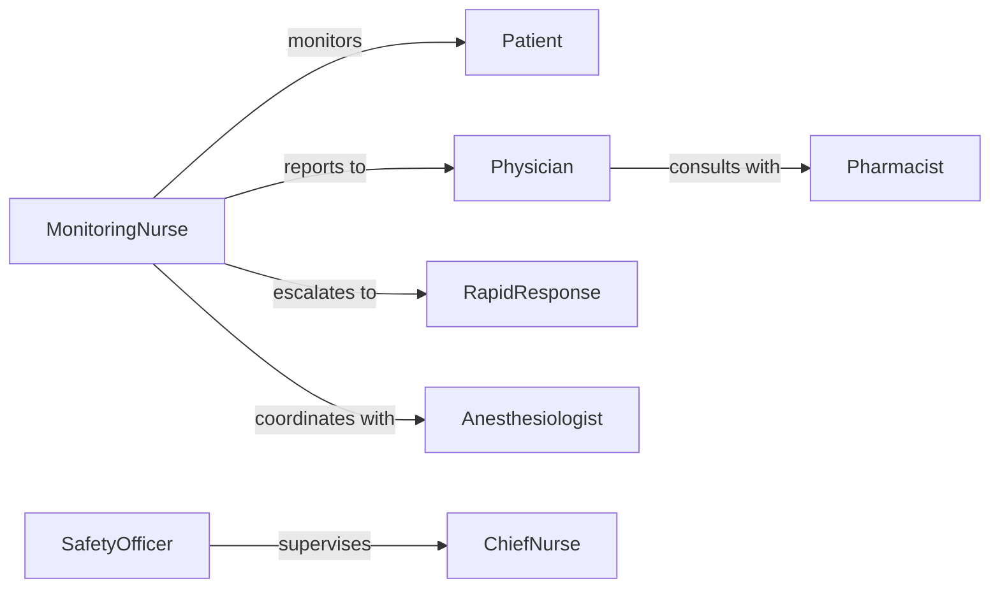

# Monitor Patient Conditions During Treatments

> Business-as-Code definition for real-time patient condition monitoring during active treatments. Tracks vital signs, adverse reactions, and treatment responses to ensure patient safety during procedures and therapies.

## Overview

Patient condition monitoring during treatments involves continuous or frequent observation of physiological indicators, symptoms, and responses while medical interventions are being administered. This definition provides actions for vital sign tracking, events for immediate response triggers, and searches for safety analysis. Used in operating rooms, intensive care units, infusion centers, dialysis facilities, and other treatment settings requiring active monitoring.

## Actors

| Actor | Description |
|-------|-------------|
| Patient | Receives treatment and is being monitored |
| Physician | Orders treatment and responds to complications |
| Nurse | Administers treatment and monitors continuously |
| Anesthesiologist | Manages sedation and monitors airway |
| Pharmacist | Reviews medication safety and interactions |
| EmergencyTeam | Responds to critical events during treatment |

## Roles

| Role | Description |
|------|-------------|
| MonitoringNurse | Dedicated to continuous patient observation |
| SafetyOfficer | Oversees treatment safety protocols |
| ChiefNurse | Manages nursing assignments and escalations |
| RapidResponse | Provides emergency interventions |

## Entities

| Entity | Description |
|--------|-------------|
| Treatment | Active medical intervention being administered |
| VitalSigns | Real-time physiological measurements |
| Observation | Documented patient status or symptom |
| Alert | Notification of concerning condition |
| Intervention | Action taken in response to condition change |
| Protocol | Standardized monitoring and response procedures |

## Actions

| Action | Description |
|--------|-------------|
| recordVitals | Capture real-time physiological measurements |
| documentSymptom | Log patient-reported or observed symptoms |
| detectAdverseEvent | Identify unexpected treatment reactions |
| escalateCondition | Alert senior staff or emergency team |
| adjustTreatment | Modify intervention based on patient response |
| performIntervention | Execute emergency or corrective action |
| completeMonitoring | Finalize monitoring when treatment ends |

## Events

| Event | Description |
|-------|-------------|
| vitalsRecorded | Physiological measurements have been captured |
| symptomDocumented | Patient symptom has been logged |
| adverseEventDetected | Unexpected reaction has been identified |
| conditionEscalated | Senior staff or emergency team has been alerted |
| treatmentAdjusted | Intervention has been modified |
| interventionPerformed | Emergency action has been executed |
| criticalAlertRaised | Life-threatening condition detected |

## Searches

| Search | Description |
|--------|-------------|
| findPatients | List patients currently in treatment |
| getVitals | Retrieve vital sign history during treatment |
| getAlerts | View active alerts by severity or type |
| getEvents | Find adverse events by treatment type |

## Workflow



## Actor Relationships



## Usage

### Calling Actions

```typescript
import { monitorPatientConditionsDuringTreatments } from '@headlessly/monitor-patient-conditions-during-treatments'

const monitoring = monitorPatientConditionsDuringTreatments()

// Record vital signs during infusion
await monitoring.recordVitals({
  patientId: 'patient-789',
  treatmentId: 'infusion-123',
  vitals: {
    heartRate: 88,
    bloodPressure: { systolic: 125, diastolic: 78 },
    oxygenSaturation: 98,
    temperature: 37.1
  },
  timestamp: new Date()
})

// Document symptom reported during treatment
await monitoring.documentSymptom({
  patientId: 'patient-789',
  treatmentId: 'infusion-123',
  symptom: 'nausea',
  severity: 'moderate',
  action: 'anti-nausea medication administered'
})

// Detect adverse event
await monitoring.detectAdverseEvent({
  patientId: 'patient-789',
  treatmentId: 'infusion-123',
  event: 'allergic-reaction',
  severity: 'high'
})
```

### Event-Driven Automation

```typescript
// Auto-escalate critical alerts
monitoring.criticalAlertRaised(async ({ patientId, treatmentId, condition }) => {
  await monitoring.escalateCondition({
    patientId,
    treatmentId,
    team: 'rapid-response',
    urgency: 'immediate'
  })
  await notify({
    to: 'emergency-team',
    message: `Critical: ${condition} for patient ${patientId}`,
    channel: 'overhead-page'
  })
})

// Adjust treatment on adverse event
monitoring.adverseEventDetected(async ({ patientId, treatmentId, event, severity }) => {
  if (severity === 'high' || severity === 'critical') {
    await monitoring.adjustTreatment({
      patientId,
      treatmentId,
      action: 'pause-infusion',
      reason: event
    })
  }
})
```
