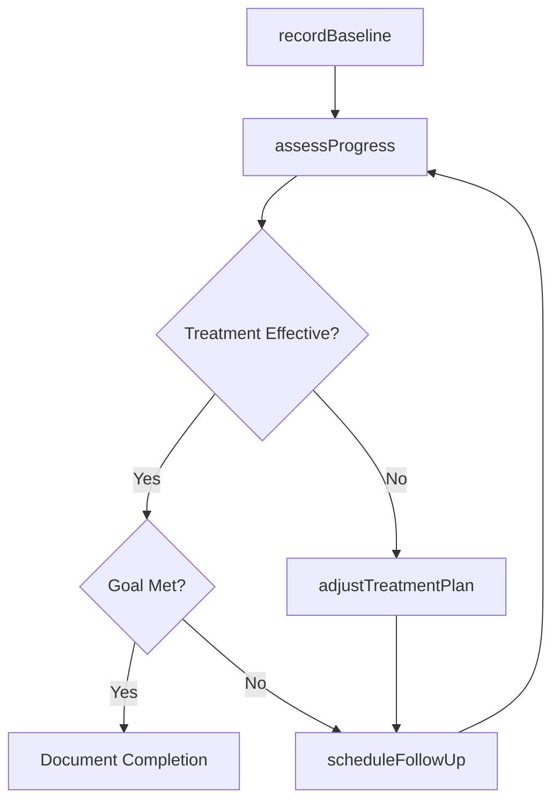
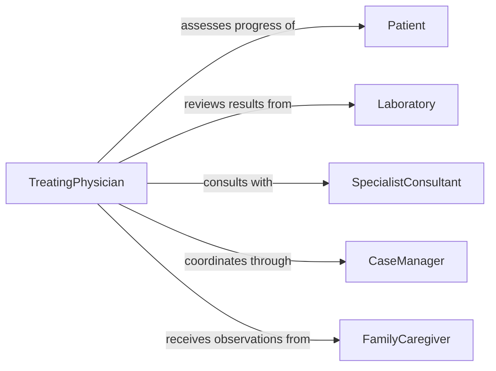

# Monitor Patient Progress Responses Treatments

> Business-as-Code definition for monitoring patient treatment responses. Models the systematic tracking of patient outcomes, therapeutic effectiveness, and adverse reactions throughout the course of clinical treatment.

## Overview

Monitoring patient progress and treatment responses involves evaluating clinical outcomes against therapeutic goals over time. Healthcare providers track symptom changes, functional improvements, laboratory markers, and side effects to determine whether a treatment plan is effective or requires modification. This definition covers the full treatment monitoring lifecycle from initial baseline measurement through ongoing assessment and treatment plan adjustment.

## Actors

| Actor | Description |
|-------|-------------|
| Patient | The individual undergoing treatment whose progress is being tracked |
| FamilyCaregiver | Observes and reports patient symptoms and functional status between clinical visits |
| Laboratory | Provides diagnostic test results used to measure treatment effectiveness |
| PharmacyService | Supplies prescribed medications and flags potential drug interactions |
| InsuranceProvider | Reviews treatment plans for coverage and prior authorization requirements |
| SpecialistConsultant | Provides expert assessment when treatment responses are unexpected |

## Roles

| Role | Description |
|------|-------------|
| TreatingPhysician | Designs and adjusts treatment plans based on patient response data |
| CaseManager | Coordinates care across providers and tracks treatment milestones |
| ClinicalNurse | Assesses patient status and documents progress at each encounter |
| ClinicalPharmacist | Reviews medication efficacy, dosing adequacy, and adverse reactions |

## Entities

| Entity | Description |
|--------|-------------|
| TreatmentPlan | A documented course of therapy including medications, procedures, and goals |
| ProgressNote | A clinical record of the patient's status at a point in time relative to treatment goals |
| OutcomeMeasure | A quantifiable indicator used to assess treatment effectiveness |
| AdverseReaction | A documented unwanted effect of a treatment or medication |
| TreatmentMilestone | A predefined checkpoint for evaluating progress toward therapeutic goals |
| BaselineAssessment | An initial measurement of patient status before treatment begins |

## Actions

| Action | Description |
|--------|-------------|
| recordBaseline | Capture initial patient measurements before treatment starts |
| assessProgress | Evaluate current patient status against treatment goals |
| logAdverseReaction | Document an unwanted side effect or complication from treatment |
| adjustTreatmentPlan | Modify medications, dosing, or therapeutic approach based on response data |
| scheduleFollowUp | Set the next evaluation appointment based on treatment phase |
| compareTrends | Analyze outcome measures over time to identify improvement or decline |
| requestConsultation | Refer to a specialist when treatment response is unexpected |

## Events

| Event | Description |
|-------|-------------|
| baselineRecorded | Initial patient measurements have been captured before treatment |
| progressAssessed | A treatment progress evaluation has been completed |
| adverseReactionLogged | An unwanted treatment effect has been documented |
| treatmentPlanAdjusted | The therapeutic approach has been modified based on response data |
| milestoneReached | A predefined treatment checkpoint has been achieved |
| treatmentGoalMet | The patient has reached the desired therapeutic outcome |
| consultationRequested | A specialist referral has been initiated for unexpected response |

## Searches

| Search | Description |
|--------|-------------|
| findPatientsByTreatmentStatus | List patients by current treatment phase or response category |
| getProgressHistory | Retrieve chronological progress notes and outcome measures for a patient |
| getAdverseReactions | Query documented side effects filtered by treatment, severity, or time period |
| findUpcomingMilestones | Locate patients approaching their next treatment evaluation checkpoint |

## Workflow



## Actor Relationships



## Usage

### Calling Actions

```typescript
import { monitorPatientProgressResponsesTreatments } from '@headlessly/monitor-patient-progress-responses-treatments'

const treatmentMonitor = monitorPatientProgressResponsesTreatments()

// Record baseline before starting chemotherapy
const baseline = await treatmentMonitor.recordBaseline({
  patientId: 'P-8841',
  treatmentPlanId: 'TP-301',
  measures: {
    tumorSize: 3.2,
    whiteBloodCellCount: 7200,
    painScore: 6,
    functionalStatus: 'ambulatory'
  }
})

// Assess progress at week 6
const assessment = await treatmentMonitor.assessProgress({
  patientId: 'P-8841',
  treatmentPlanId: 'TP-301',
  currentMeasures: {
    tumorSize: 2.1,
    whiteBloodCellCount: 3800,
    painScore: 4,
    functionalStatus: 'ambulatory'
  }
})

// Adjust plan based on partial response
await treatmentMonitor.adjustTreatmentPlan({
  treatmentPlanId: 'TP-301',
  modification: 'Increase dosing frequency from q3w to q2w',
  reason: 'Partial response with acceptable toxicity profile'
})
```

### Event-Driven Automation

```typescript
// Notify care team when adverse reactions are logged
treatmentMonitor.adverseReactionLogged(async ({ patientId, reaction, severity }) => {
  if (severity === 'severe') {
    await notify({
      to: 'treating-physician',
      message: `Severe reaction for patient ${patientId}: ${reaction}`
    })
  }
})

// Trigger review when treatment goals are met
treatmentMonitor.treatmentGoalMet(async ({ patientId, treatmentPlanId, goal }) => {
  await treatmentMonitor.scheduleFollowUp({
    patientId,
    type: 'completion-review',
    intervalDays: 30
  })
})
```
