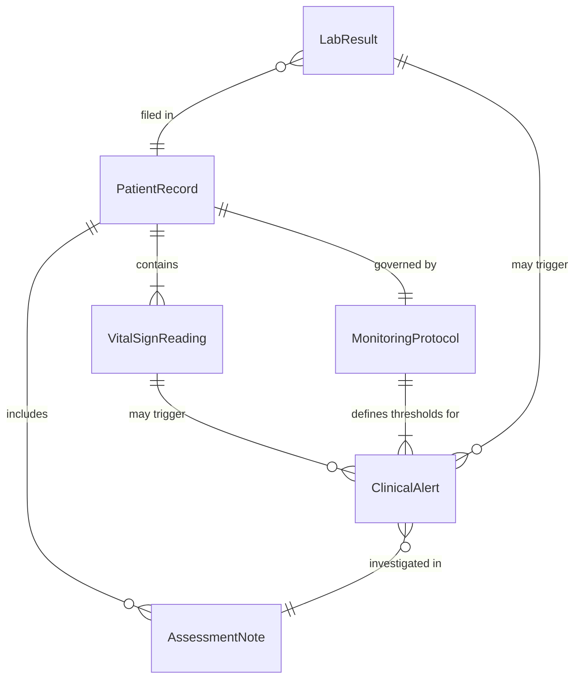
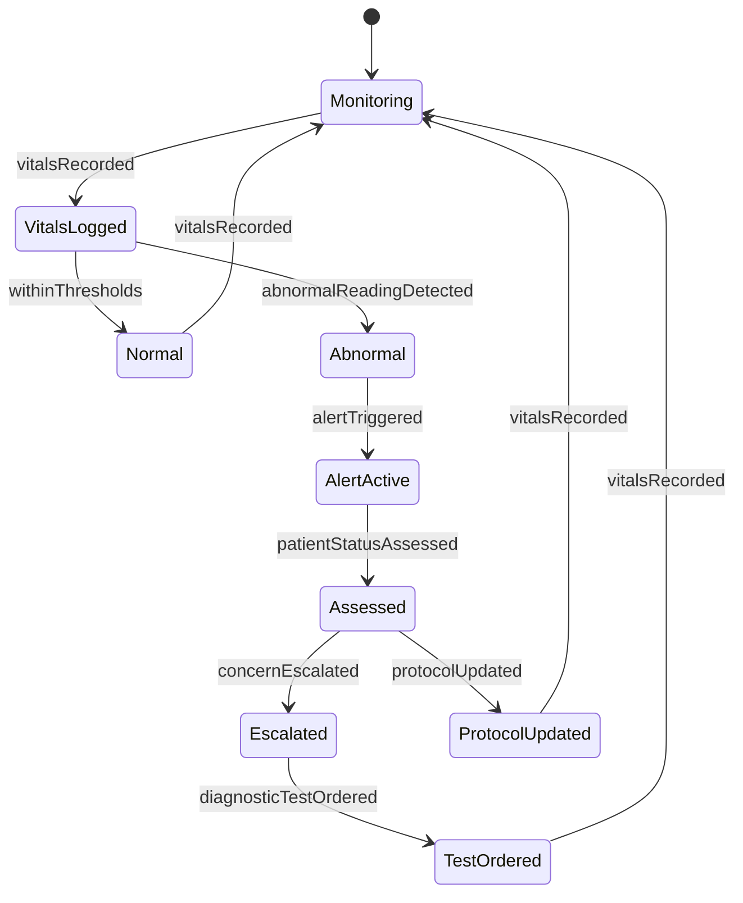
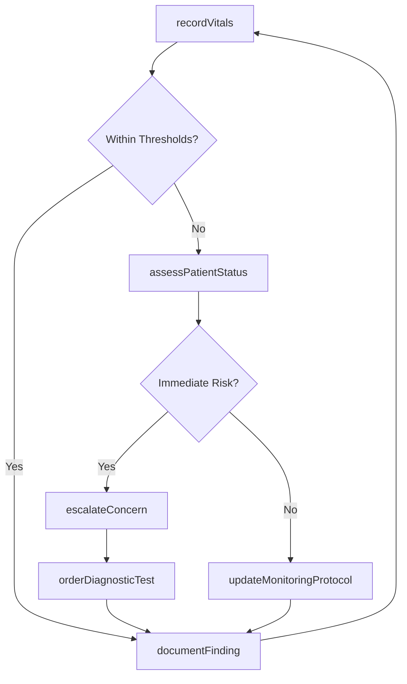
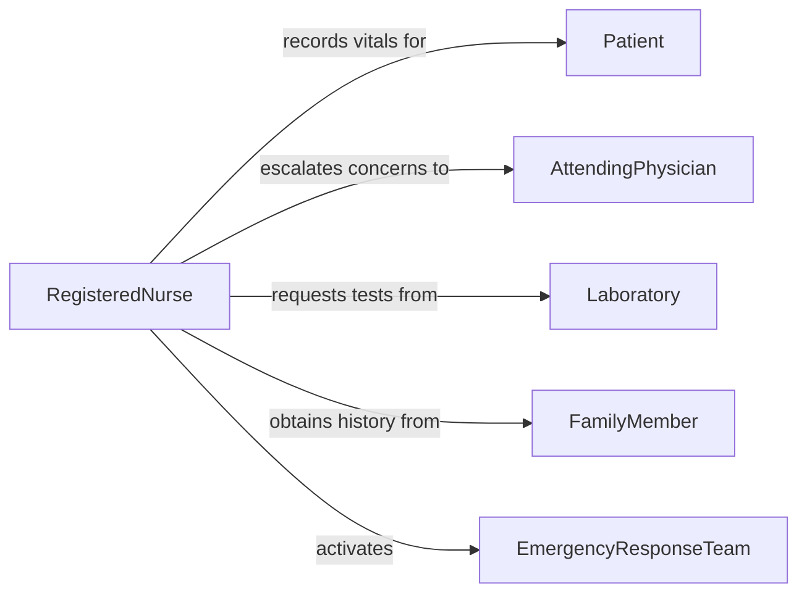

# Monitor Patients Detect Health Problems

> Business-as-Code definition for patient health monitoring. Models the continuous observation and assessment of patients to identify emerging health issues, deteriorating conditions, or complications requiring intervention.

## Overview

Patient health monitoring involves systematic observation of vital signs, symptoms, and clinical indicators to detect health problems early. Healthcare professionals use bedside assessments, telemetry systems, and laboratory results to identify changes in patient status that may signal complications or disease progression. This definition covers the complete monitoring cycle from initial baseline assessment through ongoing surveillance and escalation of detected concerns.

## Actors

| Actor | Description |
|-------|-------------|
| Patient | The individual being monitored for health changes |
| FamilyMember | Provides observational information about the patient's baseline behavior and symptoms |
| Laboratory | Processes diagnostic tests and returns results for clinical review |
| PharmacyService | Supplies medications that may affect monitored parameters |
| EmergencyResponseTeam | Responds to critical alerts when patient conditions deteriorate rapidly |

## Roles

| Role | Description |
|------|-------------|
| AttendingPhysician | Orders monitoring protocols and interprets clinical findings |
| RegisteredNurse | Performs bedside assessments and documents patient observations |
| ClinicalMonitorTechnician | Oversees telemetry and alarm systems for multiple patients |
| ChargeNurse | Coordinates staffing and escalation for monitoring coverage |

## Entities

| Entity | Description |
|--------|-------------|
| PatientRecord | Comprehensive clinical record containing history, diagnoses, and monitoring data |
| VitalSignReading | A single measurement of temperature, blood pressure, heart rate, respiration, or oxygen saturation |
| MonitoringProtocol | Defined schedule and parameters for patient observation frequency and thresholds |
| ClinicalAlert | A notification triggered when a monitored value exceeds defined thresholds |
| AssessmentNote | A documented clinical observation describing the patient's current status |
| LabResult | Diagnostic test outcome used to evaluate organ function, infection markers, or drug levels |

## Actions

| Action | Description |
|--------|-------------|
| recordVitals | Capture and store a set of vital sign measurements for a patient |
| assessPatientStatus | Perform a comprehensive bedside evaluation of the patient's condition |
| configureAlertThresholds | Set or adjust alarm parameters for specific monitoring values |
| escalateConcern | Notify the attending physician or rapid response team of a detected issue |
| orderDiagnosticTest | Request laboratory or imaging studies to investigate a suspected problem |
| updateMonitoringProtocol | Modify the frequency or scope of patient monitoring based on clinical changes |
| documentFinding | Record a clinical observation or assessment note in the patient record |

## Events

| Event | Description |
|-------|-------------|
| vitalsRecorded | A new set of vital sign measurements has been captured |
| abnormalReadingDetected | A vital sign or lab result has fallen outside normal parameters |
| patientStatusAssessed | A comprehensive bedside assessment has been completed |
| alertTriggered | A clinical monitoring threshold has been exceeded |
| concernEscalated | A detected issue has been communicated to the responsible provider |
| diagnosticTestOrdered | A lab or imaging study has been requested for further evaluation |
| protocolUpdated | The patient's monitoring schedule or parameters have been changed |

## Searches

| Search | Description |
|--------|-------------|
| findPatientsByAlertStatus | Retrieve patients with active or recent clinical alerts |
| getVitalSignTrends | Query vital sign history for a patient over a specified time range |
| getAbnormalResults | List all out-of-range readings or lab results for a patient or unit |
| findPendingAssessments | Locate patients due for their next scheduled observation |

## Entity Relationships



## State Diagram



## Workflow



## Actor Relationships



## Usage

### Calling Actions

```typescript
import { monitorPatientsDetectHealthProblems } from '@headlessly/monitor-patients-detect-health-problems'

const monitoring = monitorPatientsDetectHealthProblems()

// Record a set of vital signs
const reading = await monitoring.recordVitals({
  patientId: 'P-2249',
  vitals: {
    temperature: 101.2,
    bloodPressure: { systolic: 88, diastolic: 56 },
    heartRate: 112,
    respiratoryRate: 24,
    oxygenSaturation: 91
  }
})

// Escalate a detected concern
await monitoring.escalateConcern({
  patientId: 'P-2249',
  severity: 'urgent',
  finding: 'Hypotension with tachycardia and low-grade fever suggesting early sepsis',
  recommendedAction: 'Physician assessment and blood cultures'
})

// Update monitoring frequency
await monitoring.updateMonitoringProtocol({
  patientId: 'P-2249',
  frequency: 'every-15-minutes',
  parameters: ['bloodPressure', 'heartRate', 'oxygenSaturation']
})
```

### Event-Driven Automation

```typescript
// Alert when abnormal readings are detected
monitoring.abnormalReadingDetected(async ({ patientId, parameter, value, threshold }) => {
  await notify({
    to: 'charge-nurse',
    message: `Patient ${patientId}: ${parameter} at ${value} (threshold: ${threshold})`
  })
})

// Auto-escalate when multiple alerts fire for the same patient
monitoring.alertTriggered(async ({ patientId, alertCount }) => {
  if (alertCount >= 3) {
    await monitoring.escalateConcern({
      patientId,
      severity: 'critical',
      finding: 'Multiple concurrent alert thresholds exceeded'
    })
  }
})
```
