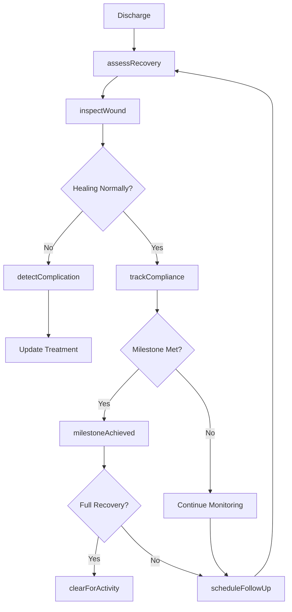
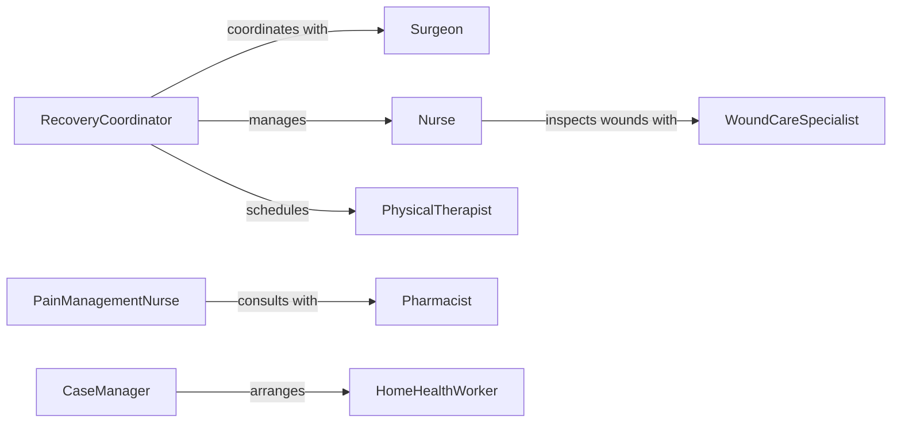

# Monitor Patients Following Surgeries Treatments

> Business-as-Code definition for post-operative and post-treatment patient monitoring. Tracks recovery progress, complications, and adherence to discharge instructions following surgical procedures or medical treatments.

## Overview

Post-surgical and post-treatment patient monitoring involves systematic assessment of recovery indicators, wound healing, medication compliance, and functional status after discharge or transfer from acute care. This definition provides actions for recovery tracking, events for complication detection, and searches for outcomes analysis. Used in post-anesthesia care units, surgical floors, outpatient clinics, home health agencies, and rehabilitation facilities.

## Actors

| Actor | Description |
|-------|-------------|
| Patient | Recovering from surgery or treatment |
| Surgeon | Performed procedure and oversees recovery |
| Nurse | Provides post-operative care and monitoring |
| PhysicalTherapist | Assists with mobility and functional recovery |
| Pharmacist | Reviews medication regimen and adherence |
| HomeHealthWorker | Provides in-home monitoring and care |

## Roles

| Role | Description |
|------|-------------|
| RecoveryCoordinator | Manages discharge planning and follow-up |
| WoundCareSpecialist | Assesses and treats surgical sites |
| PainManagementNurse | Monitors and adjusts pain control strategies |
| CaseManager | Coordinates resources and services |

## Entities

| Entity | Description |
|--------|-------------|
| RecoveryPlan | Post-operative instructions and milestones |
| Assessment | Evaluation of recovery status |
| WoundStatus | Condition of surgical site or incision |
| Complication | Adverse event during recovery period |
| Milestone | Expected recovery achievement |
| FollowUpVisit | Scheduled post-treatment evaluation |

## Actions

| Action | Description |
|--------|-------------|
| assessRecovery | Evaluate overall recovery progress |
| inspectWound | Examine surgical site for healing or complications |
| trackCompliance | Monitor adherence to discharge instructions |
| detectComplication | Identify adverse events or delayed healing |
| scheduleFollowUp | Arrange post-treatment evaluation appointment |
| updatePlan | Modify recovery instructions based on progress |
| clearForActivity | Authorize return to specific activities or work |

## Events

| Event | Description |
|-------|-------------|
| recoveryAssessed | Recovery status evaluation is complete |
| woundInspected | Surgical site examination has been performed |
| complianceTracked | Adherence assessment is complete |
| complicationDetected | Adverse event has been identified |
| followUpScheduled | Post-treatment visit has been arranged |
| planUpdated | Recovery instructions have been modified |
| milestoneAchieved | Recovery goal has been met |

## Searches

| Search | Description |
|--------|-------------|
| findPatients | List patients by procedure, status, or discharge date |
| getAssessments | Retrieve recovery evaluation history |
| getComplications | View adverse events by procedure type |
| getMilestones | Find recovery achievements by patient or cohort |

## Workflow



## Actor Relationships



## Usage

### Calling Actions

```typescript
import { monitorPatientsFollowingSurgeriesTreatments } from '@headlessly/monitor-patients-following-surgeries-treatments'

const recovery = monitorPatientsFollowingSurgeriesTreatments()

// Assess recovery at 1-week post-op
await recovery.assessRecovery({
  patientId: 'patient-456',
  procedureId: 'surgery-789',
  daysSinceProcedure: 7,
  assessmentType: 'routine-followup'
})

// Inspect surgical wound
await recovery.inspectWound({
  patientId: 'patient-456',
  woundSite: 'abdominal-incision',
  appearance: 'healing-well',
  drainage: 'minimal-serous',
  signs: { infection: false, dehiscence: false }
})

// Detect complication
await recovery.detectComplication({
  patientId: 'patient-456',
  complication: 'surgical-site-infection',
  severity: 'moderate',
  symptoms: ['erythema', 'purulent-drainage', 'fever']
})
```

### Event-Driven Automation

```typescript
// Auto-schedule follow-up when complication detected
recovery.complicationDetected(async ({ patientId, complication, severity }) => {
  if (severity === 'moderate' || severity === 'high') {
    await recovery.scheduleFollowUp({
      patientId,
      urgency: severity === 'high' ? 'urgent' : 'routine',
      reason: complication,
      targetDate: addDays(new Date(), severity === 'high' ? 1 : 3)
    })
  }
})

// Clear for activity when milestones achieved
recovery.milestoneAchieved(async ({ patientId, milestone }) => {
  const allMilestones = await recovery.getMilestones({ patientId })
  if (allMilestones.every(m => m.achieved)) {
    await recovery.clearForActivity({
      patientId,
      activities: ['work', 'exercise', 'driving']
    })
  }
})
```
