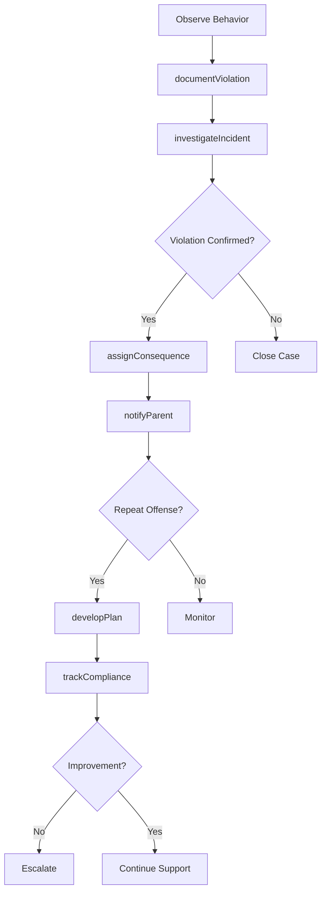
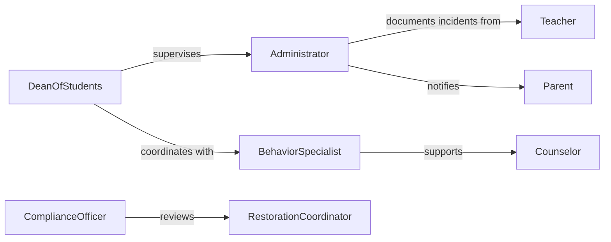

# Enforce Rules Policies Governing Student

> Business-as-Code definition for student behavior rule enforcement. Manages conduct policies, disciplinary processes, and behavioral interventions in educational settings.

## Overview

Student rule and policy enforcement involves monitoring student conduct, documenting violations, implementing consequences, and supporting behavioral improvement. This definition provides actions for violation tracking, events for intervention triggers, and searches for disciplinary analysis. Used in K-12 schools, colleges, universities, and educational programs to maintain safe learning environments and support positive student behavior.

## Actors

| Actor | Description |
|-------|-------------|
| Student | Subject to institutional conduct policies |
| Teacher | Observes behavior and reports violations |
| Administrator | Enforces policies and assigns consequences |
| Parent | Receives notification and supports intervention |
| Counselor | Provides behavioral support and guidance |
| SecurityStaff | Responds to safety incidents and violations |

## Roles

| Role | Description |
|------|-------------|
| DeanOfStudents | Oversees disciplinary processes and appeals |
| BehaviorSpecialist | Designs interventions and support plans |
| ComplianceOfficer | Ensures due process and policy adherence |
| RestorationCoordinator | Facilitates restorative justice practices |

## Entities

| Entity | Description |
|--------|-------------|
| Policy | Institutional rule governing student conduct |
| Violation | Documented breach of conduct standards |
| Consequence | Disciplinary action or intervention |
| Incident | Specific behavioral event or occurrence |
| InterventionPlan | Structured approach to behavior improvement |
| Appeal | Formal challenge to disciplinary decision |

## Actions

| Action | Description |
|--------|-------------|
| documentViolation | Record a conduct policy breach |
| investigateIncident | Gather facts about behavioral event |
| assignConsequence | Determine and apply disciplinary action |
| notifyParent | Inform guardian of violation and consequences |
| developPlan | Create behavioral intervention strategy |
| trackCompliance | Monitor adherence to intervention plan |
| processAppeal | Review challenge to disciplinary decision |

## Events

| Event | Description |
|-------|-------------|
| violationDocumented | Conduct breach has been recorded |
| incidentInvestigated | Fact-gathering is complete |
| consequenceAssigned | Disciplinary action has been determined |
| parentNotified | Guardian has been informed |
| planDeveloped | Intervention strategy has been created |
| complianceTracked | Adherence assessment is complete |
| appealProcessed | Challenge review has been completed |

## Searches

| Search | Description |
|--------|-------------|
| findViolations | List violations by student, type, or date |
| getIncidents | Retrieve incident history for analysis |
| getConsequences | View disciplinary actions by type or severity |
| getTrends | Analyze violation patterns over time |

## Workflow



## Actor Relationships



## Usage

### Calling Actions

```typescript
import { enforceRulesPoliciesGoverningStudent } from '@headlessly/enforce-rules-policies-governing-student'

const conduct = enforceRulesPoliciesGoverningStudent()

// Document a violation
await conduct.documentViolation({
  studentId: 'student-789',
  policyCode: 'CONDUCT-03',
  violation: 'disruptive-behavior',
  location: 'classroom-B12',
  reportedBy: 'teacher-456',
  description: 'Repeatedly interrupted instruction after warnings'
})

// Investigate incident
await conduct.investigateIncident({
  incidentId: 'incident-123',
  witnesses: ['teacher-456', 'student-012'],
  evidence: ['classroom-video', 'teacher-statement']
})

// Assign consequence
await conduct.assignConsequence({
  violationId: 'violation-123',
  consequence: 'detention',
  duration: '2-hours',
  date: '2026-02-10',
  educationalComponent: 'behavior-reflection-worksheet'
})
```

### Event-Driven Automation

```typescript
// Auto-notify parent on violation
conduct.violationDocumented(async ({ studentId, violation, severity }) => {
  await conduct.notifyParent({
    studentId,
    method: severity === 'high' ? 'phone' : 'email',
    content: {
      violation,
      nextSteps: 'conference-scheduled'
    }
  })
})

// Develop intervention plan for repeat offenses
conduct.consequenceAssigned(async ({ studentId, violationId }) => {
  const history = await conduct.findViolations({
    studentId,
    timeframe: 'semester'
  })
  if (history.length >= 3) {
    await conduct.developPlan({
      studentId,
      type: 'behavioral-intervention',
      team: ['counselor', 'teacher', 'parent']
    })
  }
})
```
