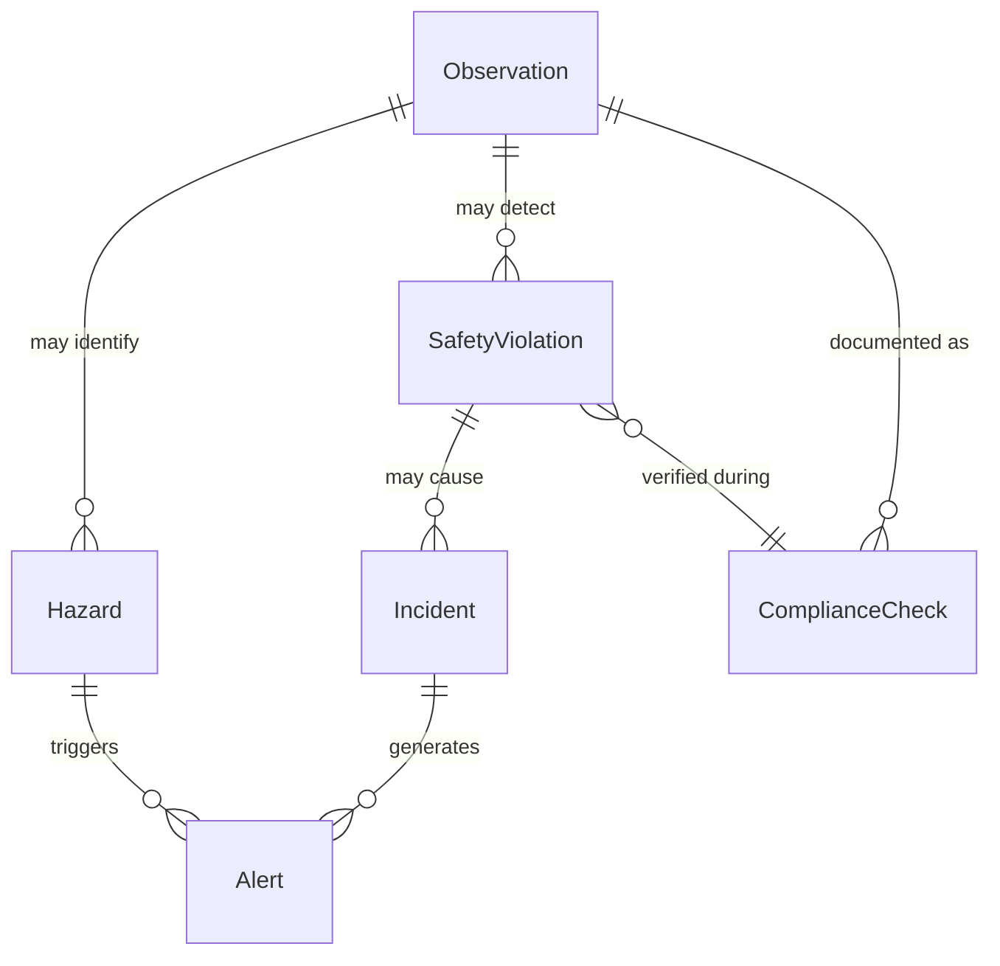
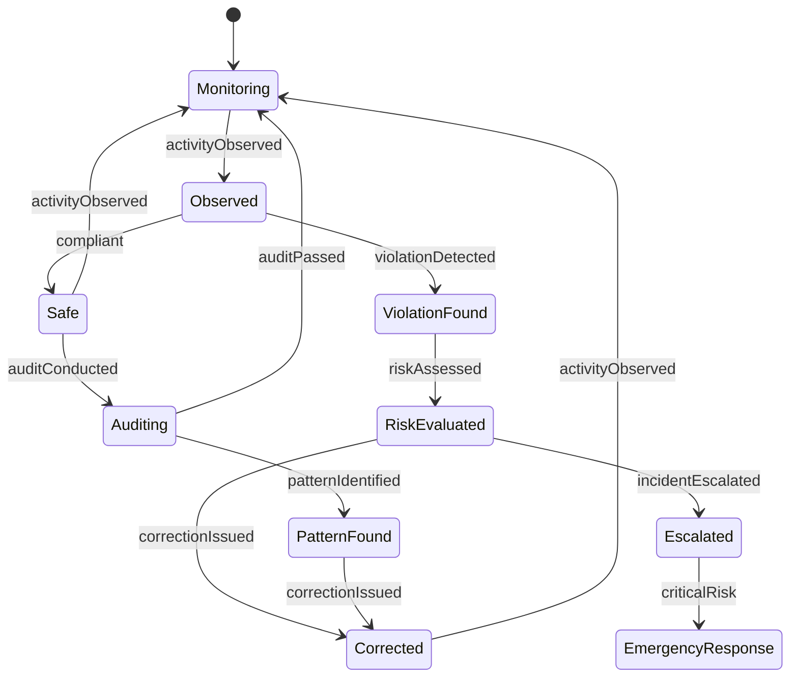
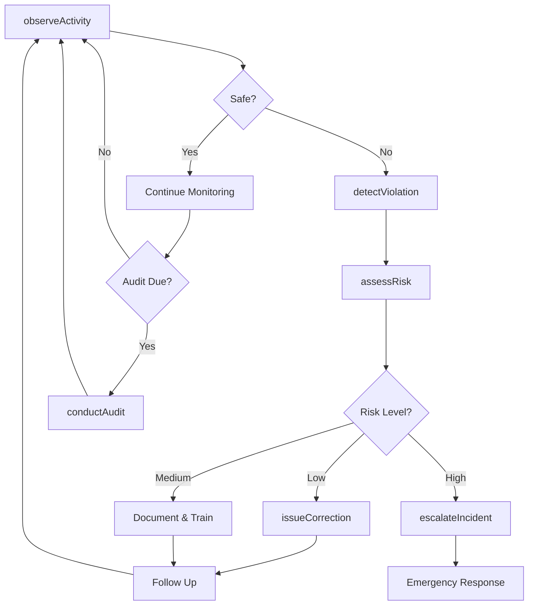
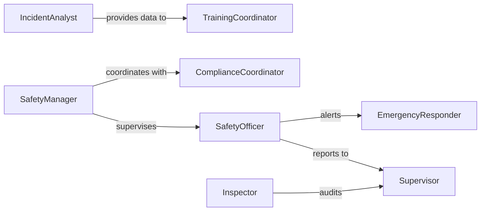

# Monitor Activities Individuals Ensure Safety

> Business-as-Code definition for safety-focused activity monitoring. Tracks individual actions and behaviors to prevent accidents, ensure regulatory compliance, and maintain secure environments.

## Overview

Safety-focused activity monitoring involves continuous or periodic observation of individual actions to identify hazards, detect non-compliance, and prevent incidents. This definition provides actions for observation tracking, events for immediate response triggers, and searches for safety analysis. Used in manufacturing facilities, construction sites, laboratories, correctional facilities, childcare centers, and other environments where safety and compliance are critical.

## Actors

| Actor | Description |
|-------|-------------|
| Individual | Person being monitored for safety or compliance |
| SafetyOfficer | Conducts observations and enforces safety protocols |
| Supervisor | Manages operations and responds to safety concerns |
| SecurityPersonnel | Monitors restricted areas and access control |
| Inspector | Audits compliance with safety regulations |
| EmergencyResponder | Reacts to incidents and safety emergencies |

## Roles

| Role | Description |
|------|-------------|
| SafetyManager | Oversees safety programs and protocols |
| ComplianceCoordinator | Ensures adherence to regulations and standards |
| IncidentAnalyst | Investigates safety events and trends |
| TrainingCoordinator | Provides safety education and certification |

## Entities

| Entity | Description |
|--------|-------------|
| Observation | Documented assessment of individual activity |
| SafetyViolation | Breach of safety protocol or regulation |
| Hazard | Condition or action presenting risk |
| Incident | Safety event or near-miss occurrence |
| ComplianceCheck | Verification of regulatory adherence |
| Alert | Notification of concerning activity or condition |

## Actions

| Action | Description |
|--------|-------------|
| observeActivity | Document individual actions and behaviors |
| detectViolation | Identify breach of safety or compliance rules |
| assessRisk | Evaluate potential danger of observed activity |
| issueCorrection | Provide guidance to address unsafe behavior |
| escalateIncident | Alert emergency response or management |
| conductAudit | Perform systematic safety compliance review |
| generateReport | Create safety monitoring summary |

## Events

| Event | Description |
|-------|-------------|
| activityObserved | Individual action has been documented |
| violationDetected | Safety breach has been identified |
| riskAssessed | Danger evaluation is complete |
| correctionIssued | Guidance has been provided |
| incidentEscalated | Emergency alert has been raised |
| auditConducted | Compliance review has been completed |
| patternIdentified | Recurring safety concern detected |

## Searches

| Search | Description |
|--------|-------------|
| findObservations | List observations by individual, type, or date |
| getViolations | Retrieve safety breaches by severity or location |
| getIncidents | View safety events and near-misses |
| getTrends | Analyze safety patterns over time |

## Entity Relationships



## State Diagram



## Workflow



## Actor Relationships



## Usage

### Calling Actions

```typescript
import { monitorActivitiesIndividualsEnsureSafety } from '@headlessly/monitor-activities-individuals-ensure-safety'

const safety = monitorActivitiesIndividualsEnsureSafety()

// Observe worker activity
await safety.observeActivity({
  individualId: 'worker-456',
  location: 'production-floor-2',
  activity: 'operating-machinery',
  ppe: ['hard-hat', 'safety-glasses', 'gloves'],
  compliance: true
})

// Detect safety violation
await safety.detectViolation({
  individualId: 'worker-789',
  violation: 'missing-ppe',
  specificIssue: 'no-safety-glasses',
  location: 'welding-station',
  observedBy: 'safety-officer-12'
})

// Assess risk of observed behavior
const risk = await safety.assessRisk({
  activity: 'confined-space-entry',
  conditions: ['adequate-ventilation', 'buddy-system'],
  hazards: ['low-oxygen-risk']
})
```

### Event-Driven Automation

```typescript
// Escalate high-risk incidents immediately
safety.riskAssessed(async ({ individualId, riskLevel, activity }) => {
  if (riskLevel === 'high' || riskLevel === 'critical') {
    await safety.escalateIncident({
      individualId,
      activity,
      urgency: 'immediate',
      team: 'emergency-response'
    })
  }
})

// Trigger training after repeated violations
safety.violationDetected(async ({ individualId, violation }) => {
  const history = await safety.getViolations({
    individualId,
    timeframe: 'month'
  })
  if (history.filter(v => v.type === violation).length >= 2) {
    await scheduleTraining({
      individualId,
      topic: violation,
      priority: 'mandatory'
    })
  }
})
```
