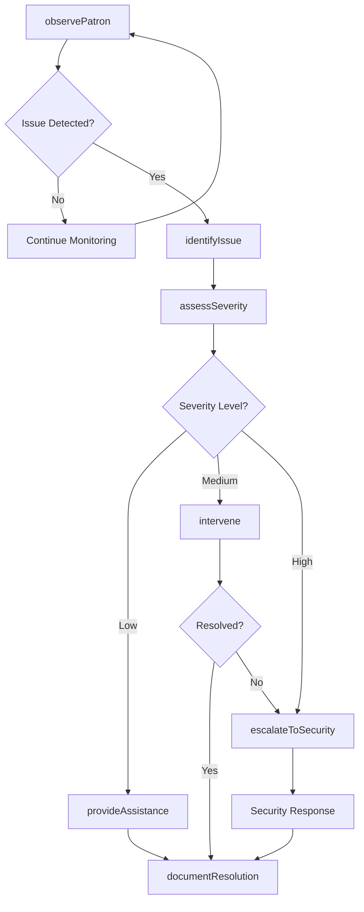
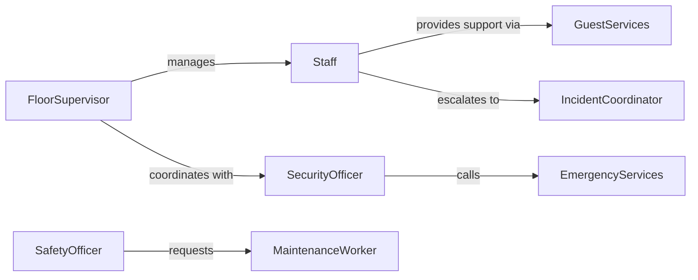

# Monitor Patron Activities Identify Problems

> Business-as-Code definition for patron activity monitoring. Tracks customer behaviors in public facilities to detect issues, prevent disturbances, and ensure positive experiences for all visitors.

## Overview

Patron activity monitoring involves observing customer behavior in libraries, museums, recreation facilities, entertainment venues, and other public spaces to identify problems before they escalate. This definition provides actions for observation tracking, events for intervention triggers, and searches for pattern analysis. Used to maintain safe, respectful environments and provide early assistance to patrons in need.

## Actors

| Actor | Description |
|-------|-------------|
| Patron | Visitor using facility services or resources |
| Staff | Monitors activities and provides assistance |
| SecurityOfficer | Responds to disturbances and safety concerns |
| Manager | Oversees operations and handles escalations |
| EmergencyServices | Responds to serious incidents |
| MaintenanceWorker | Addresses facility issues and hazards |

## Roles

| Role | Description |
|------|-------------|
| FloorSupervisor | Manages staff and monitors overall activity |
| GuestServices | Provides assistance and resolves minor issues |
| IncidentCoordinator | Documents and responds to problems |
| SafetyOfficer | Ensures compliance with facility policies |

## Entities

| Entity | Description |
|--------|-------------|
| Observation | Documented patron behavior or activity |
| Issue | Identified problem requiring attention |
| Incident | Disruptive event or policy violation |
| Intervention | Action taken to address patron problem |
| Alert | Notification of concerning activity |
| Resolution | Outcome of problem intervention |

## Actions

| Action | Description |
|--------|-------------|
| observePatron | Monitor and document patron activity |
| identifyIssue | Detect problem or concerning behavior |
| assessSeverity | Evaluate urgency and risk level |
| provideAssistance | Offer help or guidance to patron |
| intervene | Take action to address disruptive behavior |
| escalateToSecurity | Alert security for serious problems |
| documentResolution | Record outcome and actions taken |

## Events

| Event | Description |
|-------|-------------|
| patronObserved | Activity has been monitored and documented |
| issueIdentified | Problem has been detected |
| severityAssessed | Risk evaluation is complete |
| assistanceProvided | Help has been offered to patron |
| interventionPerformed | Action has been taken to address problem |
| securityEscalated | Alert has been raised to security team |
| resolutionDocumented | Outcome has been recorded |

## Searches

| Search | Description |
|--------|-------------|
| findObservations | List patron observations by date or location |
| getIssues | Retrieve identified problems by type or severity |
| getIncidents | View disruptive events and resolutions |
| getTrends | Analyze problem patterns over time |

## Workflow



## Actor Relationships



## Usage

### Calling Actions

```typescript
import { monitorPatronActivitiesIdentifyProblems } from '@headlessly/monitor-patron-activities-identify-problems'

const monitoring = monitorPatronActivitiesIdentifyProblems()

// Observe patron behavior
await monitoring.observePatron({
  patronId: 'patron-456',
  location: 'reading-room',
  activity: 'using-computers',
  notes: 'Patron appears frustrated with equipment'
})

// Identify issue needing attention
await monitoring.identifyIssue({
  patronId: 'patron-456',
  issue: 'technical-difficulty',
  description: 'Unable to access online catalog',
  severity: 'low'
})

// Provide assistance
await monitoring.provideAssistance({
  patronId: 'patron-456',
  staffId: 'staff-789',
  assistance: 'login-help',
  outcome: 'resolved'
})
```

### Event-Driven Automation

```typescript
// Auto-dispatch staff for identified issues
monitoring.issueIdentified(async ({ patronId, issue, location }) => {
  const severity = await monitoring.assessSeverity({ patronId, issue })
  if (severity.level === 'medium' || severity.level === 'high') {
    await dispatchStaff({
      location,
      issue,
      priority: severity.level
    })
  }
})

// Escalate to security for high severity
monitoring.severityAssessed(async ({ patronId, issue, level }) => {
  if (level === 'high' || level === 'critical') {
    await monitoring.escalateToSecurity({
      patronId,
      issue,
      urgency: 'immediate',
      location: await getPatronLocation(patronId)
    })
  }
})
```
