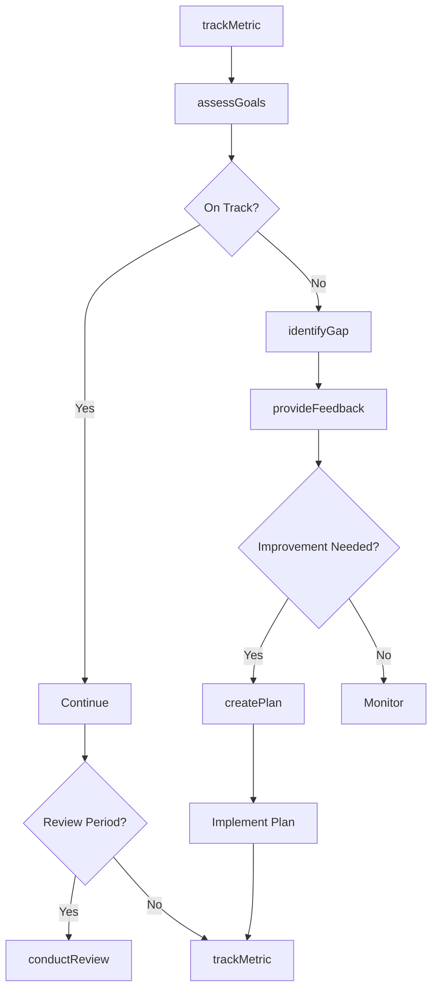
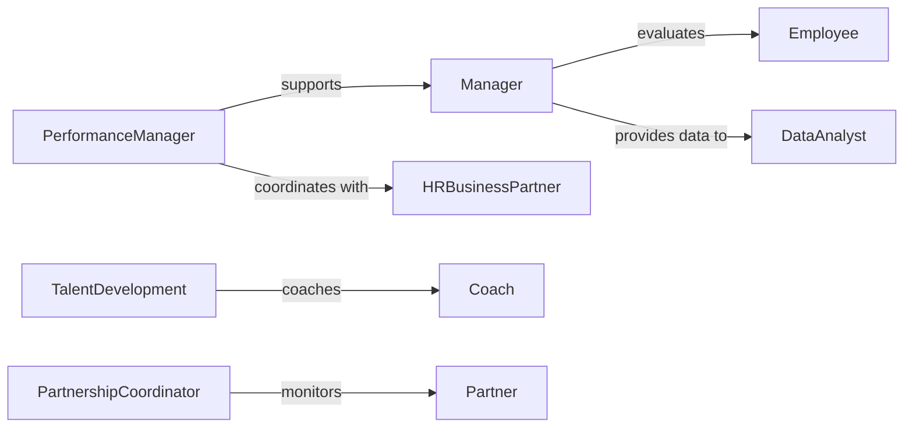

# Monitor Performance Organizational Members Partners

> Business-as-Code definition for organizational performance monitoring. Tracks individual and partner contributions, goal attainment, and productivity metrics to support management decisions and development initiatives.

## Overview

Organizational performance monitoring involves systematic assessment of employee output, partner deliverables, and goal achievement against established targets. This definition provides actions for performance tracking, events for intervention triggers, and searches for comparative analysis. Used in human resources, operations management, and partnership governance to evaluate effectiveness, identify development needs, and ensure accountability.

## Actors

| Actor | Description |
|-------|-------------|
| Employee | Individual contributor being evaluated |
| Manager | Assesses team member performance |
| Partner | External organization with performance commitments |
| ExecutiveLeadership | Reviews organizational performance data |
| HRBusiness Partner | Supports performance management processes |
| Coach | Provides development support and training |

## Roles

| Role | Description |
|------|-------------|
| PerformanceManager | Oversees performance evaluation systems |
| DataAnalyst | Analyzes performance trends and metrics |
| TalentDevelopment | Designs improvement programs |
| PartnershipCoordinator | Manages external partner relationships |

## Entities

| Entity | Description |
|--------|-------------|
| PerformanceGoal | Specific, measurable objective |
| Metric | Quantitative measure of output or quality |
| Review | Formal performance evaluation |
| DevelopmentPlan | Structured approach to skill improvement |
| Feedback | Qualitative assessment or guidance |
| Alert | Notification of performance concern |

## Actions

| Action | Description |
|--------|-------------|
| trackMetric | Record quantitative performance measurement |
| assessGoals | Evaluate progress toward objectives |
| conductReview | Perform formal performance evaluation |
| provideFeedback | Deliver qualitative guidance or assessment |
| identifyGap | Detect performance shortfall or concern |
| createPlan | Develop improvement or development strategy |
| generateReport | Create performance summary for stakeholders |

## Events

| Event | Description |
|-------|-------------|
| metricTracked | Performance measurement has been recorded |
| goalsAssessed | Objective progress evaluation is complete |
| reviewConducted | Formal evaluation has been performed |
| feedbackProvided | Guidance has been delivered |
| gapIdentified | Performance concern has been detected |
| planCreated | Improvement strategy has been developed |
| targetAchieved | Performance goal has been met |

## Searches

| Search | Description |
|--------|-------------|
| findPerformers | List individuals or partners by status |
| getMetrics | Retrieve performance measurements over time |
| getReviews | View evaluation history for analysis |
| getGaps | Find performance concerns by type or severity |

## Workflow



## Actor Relationships



## Usage

### Calling Actions

```typescript
import { monitorPerformanceOrganizationalMembersPartners } from '@headlessly/monitor-performance-organizational-members-partners'

const performance = monitorPerformanceOrganizationalMembersPartners()

// Track quarterly sales metric
await performance.trackMetric({
  memberId: 'employee-456',
  metric: 'quarterly-sales',
  value: 285000,
  target: 300000,
  period: 'Q1-2026'
})

// Assess goal progress
const assessment = await performance.assessGoals({
  memberId: 'employee-456',
  period: 'Q1-2026'
})

// Conduct annual review
await performance.conductReview({
  memberId: 'employee-456',
  reviewerId: 'manager-789',
  type: 'annual',
  rating: 'meets-expectations',
  strengths: ['client-relationships', 'technical-expertise'],
  developmentAreas: ['presentation-skills', 'time-management']
})
```

### Event-Driven Automation

```typescript
// Create development plan when gap identified
performance.gapIdentified(async ({ memberId, gap, severity }) => {
  if (severity === 'medium' || severity === 'high') {
    await performance.createPlan({
      memberId,
      focus: gap,
      duration: '90-days',
      milestones: await generateMilestones(gap)
    })
  }
})

// Alert leadership when partner underperforms
performance.goalsAssessed(async ({ partnerId, achievement }) => {
  if (achievement < 0.7 && isPartner(partnerId)) {
    await notify({
      to: 'partnership-coordinator',
      message: `Partner ${partnerId} at ${achievement * 100}% of target`,
      action: 'schedule-review'
    })
  }
})
```
