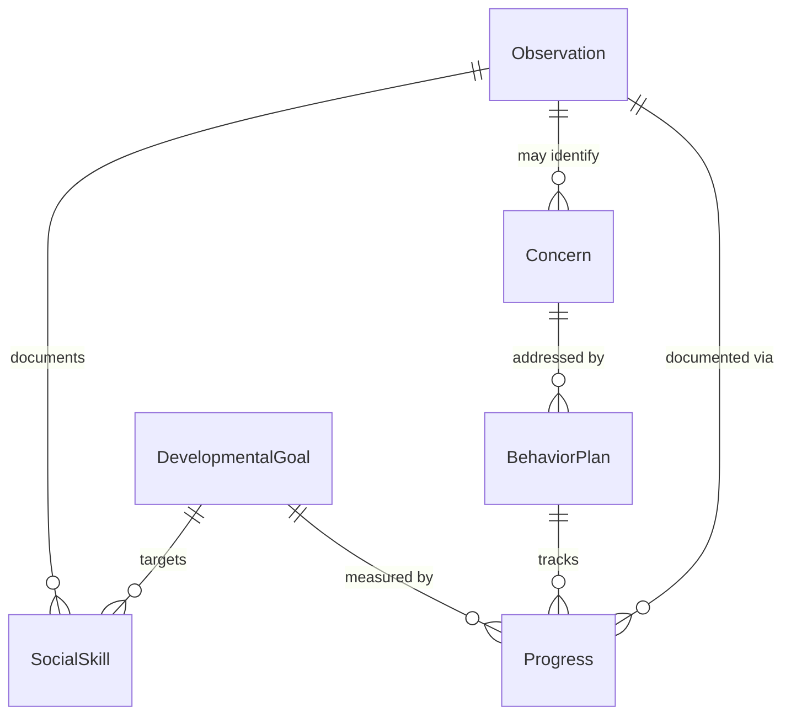
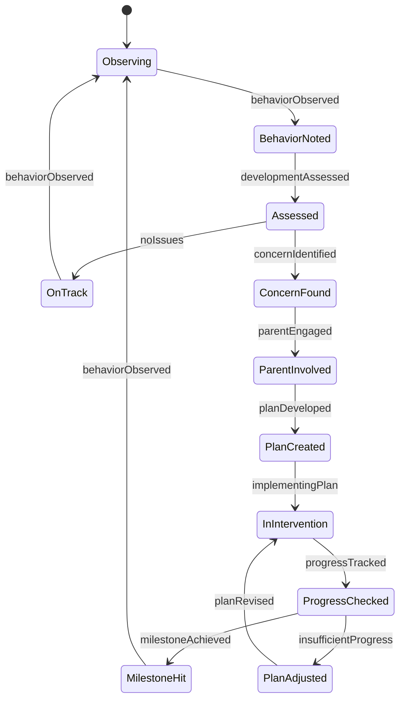
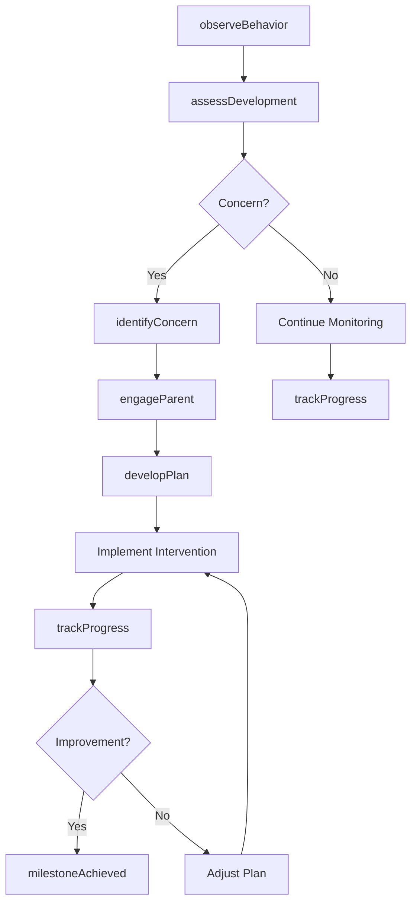
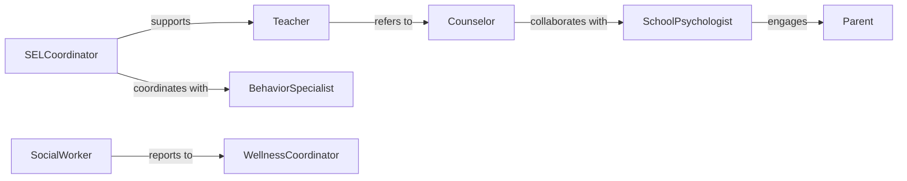

# Monitor Student Behavior Social Development

> Business-as-Code definition for student behavioral and social development monitoring. Tracks social-emotional learning, peer interactions, and behavioral patterns to support whole-child education and early intervention.

## Overview

Student behavior and social development monitoring involves systematic observation of social-emotional competencies, peer relationships, and conduct patterns to identify strengths and concerns. This definition provides actions for developmental tracking, events for intervention triggers, and searches for trend analysis. Used in K-12 schools, early childhood programs, and special education settings to support positive development and address behavioral health needs.

## Actors

| Actor | Description |
|-------|-------------|
| Student | Individual whose development is being monitored |
| Teacher | Observes daily behavior and social interactions |
| Counselor | Provides social-emotional support and interventions |
| Parent | Provides home context and collaborates on interventions |
| SchoolPsychologist | Conducts assessments and develops support plans |
| Administrator | Oversees student support services and resources |

## Roles

| Role | Description |
|------|-------------|
| BehaviorSpecialist | Designs interventions and analyzes patterns |
| SocialWorker | Addresses external factors affecting development |
| SELCoordinator | Manages social-emotional learning programs |
| WellnessCoordinator | Oversees mental health and wellness initiatives |

## Entities

| Entity | Description |
|--------|-------------|
| Observation | Documented behavior or social interaction |
| DevelopmentalGoal | Target for social-emotional skill acquisition |
| BehaviorPlan | Structured intervention for conduct concerns |
| SocialSkill | Specific competency being developed |
| Concern | Identified issue requiring attention |
| Progress | Measured development over time |

## Actions

| Action | Description |
|--------|-------------|
| observeBehavior | Document student actions and interactions |
| assessDevelopment | Evaluate social-emotional competencies |
| identifyConcern | Detect behavioral or developmental issue |
| developPlan | Create intervention or support strategy |
| trackProgress | Monitor skill development over time |
| engageParent | Involve family in support process |
| generateReport | Create developmental summary for stakeholders |

## Events

| Event | Description |
|-------|-------------|
| behaviorObserved | Student action or interaction has been documented |
| developmentAssessed | Social-emotional evaluation is complete |
| concernIdentified | Behavioral or developmental issue detected |
| planDeveloped | Intervention strategy has been created |
| progressTracked | Skill development has been measured |
| parentEngaged | Family has been involved in support |
| milestoneAchieved | Developmental goal has been met |

## Searches

| Search | Description |
|--------|-------------|
| findStudents | List students by developmental status or concern |
| getObservations | Retrieve behavioral documentation history |
| getConcerns | View identified issues by type or severity |
| getTrends | Analyze developmental patterns over time |

## Entity Relationships



## State Diagram



## Workflow



## Actor Relationships



## Usage

### Calling Actions

```typescript
import { monitorStudentBehaviorSocialDevelopment } from '@headlessly/monitor-student-behavior-social-development'

const development = monitorStudentBehaviorSocialDevelopment()

// Observe student social interaction
await development.observeBehavior({
  studentId: 'student-456',
  context: 'playground-recess',
  observation: 'Successfully resolved conflict with peer using words',
  skills: ['conflict-resolution', 'verbal-communication'],
  positive: true
})

// Assess social-emotional development
const assessment = await development.assessDevelopment({
  studentId: 'student-456',
  period: 'semester',
  domains: ['self-awareness', 'relationship-skills', 'responsible-decision-making']
})

// Identify developmental concern
await development.identifyConcern({
  studentId: 'student-789',
  concern: 'social-withdrawal',
  severity: 'moderate',
  indicators: ['isolated-during-lunch', 'avoids-group-work', 'limited-peer-interaction']
})
```

### Event-Driven Automation

```typescript
// Engage parent when concern identified
development.concernIdentified(async ({ studentId, concern, severity }) => {
  if (severity === 'moderate' || severity === 'high') {
    await development.engageParent({
      studentId,
      method: 'conference',
      purpose: `discuss ${concern}`,
      urgency: severity === 'high' ? 'immediate' : 'routine'
    })
  }
})

// Develop plan for recurring concerns
development.concernIdentified(async ({ studentId, concern }) => {
  const history = await development.getConcerns({
    studentId,
    timeframe: 'year'
  })
  if (history.filter(c => c.type === concern).length >= 3) {
    await development.developPlan({
      studentId,
      focus: concern,
      team: ['teacher', 'counselor', 'parent']
    })
  }
})
```
