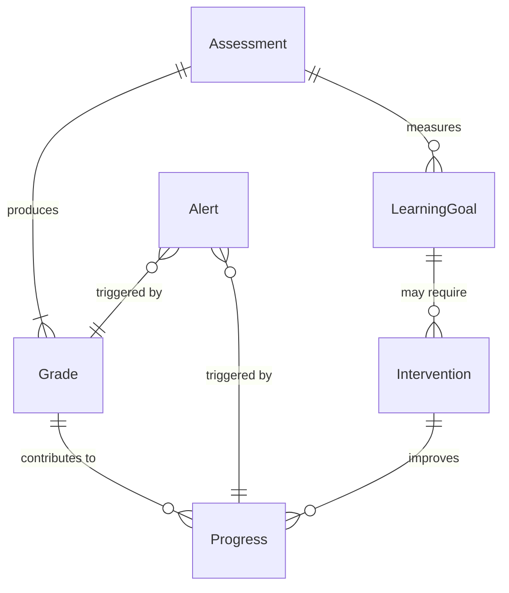
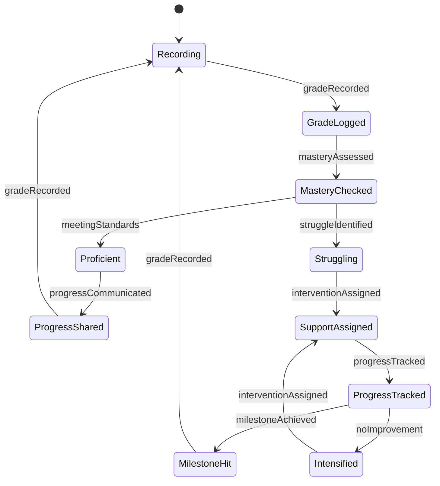
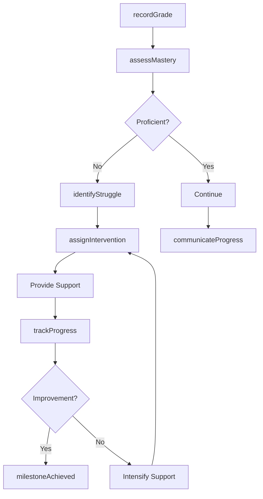
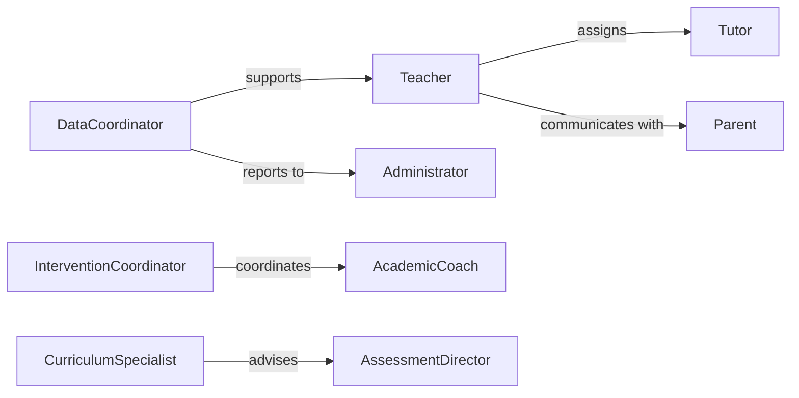

# Monitor Student Performance

> Business-as-Code definition for academic performance monitoring. Tracks student achievement, learning progress, and mastery of educational standards to inform instruction and support interventions.

## Overview

Student performance monitoring involves systematic assessment of academic achievement, learning growth, and skill mastery to guide instructional decisions and identify support needs. This definition provides actions for performance tracking, events for intervention triggers, and searches for achievement analysis. Used in K-12 schools, colleges, universities, and training programs to ensure learning objectives are met and struggling students receive timely support.

## Actors

| Actor | Description |
|-------|-------------|
| Student | Individual whose academic progress is tracked |
| Teacher | Monitors daily performance and delivers instruction |
| Parent | Reviews progress and supports learning at home |
| Tutor | Provides supplemental academic support |
| AcademicCoach | Offers study skills and learning strategies |
| Administrator | Reviews schoolwide performance data |

## Roles

| Role | Description |
|------|-------------|
| DataCoordinator | Manages assessment systems and reporting |
| CurriculumSpecialist | Aligns assessments to learning standards |
| InterventionCoordinator | Manages academic support programs |
| AssessmentDirector | Oversees testing and evaluation systems |

## Entities

| Entity | Description |
|--------|-------------|
| Assessment | Evaluation of student knowledge or skills |
| Grade | Measure of achievement on assignment or course |
| LearningGoal | Specific academic objective or standard |
| Intervention | Targeted support for academic struggle |
| Progress | Measured growth over time |
| Alert | Notification of academic concern |

## Actions

| Action | Description |
|--------|-------------|
| recordGrade | Log score on assignment, test, or course |
| assessMastery | Evaluate proficiency on learning standards |
| trackProgress | Monitor achievement growth over time |
| identifyStruggle | Detect academic difficulty or risk |
| assignIntervention | Provide targeted academic support |
| communicateProgress | Share performance data with stakeholders |
| generateTranscript | Create official academic record |

## Events

| Event | Description |
|-------|-------------|
| gradeRecorded | Score has been logged in system |
| masteryAssessed | Proficiency evaluation is complete |
| progressTracked | Growth measurement has been recorded |
| struggleIdentified | Academic difficulty has been detected |
| interventionAssigned | Support has been provided |
| progressCommunicated | Performance data has been shared |
| milestoneAchieved | Learning goal has been met |

## Searches

| Search | Description |
|--------|-------------|
| findStudents | List students by achievement level or status |
| getGrades | Retrieve score history for analysis |
| getProgress | View learning growth over time |
| getAlerts | Find students requiring intervention |

## Entity Relationships



## State Diagram



## Workflow



## Actor Relationships



## Usage

### Calling Actions

```typescript
import { monitorStudentPerformance } from '@headlessly/monitor-student-performance'

const performance = monitorStudentPerformance()

// Record quiz grade
await performance.recordGrade({
  studentId: 'student-456',
  assignment: 'unit-3-quiz',
  subject: 'mathematics',
  score: 85,
  maxScore: 100,
  standards: ['8.EE.A.1', '8.EE.A.2']
})

// Assess mastery of learning standards
const mastery = await performance.assessMastery({
  studentId: 'student-456',
  standards: ['8.EE.A.1', '8.EE.A.2', '8.EE.A.3'],
  period: 'quarter-2'
})

// Track semester progress
const progress = await performance.trackProgress({
  studentId: 'student-456',
  subject: 'mathematics',
  period: 'semester-1'
})
```

### Event-Driven Automation

```typescript
// Assign intervention when struggle identified
performance.struggleIdentified(async ({ studentId, subject, severity }) => {
  if (severity === 'moderate' || severity === 'high') {
    await performance.assignIntervention({
      studentId,
      type: severity === 'high' ? 'intensive-tutoring' : 'small-group',
      subject,
      frequency: severity === 'high' ? 'daily' : 'twice-weekly'
    })
  }
})

// Communicate progress on milestone achievement
performance.milestoneAchieved(async ({ studentId, goal }) => {
  await performance.communicateProgress({
    studentId,
    recipients: ['parent'],
    message: `${goal} mastered`,
    method: 'email'
  })
})
```
