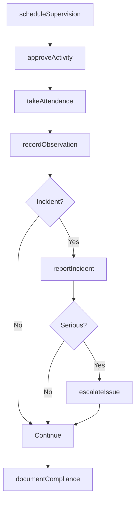
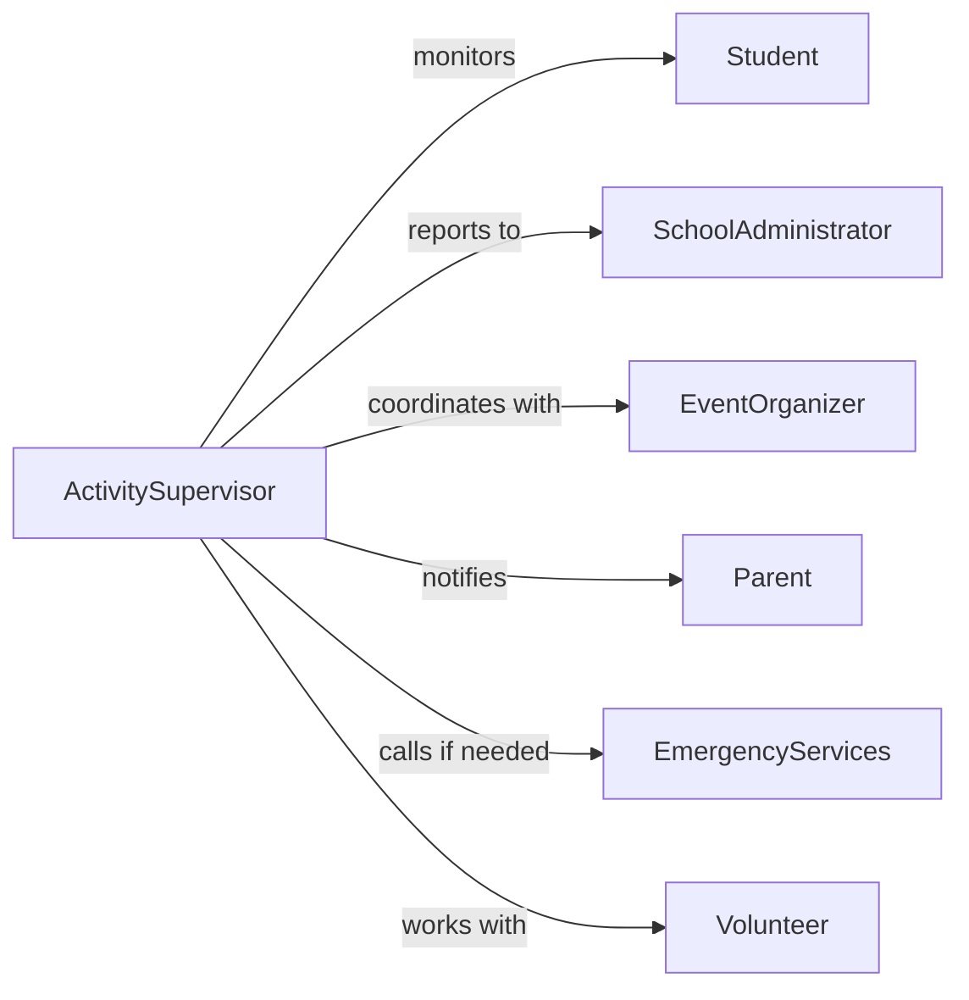

# Supervise School Student Activities

> Business-as-Code definition for supervising school and student activities. Models the complete supervision lifecycle from planning through monitoring and incident management.

## Overview

School and student activity supervision involves overseeing extracurricular programs, field trips, athletic events, and on-campus activities to ensure student safety, proper behavior, and educational outcomes. This definition exposes actions for scheduling supervision, recording observations, managing incidents, and coordinating with staff.

## Actors

| Actor | Description |
|-------|-------------|
| Student | Participates in supervised activities |
| Parent | Receives notifications about student behavior and activities |
| SchoolAdministrator | Oversees supervision policies and staff assignments |
| EventOrganizer | Coordinates activities requiring supervision |
| EmergencyServices | Responds to incidents requiring external intervention |
| Volunteer | Assists with supervision during events |

## Roles

| Role | Description |
|------|-------------|
| ActivitySupervisor | Directly monitors student behavior and safety |
| SupervisionCoordinator | Assigns supervisors and schedules coverage |
| BehaviorSpecialist | Addresses disciplinary issues and interventions |
| SafetyOfficer | Ensures compliance with safety protocols |

## Entities

| Entity | Description |
|--------|-------------|
| Activity | A scheduled event or program requiring supervision |
| SupervisionAssignment | Staff member assigned to supervise an activity |
| Observation | Recorded note about student behavior or incident |
| Incident | Safety or behavioral issue requiring documentation |
| AttendanceRecord | Log of students present at supervised activity |
| SafetyProtocol | Guidelines for managing specific activity types |

## Actions

| Action | Description |
|--------|-------------|
| scheduleSupervision | Assign supervisors to activities and time slots |
| recordObservation | Document student behavior or activity notes |
| reportIncident | Log safety or behavioral incident |
| takeAttendance | Record student presence at activity |
| escalateIssue | Notify administrators of serious concerns |
| approveActivity | Authorize activity to proceed with supervision plan |
| documentCompliance | Record adherence to safety and behavioral protocols |

## Events

| Event | Description |
|-------|-------------|
| supervisionScheduled | Supervisor has been assigned to activity |
| observationRecorded | Behavior or activity note has been documented |
| incidentReported | Safety or behavioral incident logged |
| attendanceTaken | Student attendance recorded for activity |
| issueEscalated | Serious concern raised to administration |
| activityApproved | Activity authorized to proceed |
| complianceDocumented | Protocol adherence verified and recorded |

## Searches

| Search | Description |
|--------|-------------|
| findActivities | List activities by date, type, or supervisor |
| getIncidents | Retrieve incidents by student, activity, or severity |
| getObservations | Search behavioral observations by student or date |
| getAssignments | Find supervision assignments by staff or schedule |

## Workflow



## Actor Relationships



## Usage

### Calling Actions

```typescript
import { superviseSchoolStudentActivities } from '@headlessly/supervise-school-student-activities'

const supervision = superviseSchoolStudentActivities()

// Schedule supervision for field trip
const assignment = await supervision.scheduleSupervision({
  activityId: 'field-trip-123',
  supervisorId: 'teacher-456',
  date: '2026-03-15',
  timeSlot: { start: '09:00', end: '15:00' },
  location: 'Science Museum'
})

// Record student attendance
await supervision.takeAttendance({
  activityId: 'field-trip-123',
  presentStudents: ['student-1', 'student-2', 'student-3'],
  absentStudents: ['student-4']
})

// Document behavioral observation
await supervision.recordObservation({
  activityId: 'field-trip-123',
  studentId: 'student-2',
  observation: 'Demonstrated exceptional leadership during group activity',
  timestamp: '2026-03-15T11:30:00Z'
})
```

### Event-Driven Automation

```typescript
// Notify parents of incidents
supervision.incidentReported(async ({ incident }) => {
  if (incident.severity === 'minor' || incident.severity === 'major') {
    await notify({
      to: incident.studentId.parentEmail,
      subject: 'Incident Report',
      message: `An incident occurred during ${incident.activityName}`
    })
  }
})

// Auto-escalate serious incidents
supervision.incidentReported(async ({ incident }) => {
  if (incident.severity === 'major') {
    await supervision.escalateIssue({
      incidentId: incident.id,
      escalatedTo: 'principal',
      reason: 'Major incident requiring administrative review'
    })
  }
})
```
