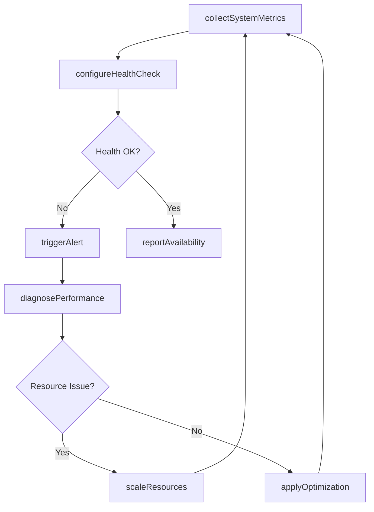
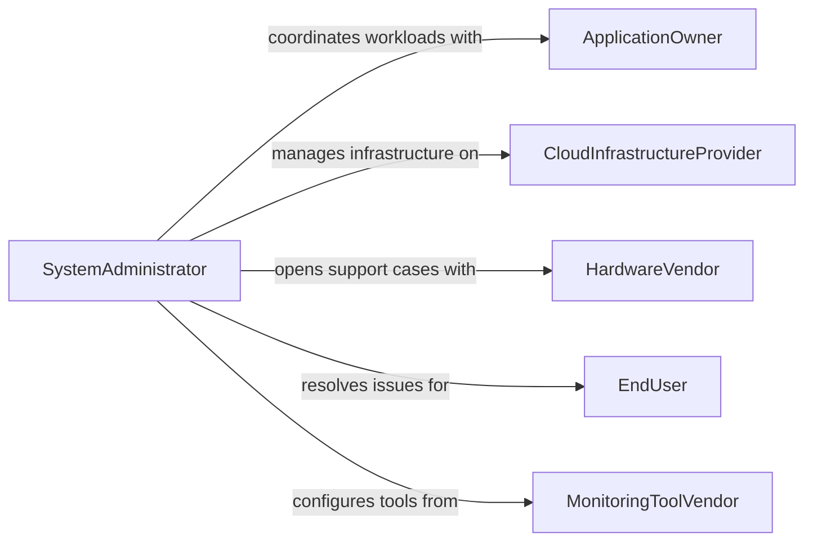

# Monitor Computer System Performance Ensure

> Business-as-Code definition for monitoring computer system performance to ensure proper operation. Models the infrastructure observability lifecycle from metric collection through alerting, troubleshooting, and optimization.

## Overview

Computer system performance monitoring involves the continuous tracking of CPU utilization, memory consumption, disk I/O, application response times, process health, and service availability across servers, workstations, and cloud compute instances. Operations teams configure monitoring agents, define health check thresholds, and build dashboards to maintain real-time visibility into system behavior. When performance degrades or services become unavailable, automated alerting and diagnostic runbooks guide rapid remediation to minimize downtime and maintain service level agreements.

## Actors

| Actor | Description |
|-------|-------------|
| ApplicationOwner | Team or individual responsible for an application running on monitored systems |
| CloudInfrastructureProvider | Vendor hosting virtual machines, containers, and managed services |
| HardwareVendor | Manufacturer providing servers, storage, and support contracts for physical infrastructure |
| EndUser | Person relying on system availability and performance to complete their work |
| MonitoringToolVendor | Provider of observability platforms, agents, and integration APIs |

## Roles

| Role | Description |
|------|-------------|
| SystemAdministrator | Manages server operating systems, patches, and resource allocation |
| SiteReliabilityEngineer | Defines SLOs, builds automation, and ensures system reliability at scale |
| DatabaseAdministrator | Monitors and optimizes database query performance and resource consumption |
| OperationsManager | Oversees the IT operations team and manages escalation and reporting processes |

## Entities

| Entity | Description |
|--------|-------------|
| SystemMetric | A measured value for CPU, memory, disk, or network utilization on a host |
| HealthCheck | A periodic test verifying that a service or process is running and responsive |
| PerformanceAlert | A notification triggered when a system metric breaches a defined threshold |
| ServiceLevelObjective | A target for system availability or response time used to measure reliability |
| IncidentTicket | A tracked work item documenting a performance issue and its resolution |
| CapacityAllocation | The compute, memory, and storage resources assigned to a system or workload |

## Actions

| Action | Description |
|--------|-------------|
| collectSystemMetrics | Gather CPU, memory, disk, and process data from monitored hosts |
| configureHealthCheck | Set up automated service availability tests with expected response criteria |
| triggerAlert | Generate a notification when a metric exceeds or falls below a threshold |
| diagnosePerformance | Investigate the root cause of a system performance degradation |
| scaleResources | Increase or decrease compute, memory, or storage allocations for a workload |
| applyOptimization | Tune operating system, application, or database settings to improve performance |
| reportAvailability | Generate an SLO compliance report for a defined service and time period |

## Events

| Event | Description |
|-------|-------------|
| metricsCollected | System performance data has been gathered for a monitoring interval |
| healthCheckFailed | A service availability test has returned an unexpected or error response |
| alertTriggered | A performance threshold breach has generated a notification |
| rootCauseIdentified | The underlying cause of a performance issue has been determined |
| resourcesScaled | Compute or storage resources have been adjusted for a workload |
| optimizationApplied | A configuration or tuning change has been implemented to improve performance |
| availabilityReported | An SLO compliance report has been generated and distributed |

## Searches

| Search | Description |
|--------|-------------|
| findActiveAlerts | Retrieve unresolved system performance alerts by host, severity, or metric |
| getMetricTimeSeries | List metric values for a specific host and parameter over a time range |
| getHealthCheckStatus | Look up current health check results by service or host group |
| findSLOBreaches | Identify services that have fallen below their availability or response time targets |

## Workflow



## Actor Relationships



## Usage

### Calling Actions

```typescript
import { monitorComputerSystemPerformanceEnsure } from '@headlessly/monitor-computer-system-performance-ensure'

const systems = monitorComputerSystemPerformanceEnsure()

// Collect metrics from production servers
const metrics = await systems.collectSystemMetrics({
  hosts: ['srv-web-01', 'srv-web-02', 'srv-api-01'],
  metrics: ['cpuUsage', 'memoryUsage', 'diskIO', 'responseTime'],
  interval: '60s'
})

// Configure a health check for the payment API
await systems.configureHealthCheck({
  service: 'payment-api',
  endpoint: 'https://api.internal/payments/health',
  expectedStatus: 200,
  timeout: 5000,
  interval: '30s',
  alertAfterFailures: 3
})

// Scale resources when demand increases
await systems.scaleResources({
  workload: 'web-frontend',
  action: 'scaleUp',
  currentInstances: 4,
  targetInstances: 8,
  reason: 'CPU utilization sustained above 85% for 15 minutes'
})
```

### Event-Driven Automation

```typescript
// Auto-scale on sustained high CPU
systems.alertTriggered(async ({ host, metric, value, threshold }) => {
  if (metric === 'cpuUsage' && value > threshold) {
    await systems.scaleResources({
      workload: host,
      action: 'scaleUp',
      reason: `CPU at ${value}% exceeds threshold of ${threshold}%`
    })
  }
})

// Notify ops manager when SLO is breached
systems.healthCheckFailed(async ({ service, consecutiveFailures, lastError }) => {
  if (consecutiveFailures >= 5) {
    await notify({
      to: 'operations-manager',
      message: `Service ${service} has failed ${consecutiveFailures} consecutive health checks. Last error: ${lastError}`
    })
  }
})
```
