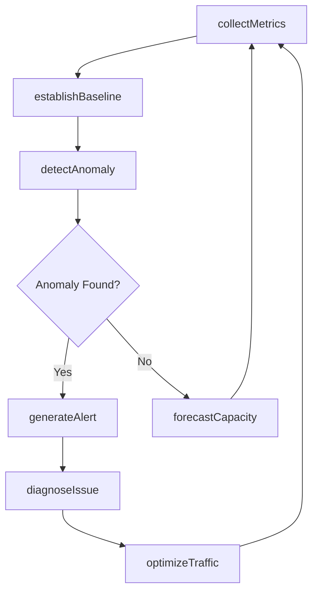
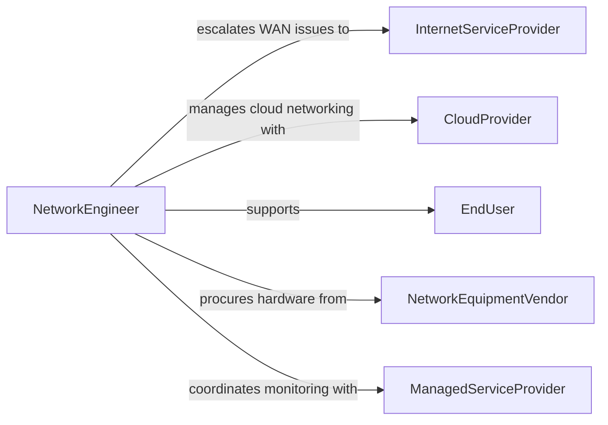

# Monitor Performance Computer Networks

> Business-as-Code definition for monitoring the performance of computer networks. Models the network observability lifecycle from baseline establishment through anomaly detection and capacity planning.

## Overview

Computer network performance monitoring involves the continuous measurement and analysis of bandwidth utilization, latency, packet loss, jitter, uptime, and error rates across LAN, WAN, and cloud network infrastructure. Network operations teams use monitoring platforms, SNMP polling, flow analysis, and synthetic testing to maintain visibility into network health. When degradation is detected, automated alerting and diagnostic workflows enable rapid identification and resolution of bottlenecks, equipment failures, and configuration issues before they impact end users.

## Actors

| Actor | Description |
|-------|-------------|
| InternetServiceProvider | Carrier delivering WAN connectivity and responsible for upstream network performance |
| CloudProvider | Infrastructure vendor hosting cloud-based network services and virtual networks |
| EndUser | Internal staff or customer experiencing network performance as service quality |
| NetworkEquipmentVendor | Manufacturer providing routers, switches, firewalls, and support contracts |
| ManagedServiceProvider | Third-party firm providing network monitoring and management services |

## Roles

| Role | Description |
|------|-------------|
| NetworkEngineer | Configures network devices and resolves complex performance and connectivity issues |
| NOCAnalyst | Monitors network dashboards, triages alerts, and performs first-level troubleshooting |
| CapacityPlanner | Analyzes utilization trends to forecast bandwidth needs and plan upgrades |
| NetworkArchitect | Designs network topology and defines performance standards and thresholds |

## Entities

| Entity | Description |
|--------|-------------|
| NetworkDevice | A router, switch, firewall, load balancer, or access point under monitoring |
| PerformanceMetric | A measured value such as bandwidth, latency, packet loss, or jitter |
| PerformanceBaseline | A historical normal range for network metrics used as a comparison reference |
| Alert | A notification triggered when a metric exceeds defined thresholds |
| NetworkTopology | A map of device interconnections, VLANs, subnets, and traffic paths |
| CapacityForecast | A projection of future bandwidth and resource requirements based on trends |

## Actions

| Action | Description |
|--------|-------------|
| collectMetrics | Gather performance data from network devices via SNMP, flow export, or API |
| establishBaseline | Calculate normal performance ranges from historical metric data |
| detectAnomaly | Identify metrics that deviate significantly from established baselines |
| diagnoseIssue | Investigate the root cause of a network performance degradation |
| generateAlert | Create and distribute a notification for a detected performance problem |
| forecastCapacity | Project future bandwidth and resource needs from utilization trends |
| optimizeTraffic | Adjust QoS policies, routing, or load balancing to improve performance |

## Events

| Event | Description |
|-------|-------------|
| metricsCollected | Performance data has been gathered from network devices for a polling interval |
| baselineEstablished | Normal performance ranges have been calculated for a network segment |
| anomalyDetected | A metric has deviated beyond the acceptable threshold from its baseline |
| alertGenerated | A performance alert has been created and sent to the operations team |
| issueDiagnosed | The root cause of a performance degradation has been identified |
| capacityForecasted | A bandwidth or resource projection has been generated for planning |
| trafficOptimized | QoS or routing adjustments have been applied to improve network performance |

## Searches

| Search | Description |
|--------|-------------|
| findActiveAlerts | Retrieve unresolved network performance alerts by severity or device |
| getMetricHistory | List performance metric values for a device or interface over a time range |
| getTopUtilization | Rank network links or devices by bandwidth utilization percentage |
| findDevicesByStatus | Look up network devices filtered by operational status or health score |

## Workflow



## Actor Relationships



## Usage

### Calling Actions

```typescript
import { monitorPerformanceComputerNetworks } from '@headlessly/monitor-performance-computer-networks'

const network = monitorPerformanceComputerNetworks()

// Collect metrics from core switches
const metrics = await network.collectMetrics({
  devices: ['core-sw-01', 'core-sw-02', 'edge-fw-01'],
  metrics: ['bandwidth', 'latency', 'packetLoss', 'jitter'],
  interval: '5m'
})

// Detect anomalies against established baselines
const anomalies = await network.detectAnomaly({
  segment: 'datacenter-core',
  metrics: metrics.data,
  sensitivityLevel: 'medium'
})

// Diagnose a detected performance issue
const diagnosis = await network.diagnoseIssue({
  alertId: 'alert-net-2026-1204',
  affectedDevice: 'core-sw-01',
  symptom: 'packet loss exceeding 2% on uplink port Eth1/1',
  diagnosticTests: ['interfaceErrors', 'crcCheck', 'cableTest', 'neighborDiscovery']
})

// Forecast capacity needs for the next quarter
const forecast = await network.forecastCapacity({
  segment: 'datacenter-core',
  period: 'Q2-2026',
  growthScenarios: ['organic', 'migration-project', 'peak-season']
})
```

### Event-Driven Automation

```typescript
// Auto-optimize traffic when congestion is detected
network.anomalyDetected(async ({ device, metric, currentValue, baseline }) => {
  if (metric === 'bandwidth' && currentValue > baseline.p95) {
    await network.optimizeTraffic({
      device,
      action: 'enable-qos-policy',
      policy: 'congestion-mitigation'
    })
  }
})

// Alert capacity planner on sustained high utilization
network.metricsCollected(async ({ segment, averageUtilization }) => {
  if (averageUtilization > 80) {
    await notify({
      to: 'capacity-planner',
      message: `Sustained utilization above 80% on ${segment}. Capacity review recommended.`
    })
  }
})
```
