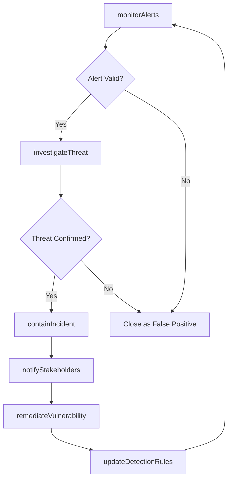
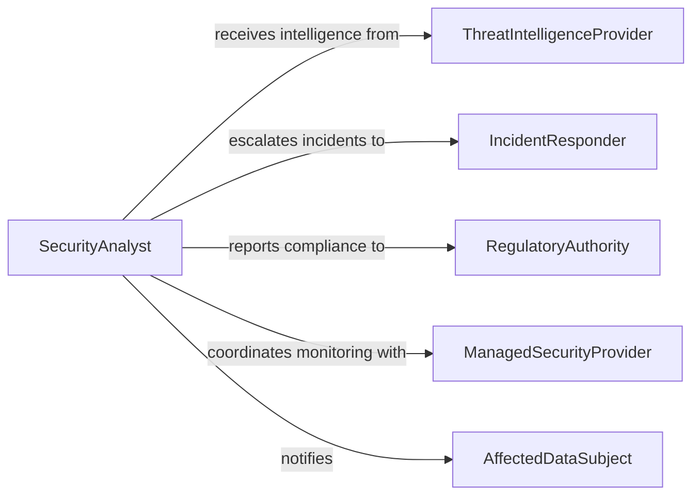

# Monitor Security Digital Information

> Business-as-Code definition for monitoring the security of digital information. Models the cybersecurity monitoring lifecycle from threat detection through incident response and remediation.

## Overview

Digital information security monitoring involves the continuous observation of networks, systems, applications, and data stores to detect unauthorized access, data breaches, malware infections, and policy violations. Security operations teams use SIEM platforms, intrusion detection systems, endpoint protection tools, and threat intelligence feeds to identify and investigate suspicious activity. When threats are confirmed, incident response procedures are activated to contain the breach, preserve evidence, remediate vulnerabilities, and notify affected stakeholders.

## Actors

| Actor | Description |
|-------|-------------|
| ThreatActor | External attacker or insider attempting unauthorized access to digital assets |
| ThreatIntelligenceProvider | Vendor supplying indicators of compromise, vulnerability data, and attack pattern intelligence |
| RegulatoryAuthority | Government body mandating data protection standards and breach notification requirements |
| ManagedSecurityProvider | Third-party SOC providing 24/7 monitoring and alert triage services |
| AffectedDataSubject | Individual whose personal data may be compromised in a security incident |

## Roles

| Role | Description |
|------|-------------|
| SecurityAnalyst | Monitors alerts, investigates suspicious activity, and escalates confirmed threats |
| IncidentResponder | Leads containment, eradication, and recovery efforts during security incidents |
| SecurityEngineer | Configures and maintains monitoring tools, detection rules, and security controls |
| ChiefInformationSecurityOfficer | Oversees the information security program and reports to executive leadership |

## Entities

| Entity | Description |
|--------|-------------|
| SecurityAlert | A notification generated by monitoring tools indicating potential malicious activity |
| SecurityIncident | A confirmed security event requiring investigation and response actions |
| ThreatIndicator | An IP address, domain, file hash, or behavior pattern associated with known threats |
| VulnerabilityRecord | A documented software or configuration weakness that could be exploited |
| AuditLog | A chronological record of system events used for forensic analysis |
| DetectionRule | A logic pattern configured in monitoring tools to identify specific threat behaviors |

## Actions

| Action | Description |
|--------|-------------|
| monitorAlerts | Review and triage security alerts generated by SIEM and detection tools |
| investigateThreat | Analyze suspicious activity to determine scope, impact, and attribution |
| containIncident | Isolate affected systems and accounts to prevent further unauthorized access |
| updateDetectionRules | Add or modify detection logic based on new threat intelligence |
| scanVulnerabilities | Assess systems for known security weaknesses and misconfigurations |
| notifyStakeholders | Communicate incident details to affected parties and regulatory authorities |
| remediateVulnerability | Apply patches, configuration changes, or compensating controls to fix weaknesses |

## Events

| Event | Description |
|-------|-------------|
| alertGenerated | A security monitoring tool has produced a new alert for review |
| threatConfirmed | An investigation has verified that a security alert represents a genuine threat |
| incidentContained | Affected systems have been isolated and further unauthorized access prevented |
| detectionRuleUpdated | Monitoring logic has been modified to address new threat patterns |
| vulnerabilityDiscovered | A system scan has identified a security weakness requiring remediation |
| stakeholdersNotified | Affected individuals and authorities have been informed of a security incident |
| vulnerabilityRemediated | A security weakness has been patched or mitigated |

## Searches

| Search | Description |
|--------|-------------|
| findOpenAlerts | Retrieve unresolved security alerts by severity, source, or time range |
| getIncidentHistory | List security incidents filtered by type, status, or affected system |
| findVulnerabilities | Look up known vulnerabilities by system, severity score, or remediation status |
| searchAuditLogs | Query system event logs by user, action type, or time range for forensic analysis |

## Workflow



## Actor Relationships



## Usage

### Calling Actions

```typescript
import { monitorSecurityDigitalInformation } from '@headlessly/monitor-security-digital-information'

const security = monitorSecurityDigitalInformation()

// Investigate a suspicious alert
const investigation = await security.investigateThreat({
  alertId: 'alert-2026-08472',
  indicators: [
    { type: 'ip', value: '198.51.100.42', context: 'outbound C2 communication' },
    { type: 'fileHash', value: 'a1b2c3d4e5f6...', context: 'suspicious executable on endpoint' }
  ],
  affectedSystems: ['ws-fin-034', 'srv-db-prod-02']
})

// Contain a confirmed incident
await security.containIncident({
  incidentId: investigation.incidentId,
  actions: [
    { type: 'isolateEndpoint', target: 'ws-fin-034' },
    { type: 'disableAccount', target: 'jdoe@company.com' },
    { type: 'blockIP', target: '198.51.100.42' }
  ]
})

// Scan for related vulnerabilities
const scan = await security.scanVulnerabilities({
  scope: ['srv-db-prod-02', 'srv-db-prod-03'],
  scanType: 'authenticated',
  priority: 'critical-high'
})
```

### Event-Driven Automation

```typescript
// Auto-contain high-severity threats
security.threatConfirmed(async ({ incidentId, severity, affectedSystems }) => {
  if (severity === 'critical') {
    for (const system of affectedSystems) {
      await security.containIncident({
        incidentId,
        actions: [{ type: 'isolateEndpoint', target: system }]
      })
    }
  }
})

// Auto-notify on data breach
security.incidentContained(async ({ incidentId, dataExposed, classification }) => {
  if (classification === 'PII' || classification === 'PHI') {
    await security.notifyStakeholders({
      incidentId,
      notificationType: 'breach',
      regulatoryRequirement: 'GDPR-72hr'
    })
  }
})
```
