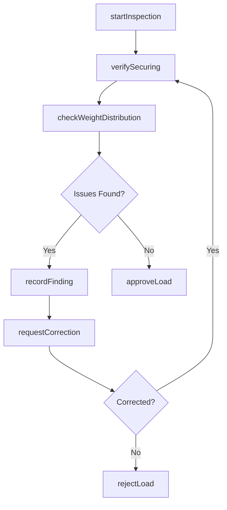
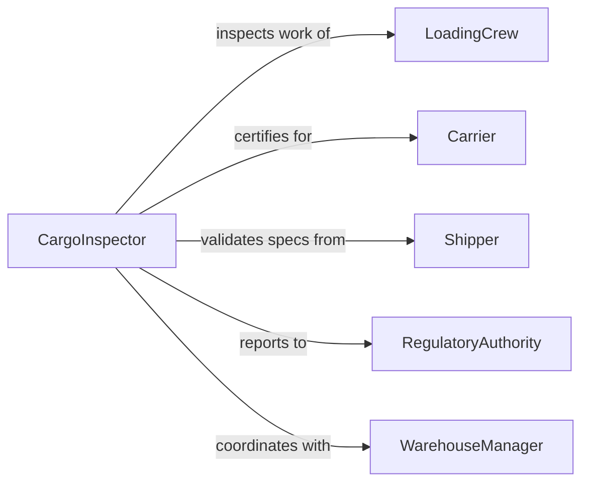

# Inspect Cargo Ensure It Is

> Business-as-Code definition for cargo loading and securing inspection. Models the complete inspection lifecycle from pre-load checks through verification and documentation.

## Overview

Cargo inspection ensures that freight is properly loaded, secured, and compliant with safety regulations before transport. This definition exposes actions for conducting inspections, recording findings, managing non-compliance, and coordinating with loading crews and carriers.

## Actors

| Actor | Description |
|-------|-------------|
| LoadingCrew | Loads and secures cargo in transport vehicles |
| Carrier | Transports cargo and maintains vehicle safety |
| Shipper | Sends cargo and provides packing specifications |
| RegulatoryAuthority | Enforces cargo safety and transportation regulations |
| WarehouseManager | Oversees loading dock operations |
| InsuranceProvider | Assesses risk based on cargo securing practices |

## Roles

| Role | Description |
|------|-------------|
| CargoInspector | Conducts inspections and verifies compliance |
| LoadMaster | Coordinates cargo placement and weight distribution |
| SafetyOfficer | Ensures adherence to safety protocols |
| DocumentationSpecialist | Records inspection results and certifications |

## Entities

| Entity | Description |
|--------|-------------|
| CargoInspection | A recorded inspection of loaded cargo |
| InspectionFinding | Specific issue or compliance point identified |
| LoadingPlan | Strategy for placing and securing cargo |
| SecuringDevice | Equipment used to restrain cargo (straps, chains) |
| ViolationReport | Documentation of non-compliance |
| InspectionCertificate | Formal approval of cargo load |

## Actions

| Action | Description |
|--------|-------------|
| startInspection | Initialize cargo inspection for a shipment |
| verifySecuring | Check that cargo restraints meet requirements |
| checkWeightDistribution | Ensure load is balanced and within limits |
| recordFinding | Document compliance issue or observation |
| requestCorrection | Require loading crew to fix identified problems |
| approveLoad | Certify cargo as ready for transport |
| rejectLoad | Deny transport authorization due to violations |

## Events

| Event | Description |
|-------|-------------|
| inspectionStarted | Cargo inspection has begun |
| securingVerified | Restraints confirmed to meet standards |
| weightDistributionChecked | Load balance verified |
| findingRecorded | Issue or observation documented |
| correctionRequested | Loading crew instructed to fix problem |
| loadApproved | Cargo certified for transport |
| loadRejected | Transport denied due to violations |

## Searches

| Search | Description |
|--------|-------------|
| findInspections | List inspections by date, vehicle, or inspector |
| getFindings | Retrieve compliance issues by shipment or type |
| getViolations | Search rejected loads or serious violations |
| getApprovals | Find certified loads by carrier or date |

## Workflow



## Actor Relationships



## Usage

### Calling Actions

```typescript
import { inspectCargoEnsureItIs } from '@headlessly/inspect-cargo-ensure-it-is'

const cargoInspection = inspectCargoEnsureItIs()

// Start inspection for outbound shipment
const inspection = await cargoInspection.startInspection({
  shipmentId: 'ship-789',
  vehicleId: 'truck-456',
  inspectorId: 'inspector-123',
  scheduledTime: '2026-02-05T08:00:00Z'
})

// Verify securing devices
const securingCheck = await cargoInspection.verifySecuring({
  inspectionId: inspection.id,
  devices: [
    { type: 'ratchet-strap', location: 'front-left', tension: 'adequate' },
    { type: 'ratchet-strap', location: 'front-right', tension: 'inadequate' }
  ]
})

// Request correction for inadequate securing
await cargoInspection.requestCorrection({
  inspectionId: inspection.id,
  findingId: 'finding-001',
  correctionRequired: 'Tighten front-right strap to minimum 1500 lbs tension',
  priority: 'high'
})
```

### Event-Driven Automation

```typescript
// Auto-notify carrier of approval
cargoInspection.loadApproved(async ({ shipmentId, vehicleId }) => {
  await notify({
    to: 'dispatch@carrier.com',
    subject: 'Load Approved for Departure',
    message: `Vehicle ${vehicleId} cleared for departure with shipment ${shipmentId}`
  })
})

// Escalate rejected loads
cargoInspection.loadRejected(async ({ shipmentId, violations }) => {
  await notify({
    to: 'safety-team',
    priority: 'urgent',
    message: `Load ${shipmentId} rejected with ${violations.length} violations`
  })
})
```
