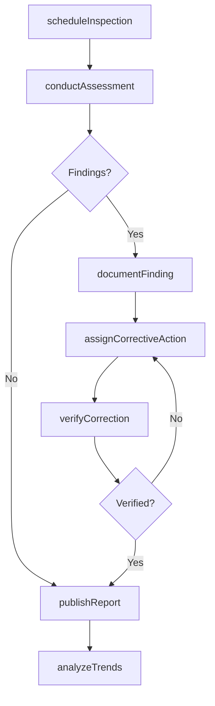
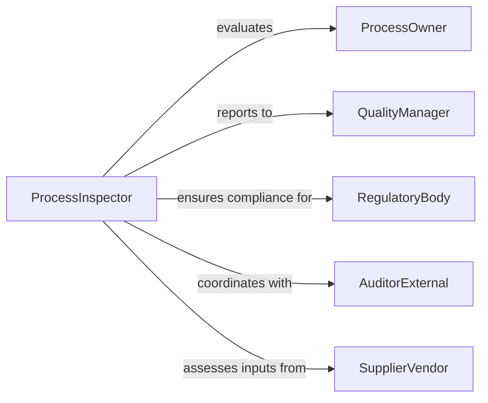

# Inspect Operational Processes

> Business-as-Code definition for operational process inspection. Models the complete inspection lifecycle from planning through assessment, findings management, and continuous improvement.

## Overview

Operational process inspection involves systematic evaluation of business workflows, manufacturing procedures, and service delivery methods to ensure compliance, efficiency, and quality. This definition exposes actions for scheduling inspections, documenting observations, managing corrective actions, and tracking performance trends.

## Actors

| Actor | Description |
|-------|-------------|
| ProcessOwner | Manages and operates the process being inspected |
| QualityManager | Oversees quality assurance and inspection programs |
| RegulatoryBody | Enforces compliance with industry standards |
| AuditorExternal | Conducts third-party audits and certifications |
| SupplierVendor | Provides inputs that affect process performance |
| CustomerClient | Benefits from process outputs and quality |

## Roles

| Role | Description |
|------|-------------|
| ProcessInspector | Conducts inspections and evaluates compliance |
| ComplianceOfficer | Ensures adherence to regulatory requirements |
| ProcessAnalyst | Analyzes inspection data for improvement opportunities |
| CorrectiveActionCoordinator | Manages remediation of identified issues |

## Entities

| Entity | Description |
|--------|-------------|
| ProcessInspection | A scheduled evaluation of an operational process |
| InspectionCriteria | Standards and metrics used to assess processes |
| Finding | Observation of compliance gap or improvement area |
| CorrectiveAction | Planned remedy for identified process deficiency |
| InspectionReport | Formal documentation of inspection results |
| TrendAnalysis | Pattern identification across multiple inspections |

## Actions

| Action | Description |
|--------|-------------|
| scheduleInspection | Plan evaluation of specific operational process |
| conductAssessment | Perform systematic review against criteria |
| documentFinding | Record compliance gap or observation |
| assignCorrectiveAction | Delegate remediation to responsible party |
| verifyCorrection | Confirm that corrective action resolved issue |
| publishReport | Distribute inspection findings and recommendations |
| analyzeTrends | Identify patterns across inspection history |

## Events

| Event | Description |
|-------|-------------|
| inspectionScheduled | Process evaluation planned and assigned |
| assessmentConducted | Systematic review completed |
| findingDocumented | Compliance gap or observation recorded |
| correctiveActionAssigned | Remediation delegated to owner |
| correctionVerified | Fix confirmed as effective |
| reportPublished | Inspection results formally shared |
| trendsAnalyzed | Patterns identified for improvement planning |

## Searches

| Search | Description |
|--------|-------------|
| findInspections | List inspections by process, date, or status |
| getFindings | Retrieve observations by severity or category |
| getCorrectiveActions | Search remediation tasks by owner or status |
| getTrends | Identify recurring issues across inspections |

## Workflow



## Actor Relationships



## Usage

### Calling Actions

```typescript
import { inspectOperationalProcesses } from '@headlessly/inspect-operational-processes'

const processInspection = inspectOperationalProcesses()

// Schedule quarterly process audit
const inspection = await processInspection.scheduleInspection({
  processId: 'manufacturing-assembly-line-3',
  scheduledDate: '2026-03-15',
  inspectorId: 'inspector-567',
  criteria: ['ISO9001', 'company-standards-v2']
})

// Conduct assessment and document findings
await processInspection.conductAssessment({
  inspectionId: inspection.id,
  checkpoints: [
    { criterion: 'work-instruction-compliance', status: 'compliant' },
    { criterion: 'tool-calibration', status: 'non-compliant' },
    { criterion: 'training-records', status: 'compliant' }
  ]
})

// Document non-compliance and assign corrective action
const finding = await processInspection.documentFinding({
  inspectionId: inspection.id,
  category: 'equipment-calibration',
  severity: 'medium',
  description: 'Torque wrench calibration expired by 14 days'
})

await processInspection.assignCorrectiveAction({
  findingId: finding.id,
  assignedTo: 'maintenance-supervisor',
  dueDate: '2026-03-22',
  action: 'Recalibrate all torque wrenches and update calibration schedule'
})
```

### Event-Driven Automation

```typescript
// Auto-escalate critical findings
processInspection.findingDocumented(async ({ finding }) => {
  if (finding.severity === 'critical') {
    await notify({
      to: 'quality-director',
      priority: 'urgent',
      message: `Critical finding in ${finding.processName}: ${finding.description}`
    })
  }
})

// Generate monthly trend reports
processInspection.reportPublished(async ({ report }) => {
  const monthEnd = isMonthEnd(report.date)
  if (monthEnd) {
    await processInspection.analyzeTrends({
      period: 'monthly',
      processes: report.processes
    })
  }
})
```
