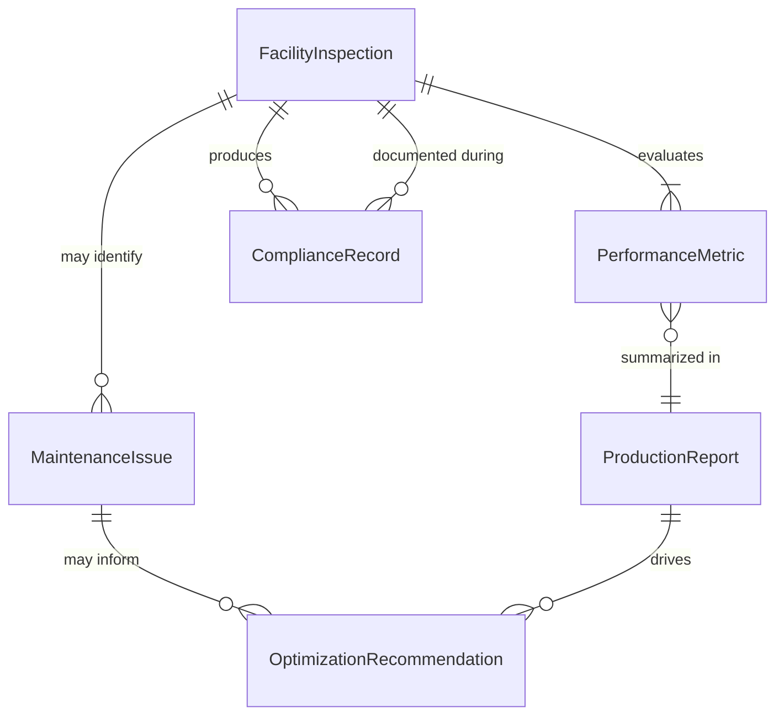
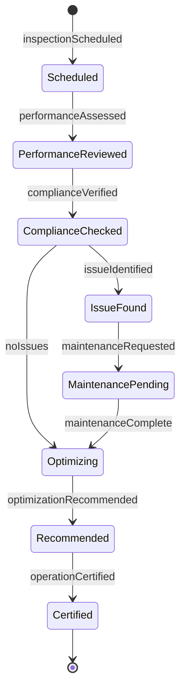
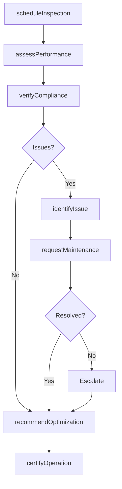
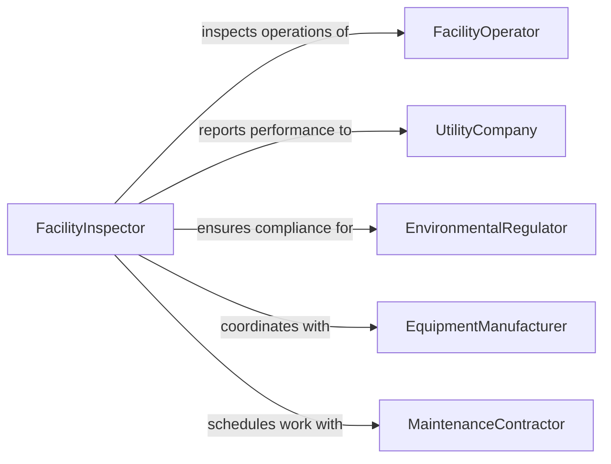

# Inspect Operations Green Energy Facilities

> Business-as-Code definition for green energy facility operations inspection. Models the complete inspection lifecycle from planning through performance verification, compliance documentation, and optimization recommendations.

## Overview

Green energy facility inspection involves evaluating the operational performance, safety, and environmental compliance of renewable energy installations including solar farms, wind turbines, hydroelectric plants, and biomass facilities. This definition exposes actions for scheduling inspections, monitoring performance metrics, documenting findings, and coordinating maintenance.

## Actors

| Actor | Description |
|-------|-------------|
| FacilityOperator | Manages day-to-day renewable energy production |
| UtilityCompany | Purchases power generated by the facility |
| EnvironmentalRegulator | Enforces environmental compliance standards |
| EquipmentManufacturer | Provides technical specifications and support |
| MaintenanceContractor | Performs repairs and preventive maintenance |
| GridOperator | Manages integration with electrical grid |

## Roles

| Role | Description |
|------|-------------|
| FacilityInspector | Conducts operational and safety inspections |
| PerformanceAnalyst | Evaluates energy production efficiency |
| EnvironmentalComplianceOfficer | Ensures adherence to environmental regulations |
| TechnicalSpecialist | Assesses specialized renewable technology |

## Entities

| Entity | Description |
|--------|-------------|
| FacilityInspection | Scheduled evaluation of renewable energy facility |
| PerformanceMetric | Energy output, efficiency, or uptime measurement |
| ComplianceRecord | Documentation of environmental and safety adherence |
| MaintenanceIssue | Identified equipment or operational deficiency |
| ProductionReport | Energy generation data for inspection period |
| OptimizationRecommendation | Suggested improvement to facility operations |

## Actions

| Action | Description |
|--------|-------------|
| scheduleInspection | Plan evaluation of green energy facility |
| assessPerformance | Evaluate energy production against capacity |
| verifyCompliance | Check environmental and safety standards |
| identifyIssue | Document equipment or operational problem |
| recommendOptimization | Suggest improvements to energy production |
| certifyOperation | Approve facility for continued operation |
| requestMaintenance | Schedule repair or preventive service |

## Events

| Event | Description |
|-------|-------------|
| inspectionScheduled | Facility evaluation planned |
| performanceAssessed | Energy production metrics analyzed |
| complianceVerified | Environmental and safety standards confirmed |
| issueIdentified | Equipment or operational problem documented |
| optimizationRecommended | Improvement suggestion provided |
| operationCertified | Facility approved for continued operation |
| maintenanceRequested | Repair or service scheduled |

## Searches

| Search | Description |
|--------|-------------|
| findInspections | List inspections by facility, date, or type |
| getPerformanceMetrics | Retrieve energy production data |
| getComplianceRecords | Search environmental and safety documentation |
| getIssues | Find maintenance problems by facility or severity |

## Entity Relationships



## State Diagram



## Workflow



## Actor Relationships



## Usage

### Calling Actions

```typescript
import { inspectOperationsGreenEnergyFacilities } from '@headlessly/inspect-operations-green-energy-facilities'

const greenEnergyInspection = inspectOperationsGreenEnergyFacilities()

// Schedule quarterly wind farm inspection
const inspection = await greenEnergyInspection.scheduleInspection({
  facilityId: 'wind-farm-north-ridge',
  facilityType: 'wind',
  scheduledDate: '2026-03-15',
  inspectorId: 'inspector-345',
  scope: ['performance', 'compliance', 'safety']
})

// Assess energy production performance
const performance = await greenEnergyInspection.assessPerformance({
  inspectionId: inspection.id,
  period: { start: '2026-01-01', end: '2026-03-01' },
  metrics: {
    energyProduced: 125000, // MWh
    capacity: 150000, // MWh
    uptime: 0.92,
    turbinesOperational: 47,
    turbinesTotal: 50
  }
})

// Identify maintenance issue
await greenEnergyInspection.identifyIssue({
  inspectionId: inspection.id,
  turbineId: 'turbine-23',
  issueType: 'gearbox-vibration',
  severity: 'medium',
  description: 'Excessive vibration detected in main gearbox'
})
```

### Event-Driven Automation

```typescript
// Auto-schedule maintenance for critical issues
greenEnergyInspection.issueIdentified(async ({ issue, facilityId }) => {
  if (issue.severity === 'critical') {
    await greenEnergyInspection.requestMaintenance({
      facilityId,
      issueId: issue.id,
      priority: 'urgent',
      scheduledDate: 'next-available'
    })
  }
})

// Notify utility of performance shortfalls
greenEnergyInspection.performanceAssessed(async ({ performance, facilityId }) => {
  const efficiency = performance.energyProduced / performance.capacity
  if (efficiency < 0.75) {
    await notify({
      to: 'utility-operations',
      subject: 'Underperformance Alert',
      message: `Facility ${facilityId} operating at ${(efficiency * 100).toFixed(1)}% capacity`
    })
  }
})
```
