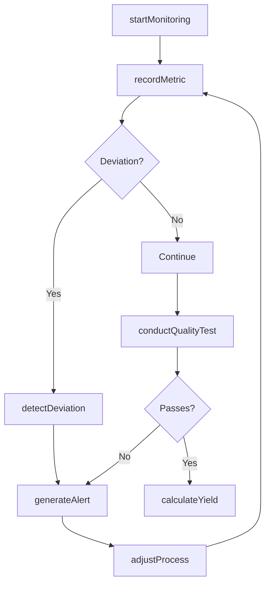
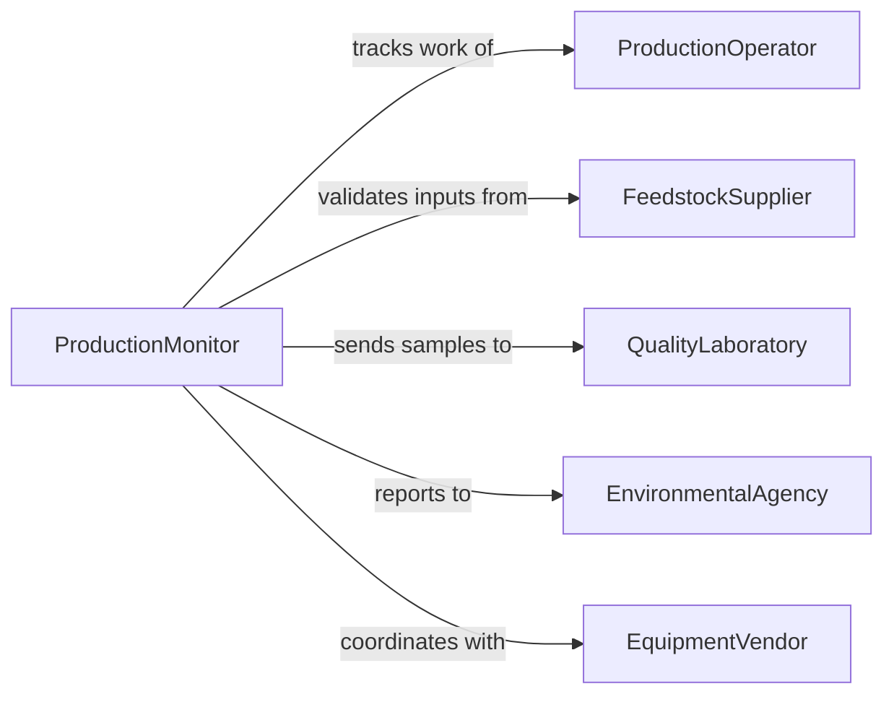

# Monitor Biofuel Production Operations

> Business-as-Code definition for biofuel production operations monitoring. Models the complete monitoring lifecycle from feedstock processing through conversion, quality control, and yield optimization.

## Overview

Biofuel production monitoring involves real-time oversight of feedstock processing, fermentation or conversion processes, quality assurance, and output measurement for biodiesel, ethanol, and other renewable fuel production. This definition exposes actions for tracking production metrics, detecting process deviations, managing quality control, and optimizing yield.

## Actors

| Actor | Description |
|-------|-------------|
| FeedstockSupplier | Provides raw materials for biofuel conversion |
| ProductionOperator | Manages day-to-day biofuel production processes |
| QualityLaboratory | Conducts testing and analysis of biofuel products |
| EnvironmentalAgency | Regulates emissions and waste from production |
| FuelDistributor | Purchases and distributes finished biofuel |
| EquipmentVendor | Provides processing equipment and technical support |

## Roles

| Role | Description |
|------|-------------|
| ProductionMonitor | Oversees real-time production operations |
| ProcessEngineer | Optimizes conversion efficiency and yield |
| QualityControlSpecialist | Ensures biofuel meets specifications |
| ComplianceOfficer | Manages environmental and regulatory adherence |

## Entities

| Entity | Description |
|--------|-------------|
| ProductionBatch | A discrete run of biofuel production |
| ProcessMetric | Measurement of temperature, pressure, pH, or conversion rate |
| QualityTest | Analysis of biofuel composition and performance |
| ProcessDeviation | Departure from normal operating parameters |
| YieldReport | Production output measurement and efficiency |
| MaintenanceAlert | Notification of equipment requiring service |

## Actions

| Action | Description |
|--------|-------------|
| startMonitoring | Initialize tracking for production batch |
| recordMetric | Log process parameter measurement |
| detectDeviation | Identify parameter outside normal range |
| adjustProcess | Modify operating conditions to correct deviation |
| conductQualityTest | Analyze biofuel sample for specification compliance |
| calculateYield | Determine production output and efficiency |
| generateAlert | Notify personnel of process or quality issue |

## Events

| Event | Description |
|-------|-------------|
| monitoringStarted | Production batch tracking initialized |
| metricRecorded | Process parameter measurement logged |
| deviationDetected | Parameter outside normal range identified |
| processAdjusted | Operating conditions modified |
| qualityTestConducted | Biofuel sample analysis completed |
| yieldCalculated | Production output and efficiency determined |
| alertGenerated | Process or quality issue notification sent |

## Searches

| Search | Description |
|--------|-------------|
| findBatches | List production runs by date, feedstock, or status |
| getMetrics | Retrieve process parameters by batch or timeframe |
| getDeviations | Search process anomalies by type or severity |
| getQualityTests | Find test results by batch or specification |

## Workflow



## Actor Relationships



## Usage

### Calling Actions

```typescript
import { monitorBiofuelProductionOperations } from '@headlessly/monitor-biofuel-production-operations'

const biofuelMonitoring = monitorBiofuelProductionOperations()

// Start monitoring ethanol production batch
const batch = await biofuelMonitoring.startMonitoring({
  batchId: 'batch-2026-034',
  feedstock: 'corn',
  feedstockVolume: 50000, // gallons
  targetOutput: 17500, // gallons ethanol
  startTime: '2026-02-05T06:00:00Z'
})

// Record fermentation temperature
await biofuelMonitoring.recordMetric({
  batchId: batch.id,
  metric: 'fermentation-temperature',
  value: 32.5, // Celsius
  timestamp: '2026-02-05T12:00:00Z',
  normalRange: { min: 30, max: 35 }
})

// Detect and respond to temperature deviation
const deviation = await biofuelMonitoring.detectDeviation({
  batchId: batch.id,
  metric: 'fermentation-temperature',
  value: 37.2,
  expectedRange: { min: 30, max: 35 },
  severity: 'medium'
})

await biofuelMonitoring.adjustProcess({
  batchId: batch.id,
  adjustment: 'reduce-heating',
  targetValue: 32,
  timestamp: '2026-02-05T12:15:00Z'
})
```

### Event-Driven Automation

```typescript
// Auto-alert on critical deviations
biofuelMonitoring.deviationDetected(async ({ deviation, batchId }) => {
  if (deviation.severity === 'critical') {
    await biofuelMonitoring.generateAlert({
      batchId,
      alertType: 'critical-deviation',
      recipients: ['production-manager', 'process-engineer'],
      message: `Critical deviation: ${deviation.metric} at ${deviation.value}`
    })
  }
})

// Auto-calculate yield on quality test pass
biofuelMonitoring.qualityTestConducted(async ({ test, batchId }) => {
  if (test.result === 'pass') {
    await biofuelMonitoring.calculateYield({
      batchId,
      includeMetrics: ['conversion-efficiency', 'energy-consumption', 'waste-volume']
    })
  }
})
```
