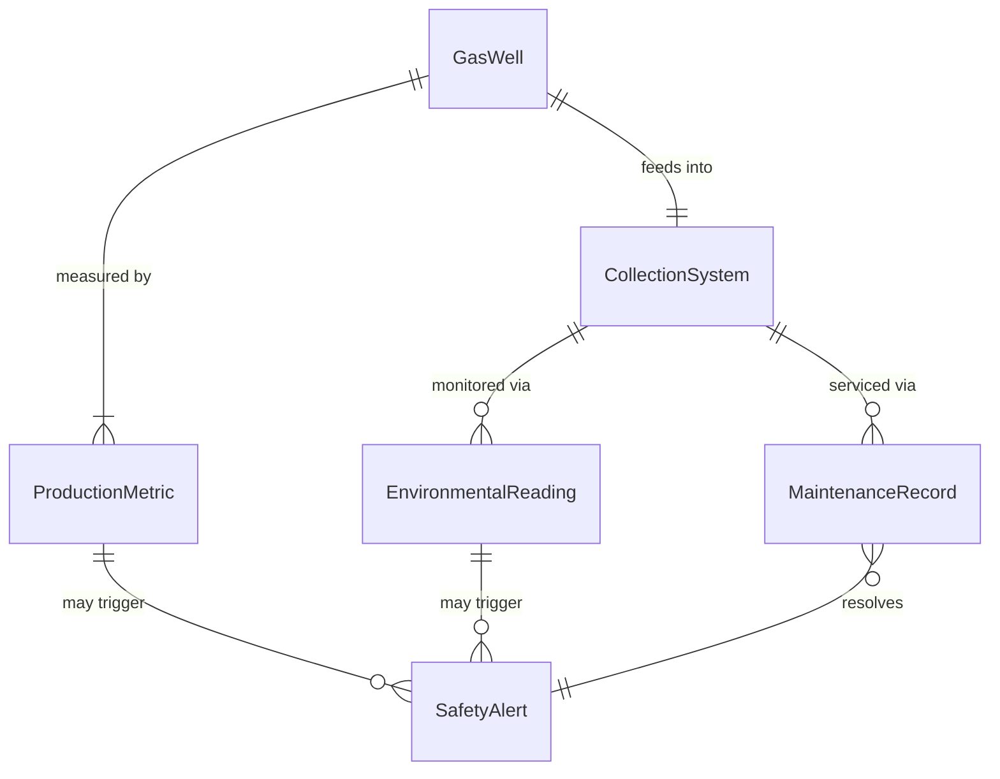
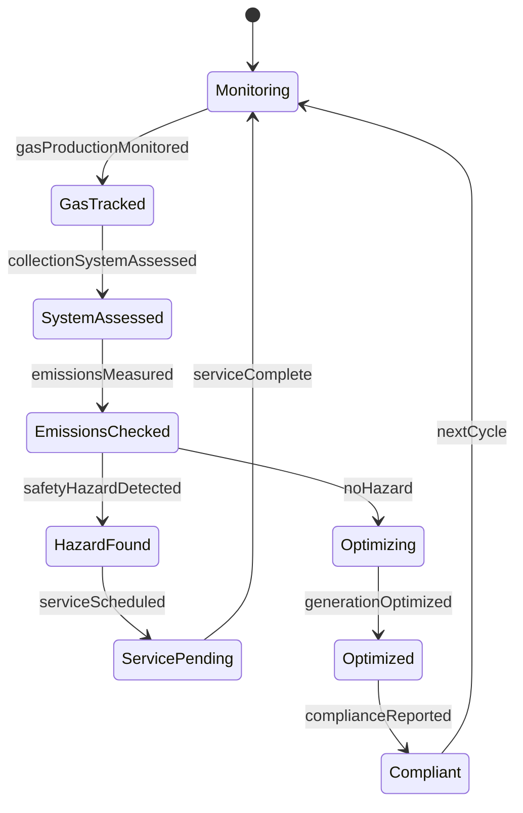
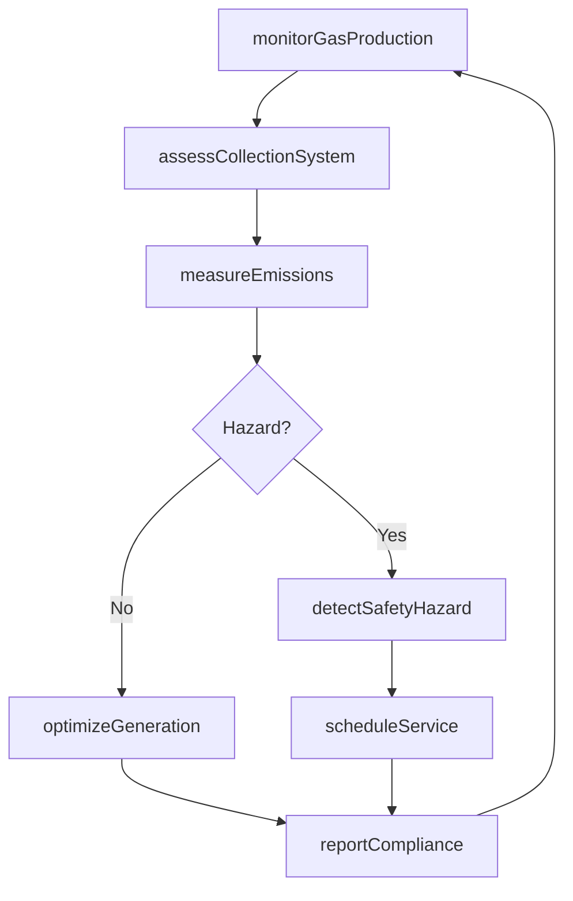
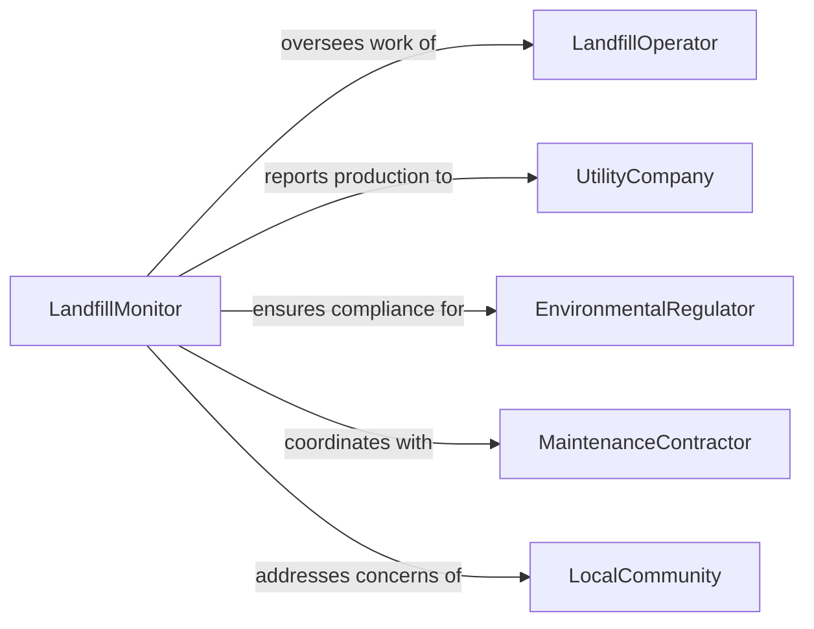

# Monitor Conditions Energy-producing Landfills

> Business-as-Code definition for energy-producing landfill conditions monitoring. Models the complete monitoring lifecycle from gas collection through power generation, environmental compliance, and safety oversight.

## Overview

Energy-producing landfill monitoring involves continuous assessment of methane gas extraction, power generation systems, environmental conditions, and safety parameters at facilities that convert landfill gas to electricity or renewable natural gas. This definition exposes actions for tracking gas production, managing collection systems, ensuring environmental compliance, and optimizing energy output.

## Actors

| Actor | Description |
|-------|-------------|
| LandfillOperator | Manages waste disposal and gas collection operations |
| UtilityCompany | Purchases electricity or gas produced from landfill |
| EnvironmentalRegulator | Enforces air quality and emissions standards |
| MaintenanceContractor | Services gas collection and generation equipment |
| LocalCommunity | Lives near landfill and monitors environmental impact |
| EquipmentManufacturer | Provides gas-to-energy conversion systems |

## Roles

| Role | Description |
|------|-------------|
| LandfillMonitor | Oversees gas collection and energy production systems |
| EnvironmentalComplianceOfficer | Ensures adherence to emissions and safety regulations |
| GasSystemEngineer | Manages methane extraction and processing |
| PowerGenerationSpecialist | Operates electricity or RNG production systems |

## Entities

| Entity | Description |
|--------|-------------|
| GasWell | Extraction point for landfill methane |
| CollectionSystem | Network of pipes and blowers gathering gas |
| ProductionMetric | Measurement of gas volume, energy output, or efficiency |
| EnvironmentalReading | Air quality, odor, or emissions measurement |
| SafetyAlert | Notification of hazardous condition |
| MaintenanceRecord | Documentation of system service or repair |

## Actions

| Action | Description |
|--------|-------------|
| monitorGasProduction | Track methane volume and quality from wells |
| assessCollectionSystem | Evaluate performance of extraction network |
| measureEmissions | Record air quality and pollutant levels |
| detectSafetyHazard | Identify dangerous conditions requiring response |
| optimizeGeneration | Adjust operations to maximize energy output |
| scheduleService | Plan maintenance for gas or power equipment |
| reportCompliance | Document adherence to environmental regulations |

## Events

| Event | Description |
|-------|-------------|
| gasProductionMonitored | Methane volume and quality data recorded |
| collectionSystemAssessed | Extraction network performance evaluated |
| emissionsMeasured | Air quality and pollutant data logged |
| safetyHazardDetected | Dangerous condition identified |
| generationOptimized | Energy output maximized through adjustments |
| serviceScheduled | Maintenance planned for equipment |
| complianceReported | Environmental adherence documented |

## Searches

| Search | Description |
|--------|-------------|
| findGasWells | List extraction points by production or status |
| getProductionMetrics | Retrieve gas volume or energy output data |
| getEmissions | Search air quality measurements by location or date |
| getSafetyAlerts | Find hazardous conditions by type or severity |

## Entity Relationships



## State Diagram



## Workflow



## Actor Relationships



## Usage

### Calling Actions

```typescript
import { monitorConditionsEnergyProducingLandfills } from '@headlessly/monitor-conditions-energy-producing-landfills'

const landfillMonitoring = monitorConditionsEnergyProducingLandfills()

// Monitor gas production from well field
const gasData = await landfillMonitoring.monitorGasProduction({
  facilityId: 'landfill-greenwood',
  wells: [
    { wellId: 'well-A12', methaneVolume: 850, methaneConcentration: 52 },
    { wellId: 'well-B07', methaneVolume: 920, methaneConcentration: 48 },
    { wellId: 'well-C15', methaneVolume: 780, methaneConcentration: 55 }
  ],
  timestamp: '2026-02-05T10:00:00Z'
})

// Measure emissions at perimeter
await landfillMonitoring.measureEmissions({
  facilityId: 'landfill-greenwood',
  location: 'south-perimeter',
  measurements: {
    methane: 2.1, // ppm
    carbonDioxide: 380, // ppm
    hydrogenSulfide: 0.05, // ppm
    odorIntensity: 'moderate'
  },
  timestamp: '2026-02-05T10:30:00Z'
})

// Detect safety hazard
await landfillMonitoring.detectSafetyHazard({
  facilityId: 'landfill-greenwood',
  hazardType: 'high-methane-concentration',
  location: 'gas-processing-building',
  severity: 'high',
  reading: 5.2, // percent LEL
  action: 'evacuate-and-ventilate'
})
```

### Event-Driven Automation

```typescript
// Auto-respond to safety hazards
landfillMonitoring.safetyHazardDetected(async ({ hazard, facilityId }) => {
  if (hazard.severity === 'critical') {
    await notify({
      to: ['emergency-response-team', 'facility-manager'],
      priority: 'urgent',
      message: `Critical safety hazard at ${facilityId}: ${hazard.hazardType}`
    })
  }
})

// Schedule maintenance for underperforming wells
landfillMonitoring.gasProductionMonitored(async ({ wells, facilityId }) => {
  const underperforming = wells.filter(w => w.methaneVolume < 500)
  if (underperforming.length > 0) {
    await landfillMonitoring.scheduleService({
      facilityId,
      equipmentType: 'gas-well',
      wellIds: underperforming.map(w => w.wellId),
      priority: 'medium'
    })
  }
})
```
