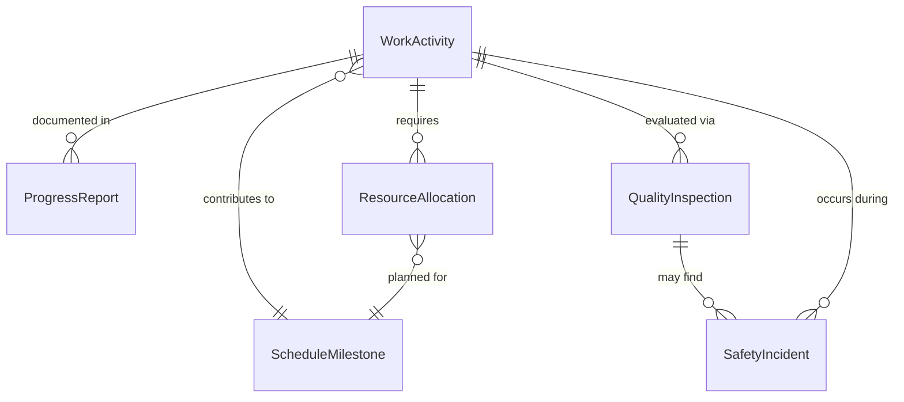
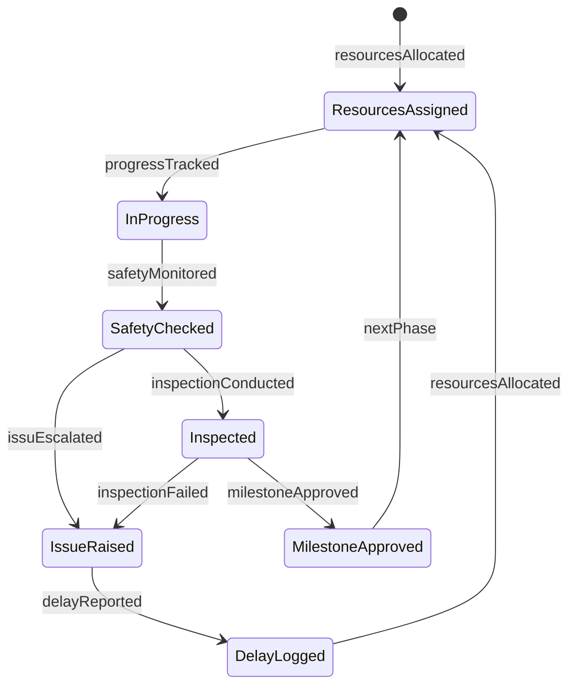
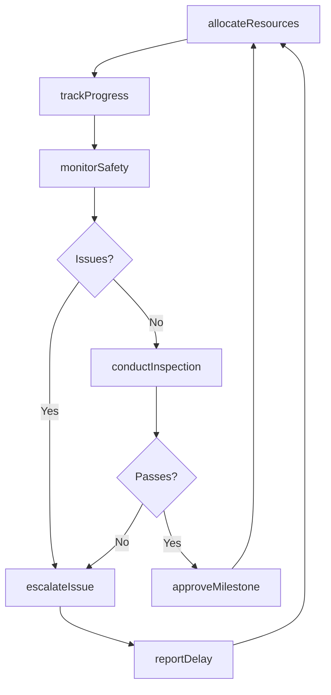
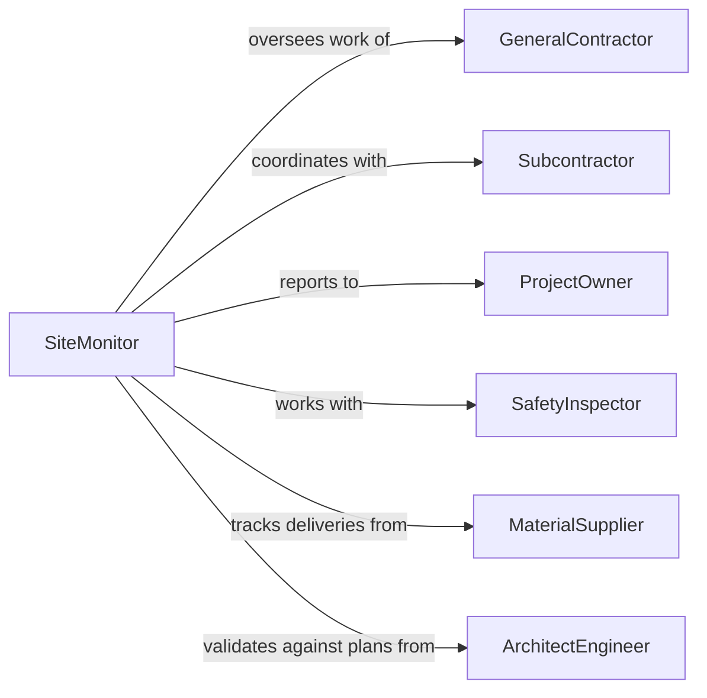

# Monitor Construction Operations

> Business-as-Code definition for construction operations monitoring. Models the complete monitoring lifecycle from site preparation through progress tracking, safety oversight, quality control, and schedule management.

## Overview

Construction operations monitoring involves real-time oversight of building activities, equipment usage, worker safety, material delivery, and project milestones to ensure projects are completed on time, within budget, and to specification. This definition exposes actions for tracking work progress, managing safety compliance, coordinating resources, and reporting project status.

## Actors

| Actor | Description |
|-------|-------------|
| GeneralContractor | Manages overall construction project execution |
| Subcontractor | Performs specialized work (electrical, plumbing, HVAC) |
| ProjectOwner | Client who commissioned the construction project |
| SafetyInspector | Enforces workplace safety regulations |
| MaterialSupplier | Delivers construction materials and equipment |
| ArchitectEngineer | Provides technical specifications and approvals |

## Roles

| Role | Description |
|------|-------------|
| SiteMonitor | Oversees daily construction activities and progress |
| SafetyOfficer | Ensures compliance with safety protocols |
| QualityController | Verifies work meets specifications and standards |
| ScheduleCoordinator | Manages project timeline and resource allocation |

## Entities

| Entity | Description |
|--------|-------------|
| WorkActivity | A specific construction task or operation |
| ProgressReport | Documentation of work completed in a period |
| SafetyIncident | Record of accident, hazard, or violation |
| QualityInspection | Evaluation of completed work against standards |
| ResourceAllocation | Assignment of workers, equipment, or materials |
| ScheduleMilestone | Key project deadline or completion target |

## Actions

| Action | Description |
|--------|-------------|
| trackProgress | Record completion status of construction activities |
| monitorSafety | Oversee compliance with safety protocols |
| conductInspection | Evaluate quality of completed work |
| allocateResources | Assign workers, equipment, or materials to tasks |
| reportDelay | Document schedule slippage or obstacles |
| approveMilestone | Certify completion of project phase |
| escalateIssue | Notify management of critical problem |

## Events

| Event | Description |
|-------|-------------|
| progressTracked | Work completion status recorded |
| safetyMonitored | Safety compliance check performed |
| inspectionConducted | Quality evaluation completed |
| resourcesAllocated | Workers or equipment assigned to tasks |
| delayReported | Schedule slippage documented |
| milestoneApproved | Project phase completion certified |
| issuEscalated | Critical problem raised to management |

## Searches

| Search | Description |
|--------|-------------|
| findActivities | List construction tasks by status or trade |
| getProgressReports | Retrieve completion data by period or phase |
| getSafetyIncidents | Search accidents or violations by type or date |
| getInspections | Find quality evaluations by area or result |

## Entity Relationships



## State Diagram



## Workflow



## Actor Relationships



## Usage

### Calling Actions

```typescript
import { monitorConstructionOperations } from '@headlessly/monitor-construction-operations'

const constructionMonitoring = monitorConstructionOperations()

// Track framing progress
const progress = await constructionMonitoring.trackProgress({
  projectId: 'building-cedar-towers',
  activityId: 'frame-floors-3-5',
  percentComplete: 65,
  workersOnSite: 12,
  equipmentUsed: ['crane-01', 'forklift-03'],
  reportDate: '2026-02-05'
})

// Monitor safety during high-risk work
await constructionMonitoring.monitorSafety({
  projectId: 'building-cedar-towers',
  area: 'floor-5-east',
  checklistItems: [
    { item: 'fall-protection', status: 'compliant' },
    { item: 'hard-hats', status: 'compliant' },
    { item: 'scaffold-inspection', status: 'non-compliant' }
  ],
  inspectorId: 'safety-officer-234'
})

// Conduct quality inspection on concrete pour
const inspection = await constructionMonitoring.conductInspection({
  projectId: 'building-cedar-towers',
  workArea: 'floor-4-slab',
  inspectionType: 'concrete-quality',
  result: 'pass',
  notes: 'Slump test 4 inches, temperature 68F, no visible defects'
})
```

### Event-Driven Automation

```typescript
// Auto-escalate safety violations
constructionMonitoring.safetyMonitored(async ({ checklistItems, projectId }) => {
  const violations = checklistItems.filter(item => item.status === 'non-compliant')
  if (violations.length > 0) {
    await constructionMonitoring.escalateIssue({
      projectId,
      issueType: 'safety-violation',
      severity: 'high',
      items: violations
    })
  }
})

// Auto-report delays on milestone approach
constructionMonitoring.progressTracked(async ({ projectId, activityId, percentComplete }) => {
  const milestone = await getMilestone(activityId)
  const daysToDeadline = daysBetween(new Date(), milestone.deadline)
  if (daysToDeadline < 5 && percentComplete < 90) {
    await constructionMonitoring.reportDelay({
      projectId,
      activityId,
      estimatedSlippage: Math.ceil((100 - percentComplete) / 10)
    })
  }
})
```
