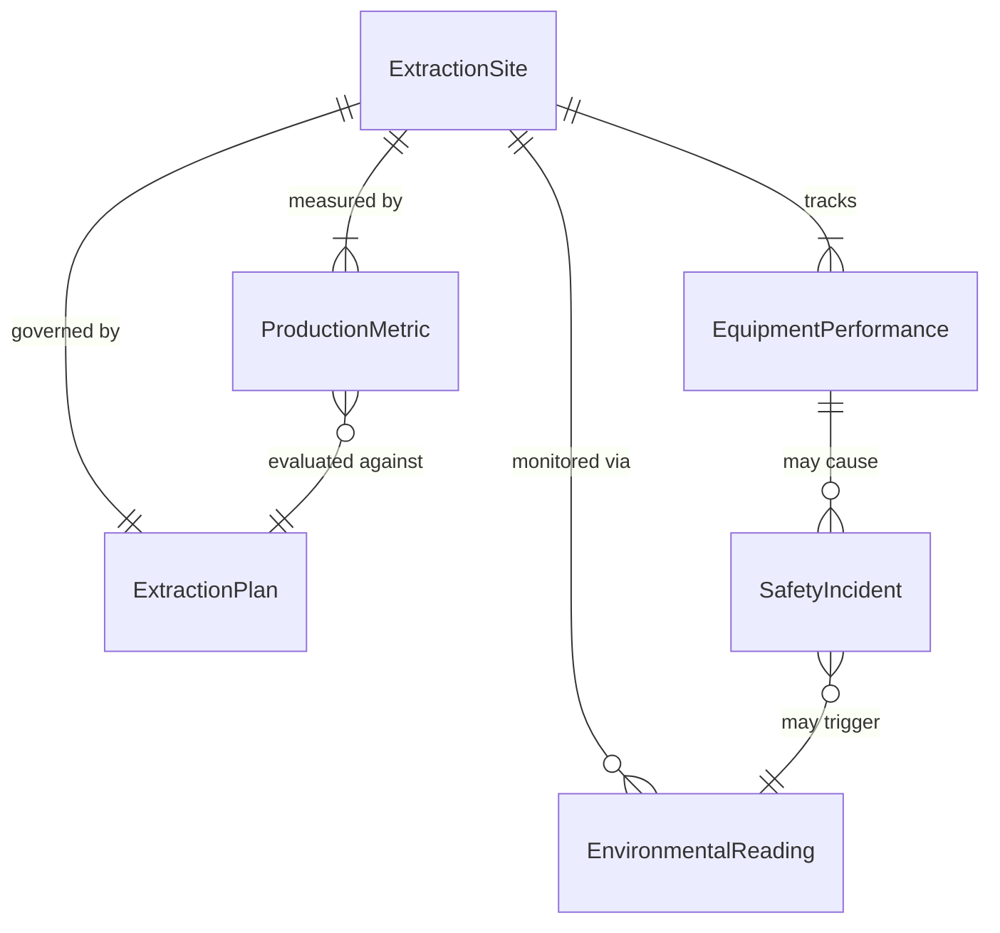
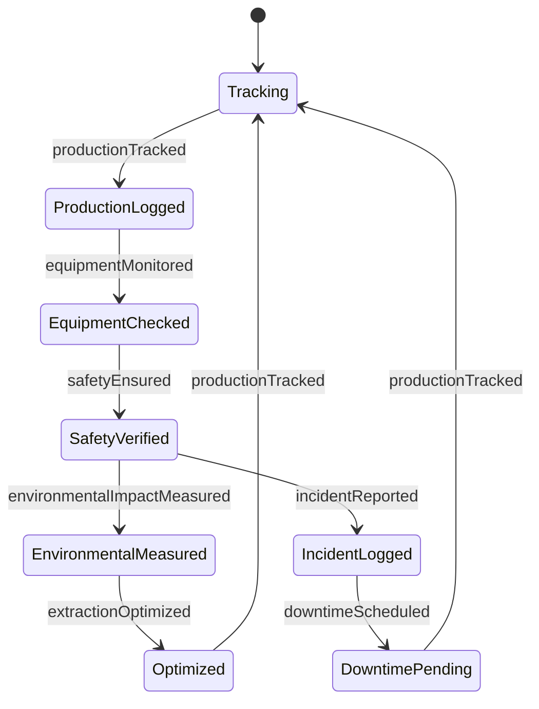
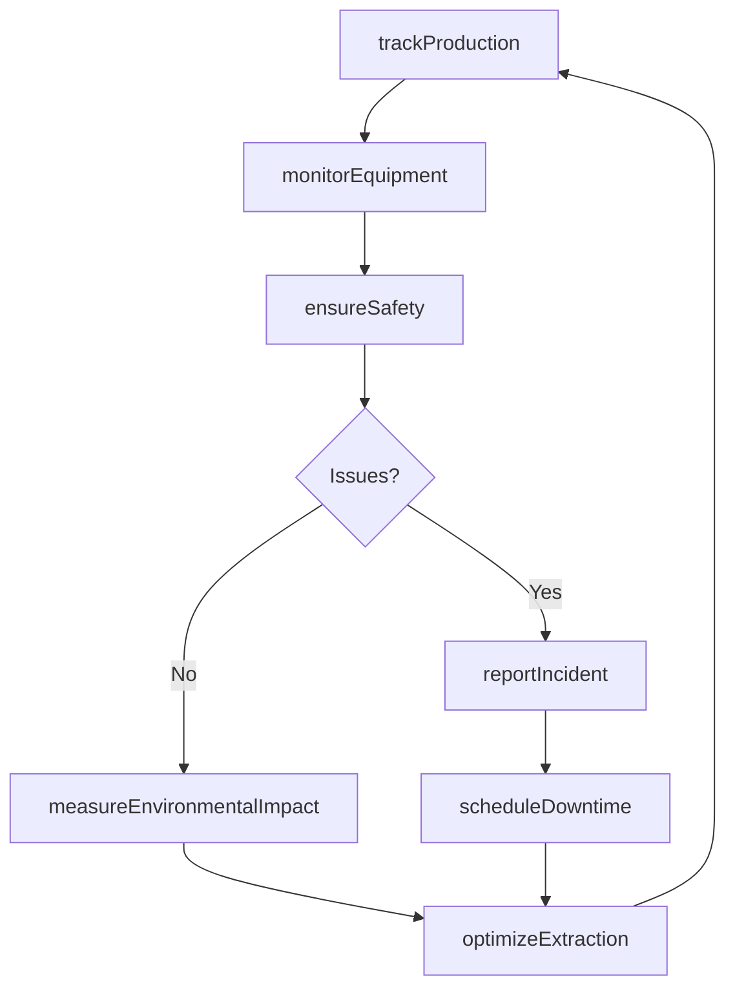
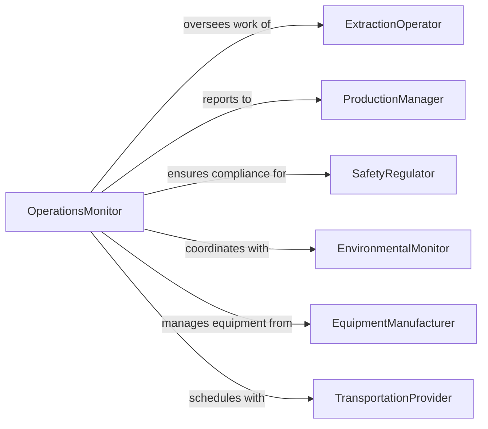

# Monitor Extraction Operations

> Business-as-Code definition for extraction operations monitoring. Models the complete monitoring lifecycle from resource extraction through equipment performance, safety compliance, environmental oversight, and production optimization.

## Overview

Extraction operations monitoring involves real-time oversight of mining, drilling, quarrying, and resource harvesting activities to ensure safety, environmental compliance, equipment efficiency, and production targets. This definition exposes actions for tracking extraction volumes, managing equipment performance, ensuring worker safety, and coordinating environmental monitoring.

## Actors

| Actor | Description |
|-------|-------------|
| ExtractionOperator | Manages drilling, blasting, or extraction equipment |
| ProductionManager | Oversees output targets and operational efficiency |
| SafetyRegulator | Enforces mining and extraction safety standards |
| EnvironmentalMonitor | Tracks environmental impact and compliance |
| EquipmentManufacturer | Provides extraction machinery and technical support |
| TransportationProvider | Hauls extracted materials from site |

## Roles

| Role | Description |
|------|-------------|
| OperationsMonitor | Oversees extraction activities and performance |
| SafetyOfficer | Ensures compliance with safety protocols |
| EnvironmentalCompliance | Manages adherence to environmental regulations |
| ProductionAnalyst | Evaluates efficiency and optimizes output |

## Entities

| Entity | Description |
|--------|-------------|
| ExtractionSite | Location where resource extraction occurs |
| ProductionMetric | Measurement of volume, rate, or efficiency |
| EquipmentPerformance | Data on machinery uptime, maintenance, or issues |
| SafetyIncident | Record of accident, hazard, or violation |
| EnvironmentalReading | Measurement of air quality, water, or land impact |
| ExtractionPlan | Strategy for resource removal and site management |

## Actions

| Action | Description |
|--------|-------------|
| trackProduction | Record extraction volume and rate |
| monitorEquipment | Assess machinery performance and status |
| ensureSafety | Verify compliance with safety protocols |
| measureEnvironmentalImpact | Record air, water, or land quality metrics |
| optimizeExtraction | Adjust operations to maximize efficiency |
| reportIncident | Document safety or environmental violation |
| scheduleDowntime | Plan equipment maintenance or repairs |

## Events

| Event | Description |
|-------|-------------|
| productionTracked | Extraction volume and rate recorded |
| equipmentMonitored | Machinery performance assessed |
| safetyEnsured | Safety compliance verified |
| environmentalImpactMeasured | Air, water, or land quality data logged |
| extractionOptimized | Operations adjusted for efficiency |
| incidentReported | Safety or environmental violation documented |
| downtimeScheduled | Maintenance or repair planned |

## Searches

| Search | Description |
|--------|-------------|
| findExtractionSites | List sites by resource type or production level |
| getProductionMetrics | Retrieve extraction volume or rate data |
| getEquipmentStatus | Search machinery performance by type or site |
| getIncidents | Find safety or environmental violations |

## Entity Relationships



## State Diagram



## Workflow



## Actor Relationships



## Usage

### Calling Actions

```typescript
import { monitorExtractionOperations } from '@headlessly/monitor-extraction-operations'

const extractionMonitoring = monitorExtractionOperations()

// Track daily coal extraction
const production = await extractionMonitoring.trackProduction({
  siteId: 'mine-blackrock-pit-7',
  resourceType: 'coal',
  volumeExtracted: 1850, // tons
  extractionRate: 185, // tons per hour
  shift: 'day',
  date: '2026-02-05'
})

// Monitor dragline excavator performance
await extractionMonitoring.monitorEquipment({
  siteId: 'mine-blackrock-pit-7',
  equipmentId: 'dragline-03',
  metrics: {
    hoursOperated: 10,
    cycleTime: 55, // seconds
    breakdowns: 0,
    maintenanceStatus: 'current'
  },
  timestamp: '2026-02-05T16:00:00Z'
})

// Measure air quality impact
await extractionMonitoring.measureEnvironmentalImpact({
  siteId: 'mine-blackrock-pit-7',
  measurementType: 'air-quality',
  readings: {
    particulateMatter: 45, // µg/m³
    sulfurDioxide: 12, // ppb
    nitrogenOxides: 8 // ppb
  },
  location: 'downwind-monitor-east',
  timestamp: '2026-02-05T14:00:00Z'
})
```

### Event-Driven Automation

```typescript
// Auto-schedule maintenance for underperforming equipment
extractionMonitoring.equipmentMonitored(async ({ equipmentId, metrics }) => {
  if (metrics.breakdowns > 2 || metrics.cycleTime > 60) {
    await extractionMonitoring.scheduleDowntime({
      equipmentId,
      maintenanceType: 'preventive',
      priority: 'high',
      scheduledDate: 'next-available'
    })
  }
})

// Alert on environmental threshold exceedance
extractionMonitoring.environmentalImpactMeasured(async ({ readings, siteId }) => {
  if (readings.particulateMatter > 50) {
    await notify({
      to: 'environmental-compliance',
      priority: 'urgent',
      message: `Air quality threshold exceeded at ${siteId}: PM ${readings.particulateMatter} µg/m³`
    })
  }
})
```
