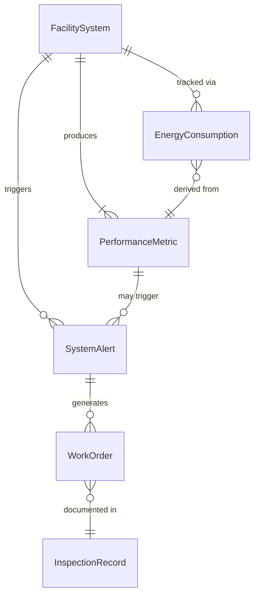
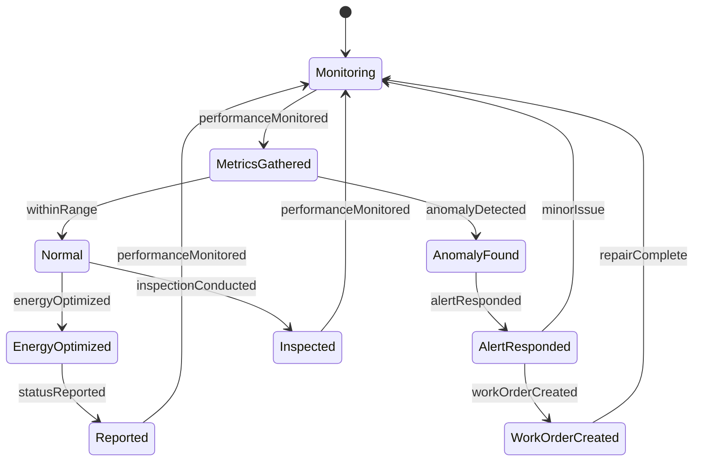
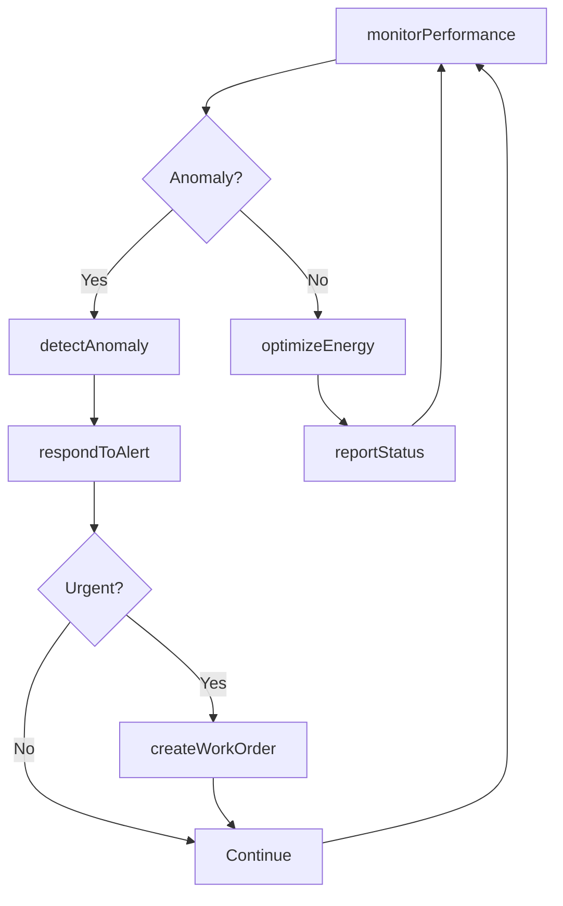
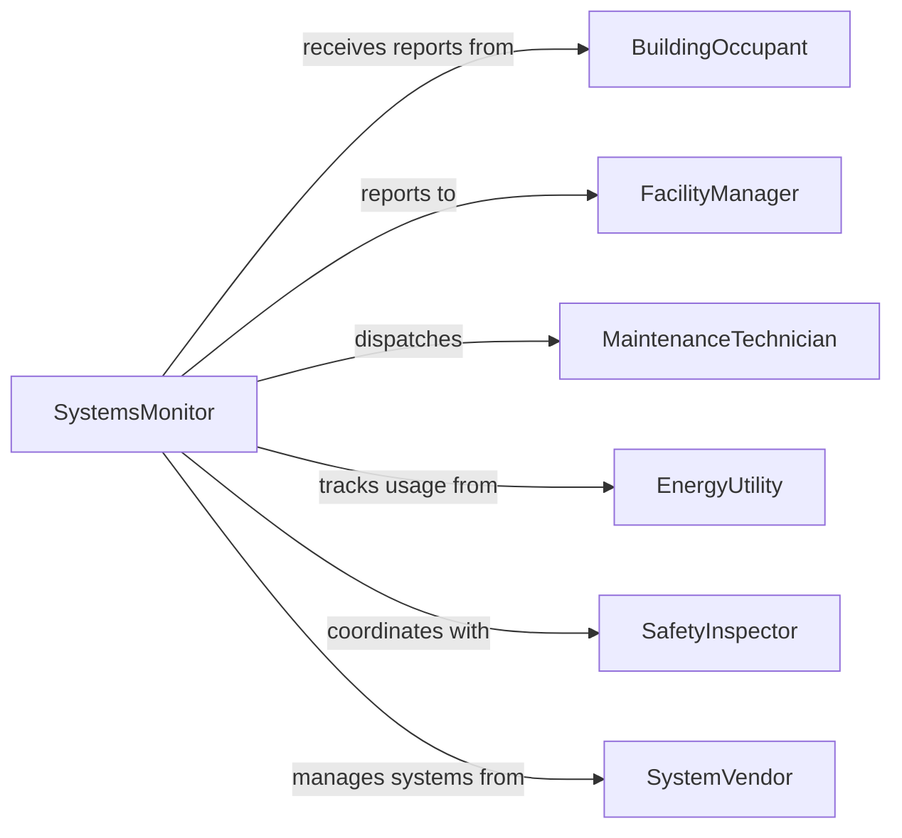

# Monitor Facilities Operational Systems

> Business-as-Code definition for facilities and operational systems monitoring. Models the complete monitoring lifecycle from real-time system oversight through performance tracking, maintenance coordination, and incident response.

## Overview

Facilities operational systems monitoring involves continuous oversight of HVAC, electrical, plumbing, security, fire safety, and building automation systems to ensure optimal performance, energy efficiency, occupant comfort, and compliance with safety regulations. This definition exposes actions for tracking system performance, detecting anomalies, managing work orders, and coordinating maintenance.

## Actors

| Actor | Description |
|-------|-------------|
| BuildingOccupant | Uses facility spaces and reports comfort issues |
| FacilityManager | Oversees building operations and maintenance |
| MaintenanceTechnician | Repairs and services facility systems |
| EnergyUtility | Provides electricity, gas, or water to facility |
| SafetyInspector | Enforces fire, life safety, and building codes |
| SystemVendor | Supplies building automation and control systems |

## Roles

| Role | Description |
|------|-------------|
| SystemsMonitor | Oversees facility systems performance |
| EnergyManager | Tracks consumption and optimizes efficiency |
| MaintenanceCoordinator | Schedules and dispatches repair work |
| ComplianceOfficer | Ensures adherence to safety and building codes |

## Entities

| Entity | Description |
|--------|-------------|
| FacilitySystem | HVAC, electrical, plumbing, or automation system |
| PerformanceMetric | Measurement of temperature, pressure, flow, or consumption |
| SystemAlert | Notification of malfunction or performance deviation |
| WorkOrder | Request for maintenance or repair service |
| EnergyConsumption | Record of utility usage by system or building |
| InspectionRecord | Documentation of safety or compliance check |

## Actions

| Action | Description |
|--------|-------------|
| monitorPerformance | Track real-time system metrics and status |
| detectAnomaly | Identify performance deviation or malfunction |
| createWorkOrder | Generate maintenance or repair request |
| optimizeEnergy | Adjust systems to reduce consumption |
| respondToAlert | Acknowledge and address system notification |
| conductInspection | Perform safety or compliance evaluation |
| reportStatus | Provide system health summary to stakeholders |

## Events

| Event | Description |
|-------|-------------|
| performanceMonitored | System metrics and status tracked |
| anomalyDetected | Performance deviation or malfunction identified |
| workOrderCreated | Maintenance or repair request generated |
| energyOptimized | System settings adjusted for efficiency |
| alertResponded | System notification acknowledged and addressed |
| inspectionConducted | Safety or compliance evaluation completed |
| statusReported | System health summary provided |

## Searches

| Search | Description |
|--------|-------------|
| findSystems | List facility systems by type, building, or status |
| getAlerts | Retrieve active or historical system notifications |
| getWorkOrders | Search maintenance requests by priority or status |
| getEnergyConsumption | Find utility usage by system or time period |

## Entity Relationships



## State Diagram



## Workflow



## Actor Relationships



## Usage

### Calling Actions

```typescript
import { monitorFacilitiesOperationalSystems } from '@headlessly/monitor-facilities-operational-systems'

const facilitiesMonitoring = monitorFacilitiesOperationalSystems()

// Monitor HVAC performance
const performance = await facilitiesMonitoring.monitorPerformance({
  facilityId: 'building-north-tower',
  systemId: 'hvac-rooftop-unit-3',
  metrics: {
    supplyAirTemp: 55, // Fahrenheit
    returnAirTemp: 72,
    chilledWaterFlow: 450, // GPM
    compressorStatus: 'running',
    airHandlerRPM: 1750
  },
  timestamp: '2026-02-05T14:00:00Z'
})

// Detect chiller anomaly
const anomaly = await facilitiesMonitoring.detectAnomaly({
  facilityId: 'building-north-tower',
  systemId: 'chiller-02',
  anomalyType: 'high-discharge-pressure',
  severity: 'medium',
  expectedValue: 95, // PSI
  actualValue: 125,
  timestamp: '2026-02-05T14:15:00Z'
})

// Create urgent work order
await facilitiesMonitoring.createWorkOrder({
  facilityId: 'building-north-tower',
  systemId: 'chiller-02',
  anomalyId: anomaly.id,
  priority: 'urgent',
  description: 'Investigate high discharge pressure on chiller 02',
  assignedTo: 'hvac-technician-team'
})
```

### Event-Driven Automation

```typescript
// Auto-create work orders for critical anomalies
facilitiesMonitoring.anomalyDetected(async ({ anomaly, systemId, facilityId }) => {
  if (anomaly.severity === 'critical') {
    await facilitiesMonitoring.createWorkOrder({
      facilityId,
      systemId,
      anomalyId: anomaly.id,
      priority: 'emergency',
      description: `Critical: ${anomaly.anomalyType}`
    })
  }
})

// Generate daily energy reports
facilitiesMonitoring.performanceMonitored(async ({ facilityId, timestamp }) => {
  if (isEndOfDay(timestamp)) {
    await facilitiesMonitoring.reportStatus({
      facilityId,
      reportType: 'daily-energy-summary',
      recipients: ['facility-manager', 'energy-team']
    })
  }
})
```
