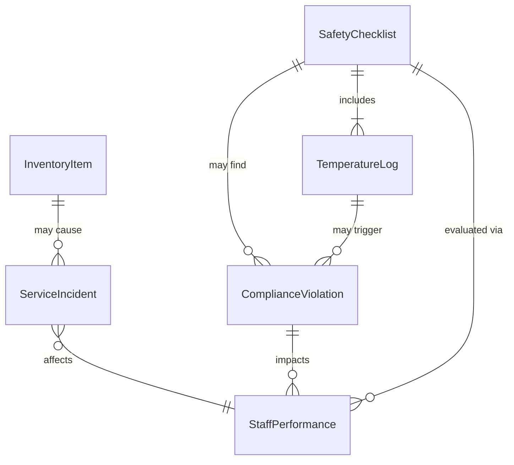
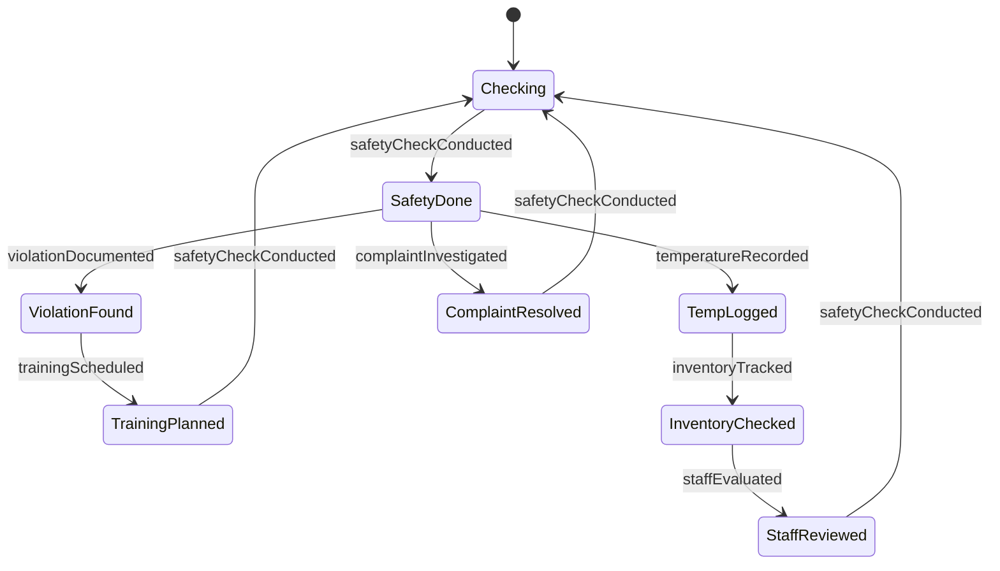
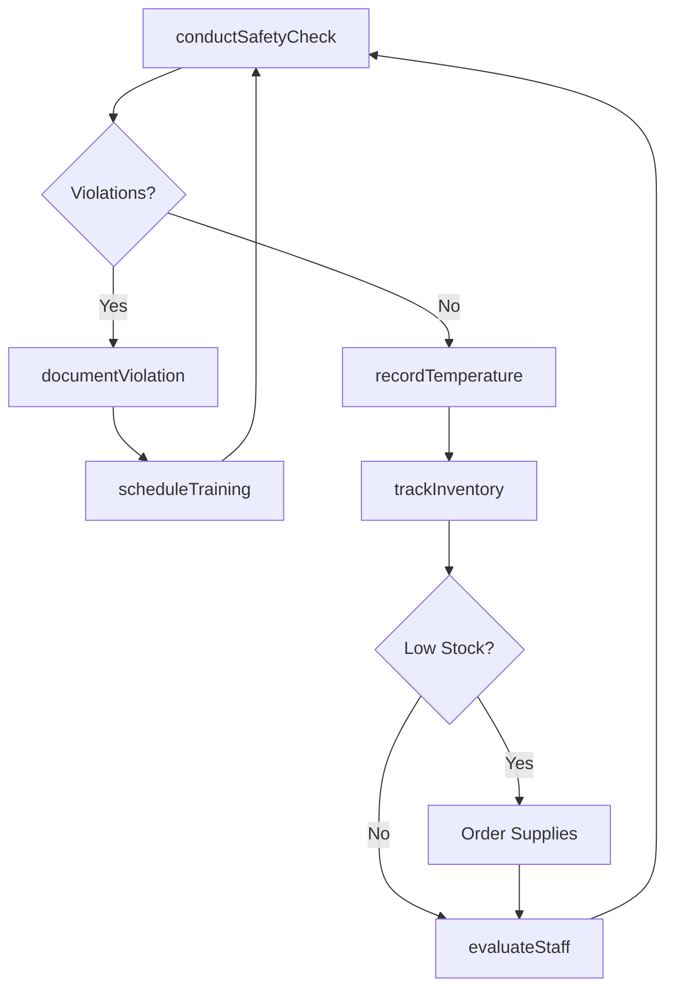
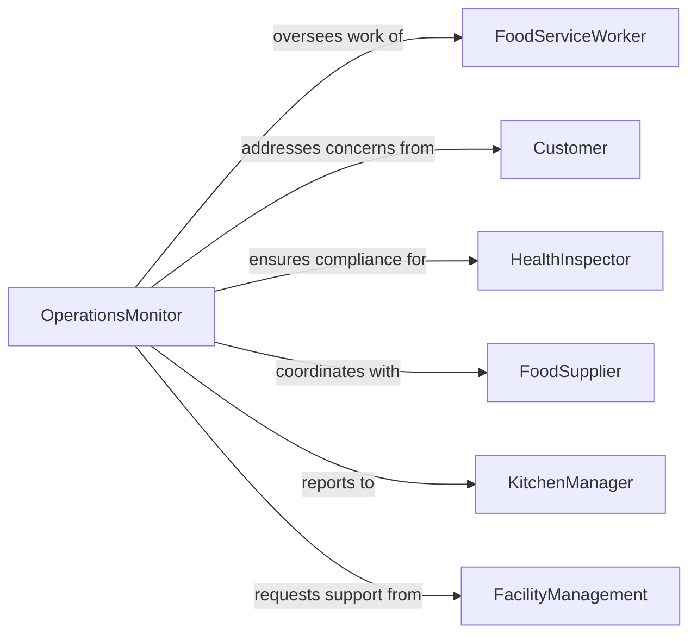

# Monitor Food Services Operations Ensure

> Business-as-Code definition for food services operations monitoring. Models the complete monitoring lifecycle from food safety compliance through service quality, inventory management, and staff performance oversight.

## Overview

Food services operations monitoring involves continuous oversight of food preparation, safety protocols, service delivery, equipment sanitation, and regulatory compliance in restaurants, cafeterias, catering operations, and institutional food service. This definition exposes actions for tracking food safety, managing service quality, coordinating staff, and ensuring adherence to health codes.

## Actors

| Actor | Description |
|-------|-------------|
| FoodServiceWorker | Prepares, cooks, or serves food to customers |
| Customer | Receives food service and provides feedback |
| HealthInspector | Enforces food safety and sanitation regulations |
| FoodSupplier | Delivers ingredients and food products |
| KitchenManager | Oversees food preparation and service operations |
| FacilityManagement | Maintains equipment and dining facilities |

## Roles

| Role | Description |
|------|-------------|
| OperationsMonitor | Oversees compliance with food service procedures |
| FoodSafetyOfficer | Ensures adherence to health and safety standards |
| QualityController | Evaluates food quality and service standards |
| InventoryCoordinator | Manages food stock and supply levels |

## Entities

| Entity | Description |
|--------|-------------|
| SafetyChecklist | Set of food safety and sanitation requirements |
| TemperatureLog | Record of food holding and cooking temperatures |
| ServiceIncident | Documentation of customer complaint or issue |
| InventoryItem | Food product or ingredient being tracked |
| ComplianceViolation | Record of health code or procedure breach |
| StaffPerformance | Evaluation of employee adherence to procedures |

## Actions

| Action | Description |
|--------|-------------|
| conductSafetyCheck | Verify compliance with food safety protocols |
| recordTemperature | Log food holding or cooking temperature |
| investigateComplaint | Address customer service or quality issue |
| trackInventory | Monitor food stock levels and expiration dates |
| documentViolation | Record health code or procedure breach |
| evaluateStaff | Assess employee performance and compliance |
| scheduleTraining | Plan food safety or service quality training |

## Events

| Event | Description |
|-------|-------------|
| safetyCheckConducted | Food safety protocol compliance verified |
| temperatureRecorded | Food temperature logged |
| complaintInvestigated | Customer issue addressed |
| inventoryTracked | Food stock levels and dates monitored |
| violationDocumented | Health code or procedure breach recorded |
| staffEvaluated | Employee performance assessed |
| trainingScheduled | Food safety or quality training planned |

## Searches

| Search | Description |
|--------|-------------|
| findSafetyChecklists | List safety checks by date or location |
| getTemperatureLogs | Retrieve temperature records by item or timeframe |
| getComplaints | Search customer issues by type or severity |
| getViolations | Find health code breaches by category or date |

## Entity Relationships



## State Diagram



## Workflow



## Actor Relationships



## Usage

### Calling Actions

```typescript
import { monitorFoodServicesOperationsEnsure } from '@headlessly/monitor-food-services-operations-ensure'

const foodServiceMonitoring = monitorFoodServicesOperationsEnsure()

// Conduct morning food safety check
const safetyCheck = await foodServiceMonitoring.conductSafetyCheck({
  locationId: 'kitchen-main',
  checklistId: 'daily-safety-inspection',
  items: [
    { item: 'hand-washing-stations', status: 'compliant' },
    { item: 'food-storage-temps', status: 'compliant' },
    { item: 'equipment-sanitation', status: 'non-compliant' },
    { item: 'pest-control', status: 'compliant' }
  ],
  inspectorId: 'monitor-123',
  timestamp: '2026-02-05T06:00:00Z'
})

// Record cooking temperature
await foodServiceMonitoring.recordTemperature({
  locationId: 'kitchen-main',
  foodItem: 'grilled-chicken-breast',
  temperatureType: 'internal-cooking',
  reading: 165, // Fahrenheit
  requiredMinimum: 165,
  timestamp: '2026-02-05T11:30:00Z',
  staffId: 'cook-456'
})

// Investigate customer complaint
await foodServiceMonitoring.investigateComplaint({
  locationId: 'dining-room-west',
  complaintType: 'food-quality',
  description: 'Chicken undercooked in center',
  severity: 'high',
  customerId: 'guest-789',
  timestamp: '2026-02-05T12:15:00Z'
})
```

### Event-Driven Automation

```typescript
// Auto-document violations and schedule training
foodServiceMonitoring.safetyCheckConducted(async ({ items, locationId }) => {
  const violations = items.filter(item => item.status === 'non-compliant')
  if (violations.length > 0) {
    const violation = await foodServiceMonitoring.documentViolation({
      locationId,
      violations: violations.map(v => v.item),
      severity: 'medium'
    })
    await foodServiceMonitoring.scheduleTraining({
      locationId,
      trainingType: 'corrective-action',
      topics: violations.map(v => v.item)
    })
  }
})

// Alert on dangerous temperature readings
foodServiceMonitoring.temperatureRecorded(async ({ foodItem, reading, requiredMinimum }) => {
  if (reading < requiredMinimum) {
    await notify({
      to: 'kitchen-manager',
      priority: 'urgent',
      message: `Temperature violation: ${foodItem} at ${reading}F (required ${requiredMinimum}F)`
    })
  }
})
```
