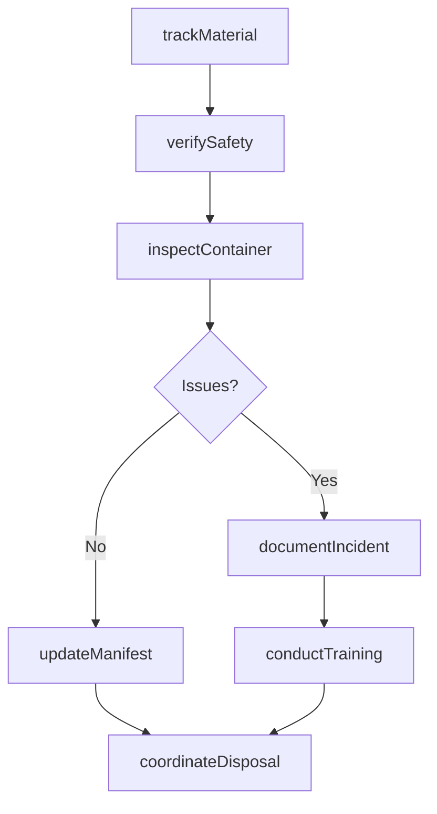
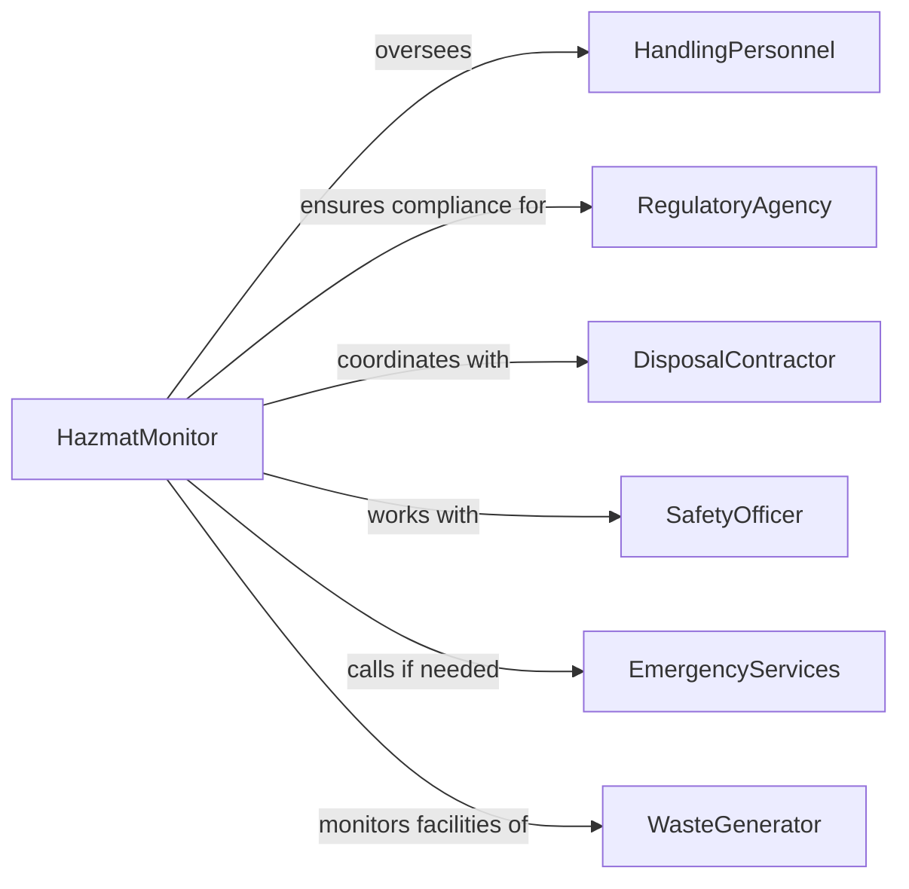

# Monitor Handling Hazardous Materials Medical

> Business-as-Code definition for hazardous materials and medical waste handling monitoring. Models the complete monitoring lifecycle from material tracking through safety compliance, disposal verification, and incident management.

## Overview

Hazardous materials and medical waste handling monitoring involves continuous oversight of chemical storage, biohazardous waste collection, personal protective equipment usage, containment procedures, and regulatory compliance to protect workers, the public, and the environment. This definition exposes actions for tracking material movement, verifying safety protocols, managing incidents, and coordinating disposal.

## Actors

| Actor | Description |
|-------|-------------|
| WasteGenerator | Healthcare or industrial facility producing hazardous materials |
| HandlingPersonnel | Workers who collect, transport, or process hazardous materials |
| RegulatoryAgency | Enforces environmental and safety regulations |
| DisposalContractor | Provides treatment or disposal services |
| SafetyOfficer | Oversees workplace safety and compliance |
| EmergencyServices | Responds to spills, exposures, or accidents |

## Roles

| Role | Description |
|------|-------------|
| HazmatMonitor | Oversees hazardous material handling operations |
| ComplianceOfficer | Ensures adherence to environmental and safety regulations |
| IncidentCoordinator | Manages spills, exposures, or safety violations |
| DisposalCoordinator | Coordinates waste pickup and treatment |

## Entities

| Entity | Description |
|--------|-------------|
| HazardousMaterial | Chemical, biological, or radioactive substance being tracked |
| WasteContainer | Receptacle for collecting hazardous or medical waste |
| SafetyProtocol | Procedure for safe handling, storage, or disposal |
| TrackingManifest | Documentation of material movement and chain of custody |
| SafetyIncident | Record of spill, exposure, or protocol violation |
| DisposalRecord | Documentation of waste treatment or destruction |

## Actions

| Action | Description |
|--------|-------------|
| trackMaterial | Record movement and storage of hazardous substance |
| verifySafety | Check compliance with handling and PPE protocols |
| inspectContainer | Evaluate waste receptacle for integrity and labeling |
| documentIncident | Record spill, exposure, or safety violation |
| coordinateDisposal | Schedule waste pickup and treatment |
| updateManifest | Log material transfer in chain of custody |
| conductTraining | Provide safety and compliance instruction |

## Events

| Event | Description |
|-------|-------------|
| materialTracked | Movement or storage of hazardous substance recorded |
| safetyVerified | Handling and PPE protocol compliance checked |
| containerInspected | Waste receptacle evaluated |
| incidentDocumented | Spill, exposure, or violation recorded |
| disposalCoordinated | Waste pickup and treatment scheduled |
| manifestUpdated | Material transfer logged in chain of custody |
| trainingConducted | Safety and compliance instruction provided |

## Searches

| Search | Description |
|--------|-------------|
| findMaterials | List hazardous substances by type, location, or status |
| getManifests | Retrieve chain of custody records |
| getIncidents | Search spills, exposures, or violations by severity |
| getDisposalRecords | Find waste treatment documentation |

## Workflow



## Actor Relationships



## Usage

### Calling Actions

```typescript
import { monitorHandlingHazardousMaterialsMedical } from '@headlessly/monitor-handling-hazardous-materials-medical'

const hazmatMonitoring = monitorHandlingHazardousMaterialsMedical()

// Track movement of biohazardous waste
const material = await hazmatMonitoring.trackMaterial({
  materialId: 'biohazard-batch-2026-034',
  materialType: 'infectious-waste',
  wasteClass: 'pathological',
  quantity: 45, // pounds
  generatorId: 'hospital-main-lab',
  storageLocation: 'hazmat-room-b',
  timestamp: '2026-02-05T09:00:00Z'
})

// Verify safety protocols during collection
await hazmatMonitoring.verifySafety({
  activityType: 'waste-collection',
  locationId: 'hospital-main-lab',
  personnelId: 'handler-234',
  protocolChecks: [
    { protocol: 'ppe-gloves-nitrile', status: 'compliant' },
    { protocol: 'ppe-face-shield', status: 'compliant' },
    { protocol: 'container-sealing', status: 'non-compliant' }
  ],
  timestamp: '2026-02-05T09:15:00Z'
})

// Document spill incident
await hazmatMonitoring.documentIncident({
  incidentType: 'container-leak',
  materialType: 'chemotherapy-waste',
  locationId: 'oncology-floor-3',
  severity: 'moderate',
  volumeReleased: 0.5, // liters
  exposedPersonnel: [],
  containmentActions: 'Spill kit applied, area cordoned, waste recontainerized',
  timestamp: '2026-02-05T10:30:00Z'
})
```

### Event-Driven Automation

```typescript
// Auto-coordinate disposal when container capacity reached
hazmatMonitoring.containerInspected(async ({ container, locationId }) => {
  if (container.fillLevel >= 0.75) {
    await hazmatMonitoring.coordinateDisposal({
      containerIds: [container.id],
      locationId,
      priority: container.fillLevel >= 0.9 ? 'urgent' : 'routine',
      requestedPickupDate: 'next-scheduled'
    })
  }
})

// Auto-schedule training on safety violations
hazmatMonitoring.incidentDocumented(async ({ incident, locationId }) => {
  if (incident.incidentType.includes('protocol-violation')) {
    await hazmatMonitoring.conductTraining({
      locationId,
      personnelIds: incident.involvedPersonnel,
      trainingType: 'corrective-action',
      topic: incident.violatedProtocol
    })
  }
})
```
