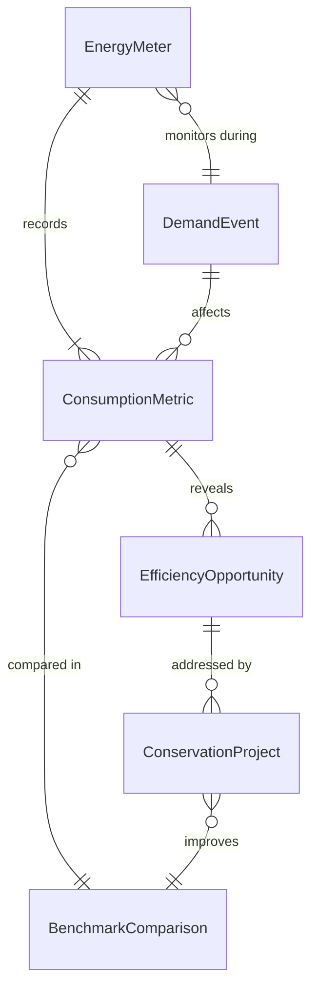
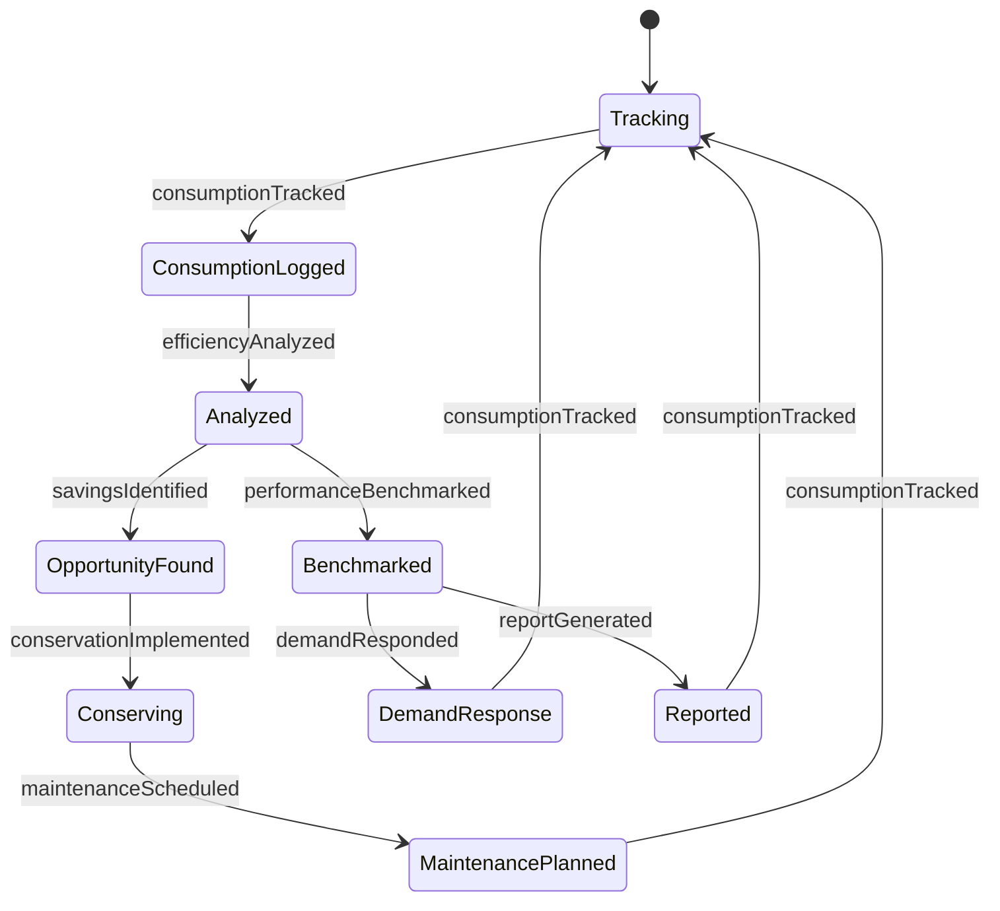
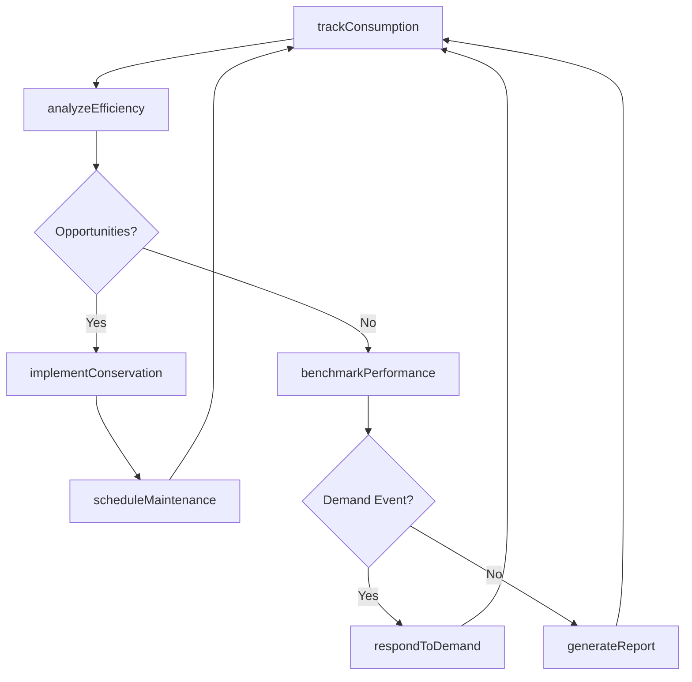
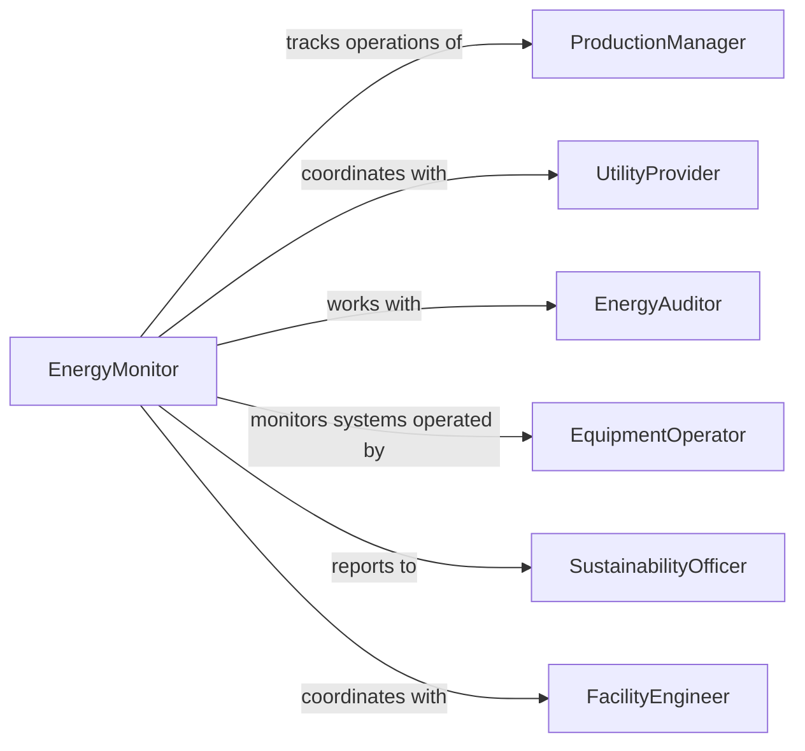

# Monitor Industrial Energy Consumption Management

> Business-as-Code definition for industrial energy consumption and management monitoring. Models the complete monitoring lifecycle from real-time usage tracking through efficiency analysis, demand response, and optimization initiatives.

## Overview

Industrial energy monitoring involves continuous oversight of electricity, natural gas, steam, and compressed air consumption across manufacturing processes, facilities, and equipment to identify inefficiencies, reduce costs, and support sustainability goals. This definition exposes actions for tracking energy usage, analyzing consumption patterns, implementing conservation measures, and coordinating with utilities.

## Actors

| Actor | Description |
|-------|-------------|
| ProductionManager | Oversees manufacturing operations consuming energy |
| UtilityProvider | Supplies electricity, gas, or steam to facility |
| EnergyAuditor | Evaluates consumption patterns and efficiency opportunities |
| EquipmentOperator | Manages industrial machinery and systems |
| SustainabilityOfficer | Tracks environmental impact and reduction targets |
| FacilityEngineer | Maintains energy-consuming systems and infrastructure |

## Roles

| Role | Description |
|------|-------------|
| EnergyMonitor | Oversees real-time consumption and performance |
| EfficiencyAnalyst | Identifies opportunities for energy reduction |
| DemandCoordinator | Manages load shedding and peak usage |
| ConservationManager | Implements energy-saving initiatives |

## Entities

| Entity | Description |
|--------|-------------|
| EnergyMeter | Device measuring consumption by source or equipment |
| ConsumptionMetric | Record of energy usage by timeframe or process |
| EfficiencyOpportunity | Identified potential for energy reduction |
| DemandEvent | Period of high utility rates or grid constraints |
| ConservationProject | Initiative to reduce energy consumption |
| BenchmarkComparison | Analysis of usage against industry standards |

## Actions

| Action | Description |
|--------|-------------|
| trackConsumption | Record real-time energy usage by source or equipment |
| analyzeEfficiency | Evaluate consumption patterns for improvement opportunities |
| respondToDemand | Adjust operations during peak pricing or grid events |
| implementConservation | Execute energy-saving measure or project |
| benchmarkPerformance | Compare usage to industry standards or targets |
| generateReport | Create consumption summary for stakeholders |
| scheduleMaintenance | Plan service for inefficient equipment |

## Events

| Event | Description |
|-------|-------------|
| consumptionTracked | Real-time energy usage recorded |
| efficiencyAnalyzed | Consumption pattern evaluation completed |
| demandResponded | Operations adjusted for peak event |
| conservationImplemented | Energy-saving measure executed |
| performanceBenchmarked | Usage compared to standards |
| reportGenerated | Consumption summary created |
| maintenanceScheduled | Service planned for inefficient equipment |

## Searches

| Search | Description |
|--------|-------------|
| findMeters | List energy measurement devices by location or type |
| getConsumption | Retrieve usage data by timeframe, source, or equipment |
| getOpportunities | Search efficiency improvements by savings potential |
| getDemandEvents | Find peak pricing or grid constraint periods |

## Entity Relationships



## State Diagram



## Workflow



## Actor Relationships



## Usage

### Calling Actions

```typescript
import { monitorIndustrialEnergyConsumptionManagement } from '@headlessly/monitor-industrial-energy-consumption-management'

const energyMonitoring = monitorIndustrialEnergyConsumptionManagement()

// Track hourly electricity consumption
const consumption = await energyMonitoring.trackConsumption({
  facilityId: 'plant-north-campus',
  meterId: 'main-electric-meter',
  energyType: 'electricity',
  usage: 1850, // kWh
  demand: 3200, // kW
  powerFactor: 0.92,
  timestamp: '2026-02-05T14:00:00Z'
})

// Analyze efficiency for production line
const analysis = await energyMonitoring.analyzeEfficiency({
  facilityId: 'plant-north-campus',
  equipmentId: 'assembly-line-3',
  period: { start: '2026-02-01', end: '2026-02-05' },
  metrics: {
    totalConsumption: 45000, // kWh
    productionVolume: 12000, // units
    energyPerUnit: 3.75 // kWh/unit
  }
})

// Respond to demand event
await energyMonitoring.respondToDemand({
  facilityId: 'plant-north-campus',
  eventType: 'peak-pricing',
  eventWindow: { start: '2026-02-05T15:00:00Z', end: '2026-02-05T18:00:00Z' },
  actions: [
    { action: 'reduce-hvac-setpoint', equipment: 'rooftop-units-all', savings: 250 },
    { action: 'defer-non-critical-loads', equipment: 'batch-process-6', savings: 400 }
  ]
})
```

### Event-Driven Automation

```typescript
// Auto-implement conservation for identified opportunities
energyMonitoring.efficiencyAnalyzed(async ({ opportunities, facilityId }) => {
  const highImpact = opportunities.filter(opp => opp.savingsPotential > 5000)
  for (const opportunity of highImpact) {
    await energyMonitoring.implementConservation({
      facilityId,
      projectType: opportunity.recommendedAction,
      equipmentId: opportunity.equipmentId,
      estimatedSavings: opportunity.savingsPotential
    })
  }
})

// Alert on excessive consumption
energyMonitoring.consumptionTracked(async ({ usage, baseline, facilityId }) => {
  const variance = (usage - baseline) / baseline
  if (variance > 0.15) {
    await notify({
      to: 'energy-management-team',
      priority: 'high',
      message: `Consumption at ${facilityId} exceeds baseline by ${(variance * 100).toFixed(1)}%`
    })
  }
})
```
