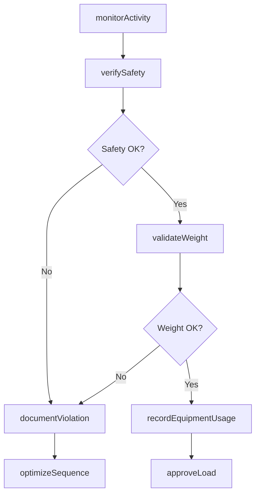
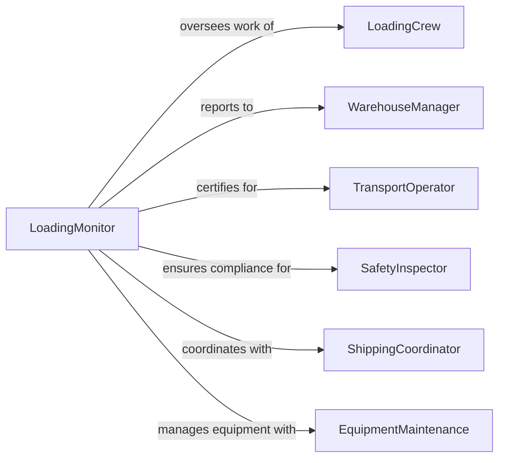

# Monitor Loading Processes Ensure They

> Business-as-Code definition for loading processes monitoring. Models the complete monitoring lifecycle from load planning through execution oversight, quality verification, and safety compliance.

## Overview

Loading processes monitoring involves continuous oversight of material handling, cargo placement, weight distribution, securing methods, and equipment operation to ensure safe, efficient, and compliant loading of trucks, railcars, ships, and aircraft. This definition exposes actions for tracking loading activities, verifying procedures, managing safety, and coordinating with transport operations.

## Actors

| Actor | Description |
|-------|-------------|
| LoadingCrew | Workers who load cargo onto transport vehicles |
| WarehouseManager | Oversees loading dock operations and schedules |
| TransportOperator | Receives loaded cargo for delivery |
| SafetyInspector | Enforces loading safety and compliance standards |
| ShippingCoordinator | Plans loading sequences and destinations |
| EquipmentMaintenance | Services forklifts, cranes, and loading equipment |

## Roles

| Role | Description |
|------|-------------|
| LoadingMonitor | Oversees loading execution and compliance |
| SafetyOfficer | Ensures adherence to safety protocols |
| QualityController | Verifies loading meets specifications |
| ProductivityAnalyst | Tracks efficiency and throughput metrics |

## Entities

| Entity | Description |
|--------|-------------|
| LoadingPlan | Strategy for cargo placement and sequencing |
| LoadingActivity | Record of cargo being loaded onto vehicle |
| SafetyChecklist | Set of safety requirements for loading operations |
| WeightDistribution | Documentation of cargo weight and balance |
| LoadingViolation | Record of procedure or safety breach |
| EquipmentLog | Usage and performance data for loading machinery |

## Actions

| Action | Description |
|--------|-------------|
| monitorActivity | Track real-time loading execution |
| verifySafety | Check compliance with safety procedures |
| validateWeight | Ensure weight limits and distribution standards met |
| documentViolation | Record procedure or safety breach |
| approveLoad | Certify loading completion and readiness for transport |
| optimizeSequence | Adjust loading order for efficiency or safety |
| recordEquipmentUsage | Log forklift, crane, or conveyor operation |

## Events

| Event | Description |
|-------|-------------|
| activityMonitored | Loading execution tracked |
| safetyVerified | Safety procedure compliance checked |
| weightValidated | Weight limits and distribution confirmed |
| violationDocumented | Procedure or safety breach recorded |
| loadApproved | Loading completion certified |
| sequenceOptimized | Loading order adjusted |
| equipmentUsageRecorded | Machinery operation logged |

## Searches

| Search | Description |
|--------|-------------|
| findActivities | List loading operations by vehicle, date, or status |
| getSafetyChecklists | Retrieve safety compliance records |
| getViolations | Search procedure or safety breaches |
| getEquipmentLogs | Find machinery usage by type or shift |

## Workflow



## Actor Relationships



## Usage

### Calling Actions

```typescript
import { monitorLoadingProcessesEnsureThey } from '@headlessly/monitor-loading-processes-ensure-they'

const loadingMonitoring = monitorLoadingProcessesEnsureThey()

// Monitor loading of outbound trailer
const activity = await loadingMonitoring.monitorActivity({
  vehicleId: 'trailer-789',
  dockId: 'dock-12',
  loadingPlanId: 'plan-2026-456',
  cargoItems: [
    { sku: 'pallet-widgets-A', quantity: 24, weight: 1200 },
    { sku: 'pallet-widgets-B', quantity: 20, weight: 1000 }
  ],
  crewId: 'loading-team-3',
  startTime: '2026-02-05T08:00:00Z'
})

// Verify safety during loading
await loadingMonitoring.verifySafety({
  activityId: activity.id,
  checklistItems: [
    { item: 'forklift-inspection', status: 'compliant' },
    { item: 'load-restraints', status: 'compliant' },
    { item: 'dock-plate-secured', status: 'compliant' },
    { item: 'spill-containment', status: 'compliant' }
  ],
  inspectorId: 'safety-officer-567'
})

// Validate weight distribution
const weightCheck = await loadingMonitoring.validateWeight({
  activityId: activity.id,
  vehicleId: 'trailer-789',
  totalWeight: 22000, // pounds
  weightLimit: 45000,
  axleWeights: {
    steer: 12000,
    drive: 34000,
    trailer: 22000
  },
  balanceStatus: 'acceptable'
})
```

### Event-Driven Automation

```typescript
// Auto-document violations and halt loading
loadingMonitoring.safetyVerified(async ({ checklistItems, activityId }) => {
  const violations = checklistItems.filter(item => item.status === 'non-compliant')
  if (violations.length > 0) {
    await loadingMonitoring.documentViolation({
      activityId,
      violationType: 'safety-procedure',
      items: violations,
      action: 'loading-halted'
    })
  }
})

// Auto-optimize sequence on weight issues
loadingMonitoring.weightValidated(async ({ balanceStatus, activityId, vehicleId }) => {
  if (balanceStatus === 'unacceptable') {
    await loadingMonitoring.optimizeSequence({
      activityId,
      vehicleId,
      optimizationGoal: 'improve-weight-distribution',
      resequenceRequired: true
    })
  }
})
```
