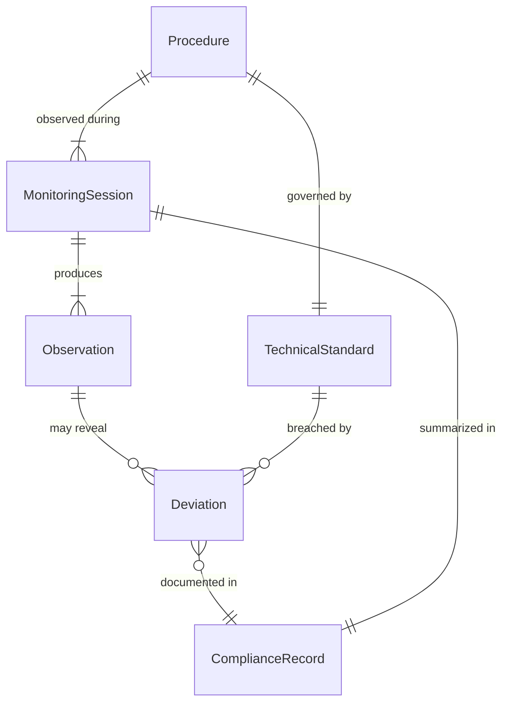
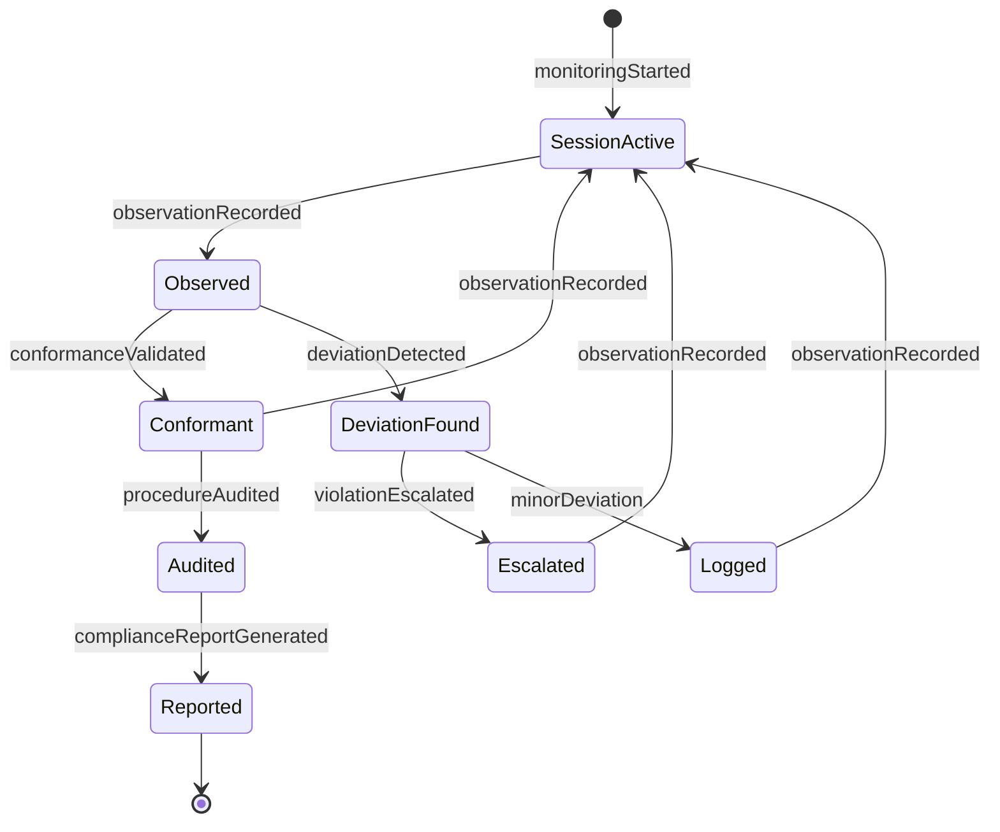
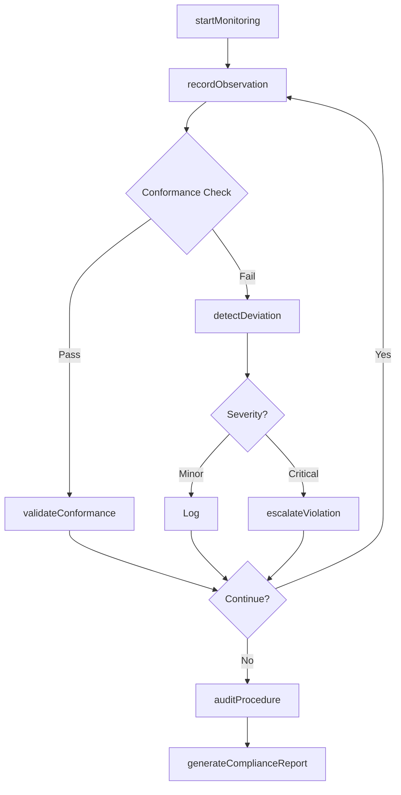
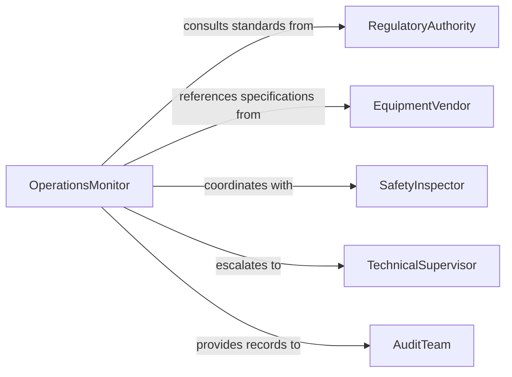

# Monitor Operational Procedures Technical Environments

> Business-as-Code definition for monitoring operational procedures in technical environments. Ensures compliance with operational standards, technical specifications, and safety protocols across complex technical operations.

## Overview

Monitoring operational procedures in technical environments involves real-time observation of technical processes, automated systems, and human operations to verify conformance with established standards, regulatory requirements, and safety protocols. This definition exposes monitoring actions, compliance event tracking, and search capabilities for audit and reporting purposes.

## Actors

| Actor | Description |
|-------|-------------|
| RegulatoryAuthority | Defines compliance standards and audit requirements |
| EquipmentVendor | Provides technical specifications and operating procedures |
| SafetyInspector | Conducts on-site safety audits and reviews procedures |
| TechnicalSupport | Assists with procedure clarifications and troubleshooting |
| AuditTeam | Reviews compliance documentation and monitoring records |
| CertificationBody | Validates conformance to industry standards |

## Roles

| Role | Description |
|------|-------------|
| OperationsMonitor | Continuously observes technical operations for conformance |
| ComplianceOfficer | Ensures procedures align with regulatory requirements |
| TechnicalSupervisor | Oversees technical operations and procedure execution |
| QualityAuditor | Verifies quality standards are maintained |

## Entities

| Entity | Description |
|--------|-------------|
| Procedure | Documented operational procedure with standards |
| MonitoringSession | A period of continuous procedural monitoring |
| Observation | A single recorded instance of procedure execution |
| Deviation | Recorded variance from established procedure standards |
| TechnicalStandard | A defined requirement for technical operations |
| ComplianceRecord | Documentation of conformance to standards |

## Actions

| Action | Description |
|--------|-------------|
| startMonitoring | Begin a monitoring session for technical procedures |
| recordObservation | Log an observed instance of procedure execution |
| detectDeviation | Identify and flag procedural non-conformance |
| validateConformance | Verify procedure execution meets standards |
| escalateViolation | Alert supervisors of critical standard violations |
| auditProcedure | Perform comprehensive procedure compliance review |
| generateComplianceReport | Create documentation of monitoring findings |

## Events

| Event | Description |
|-------|-------------|
| monitoringStarted | A monitoring session has been initiated |
| observationRecorded | Procedure execution has been documented |
| deviationDetected | Non-conformance has been identified |
| conformanceValidated | Procedure execution verified as compliant |
| violationEscalated | Critical violation has been reported to supervisors |
| procedureAudited | Comprehensive audit has been completed |
| complianceReportGenerated | Formal compliance documentation created |

## Searches

| Search | Description |
|--------|-------------|
| findDeviations | Retrieve non-conformance records by severity or date |
| getMonitoringSessions | List monitoring activities by location or procedure |
| getObservations | Retrieve procedure execution records by operator or time |
| getComplianceRecords | Find conformance documentation for audit purposes |

## Entity Relationships



## State Diagram



## Workflow



## Actor Relationships



## Usage

### Calling Actions

```typescript
import { monitorOperationalProceduresTechnicalEnvironments } from '@headlessly/monitor-operational-procedures-technical-environments'

const monitor = monitorOperationalProceduresTechnicalEnvironments()

// Start monitoring a technical procedure
const session = await monitor.startMonitoring({
  procedureId: 'PROC-2401',
  location: 'Data Center Floor 3',
  technicalStandards: ['ISO-27001', 'NIST-800-53'],
  monitoredBy: 'ops-monitor-001'
})

// Record observed procedure execution
await monitor.recordObservation({
  sessionId: session.id,
  procedureStep: 'Server Maintenance Protocol 5.2',
  operator: 'technician-42',
  executionTime: new Date(),
  conformanceStatus: 'compliant'
})

// Generate compliance report
const report = await monitor.generateComplianceReport({
  sessionId: session.id,
  period: { start: '2026-01-01', end: '2026-01-31' },
  includeDeviations: true
})
```

### Event-Driven Automation

```typescript
// Alert on critical violations
monitor.violationEscalated(async ({ deviation, procedureId, severity }) => {
  if (severity === 'critical') {
    await notify({
      to: 'safety-team',
      priority: 'urgent',
      message: `Critical procedure violation detected: ${deviation.description}`
    })
  }
})

// Auto-schedule audit on repeated deviations
monitor.deviationDetected(async ({ procedureId, sessionId }) => {
  const recent = await monitor.findDeviations({
    procedureId,
    period: 'last-7-days'
  })

  if (recent.length >= 3) {
    await monitor.auditProcedure({ procedureId, triggeredBy: 'automated-threshold' })
  }
})
```
