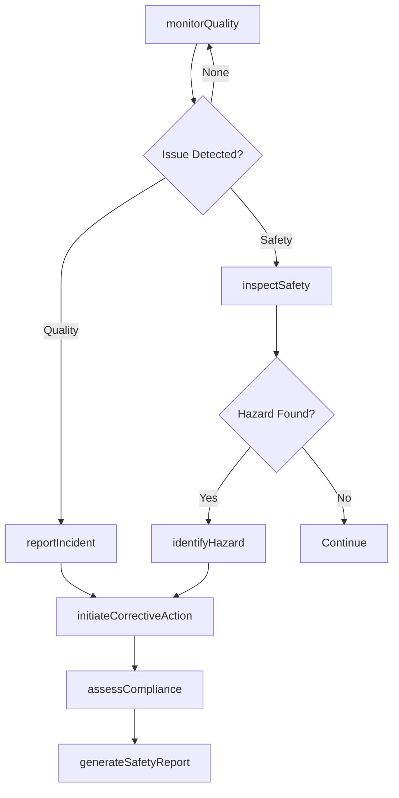
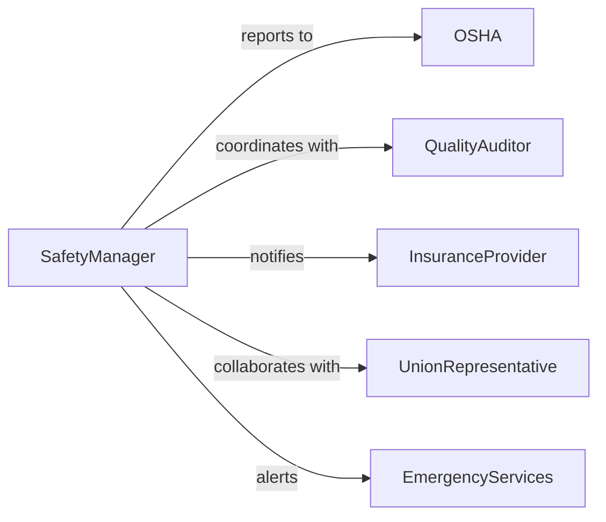

# Monitor Operational Quality Safety

> Business-as-Code definition for monitoring operational quality and safety. Provides real-time quality assurance and safety surveillance across operational environments with incident detection and remediation workflows.

## Overview

Operational quality and safety monitoring involves continuous assessment of work environments, processes, and outputs to maintain quality standards and prevent safety incidents. This definition exposes monitoring and incident management actions, quality and safety event tracking, and search capabilities for compliance reporting and trend analysis.

## Actors

| Actor | Description |
|-------|-------------|
| OSHA | Enforces workplace safety regulations and standards |
| QualityAuditor | Conducts independent quality assessments |
| InsuranceProvider | Reviews safety records for coverage and rates |
| UnionRepresentative | Advocates for worker safety and quality conditions |
| EmergencyServices | Responds to safety incidents and emergencies |
| IndustryRegulator | Enforces industry-specific quality and safety rules |

## Roles

| Role | Description |
|------|-------------|
| SafetyManager | Oversees all safety monitoring and incident response |
| QualityInspector | Conducts routine quality checks and audits |
| IncidentCoordinator | Manages safety incident reporting and investigation |
| ComplianceOfficer | Ensures adherence to safety and quality regulations |

## Entities

| Entity | Description |
|--------|-------------|
| QualityMetric | A measurable standard for operational quality |
| SafetyIncident | A recorded safety event or near-miss occurrence |
| Inspection | A scheduled or ad-hoc quality or safety assessment |
| Hazard | An identified potential safety risk or condition |
| CorrectiveAction | A remediation step taken to address quality or safety issues |
| ComplianceReport | Documentation of quality and safety status for regulators |

## Actions

| Action | Description |
|--------|-------------|
| monitorQuality | Track quality metrics in real-time operations |
| inspectSafety | Conduct safety assessment of work environment |
| reportIncident | Document a quality failure or safety event |
| identifyHazard | Flag potential safety risks for mitigation |
| initiateCorrectiveAction | Begin remediation process for quality or safety issues |
| assessCompliance | Evaluate conformance to quality and safety standards |
| generateSafetyReport | Create formal documentation of safety status |

## Events

| Event | Description |
|-------|-------------|
| qualityMonitored | Quality metrics have been recorded and analyzed |
| safetyInspected | Safety assessment has been completed |
| incidentReported | A quality or safety incident has been documented |
| hazardIdentified | A potential safety risk has been flagged |
| correctiveActionInitiated | Remediation process has been started |
| complianceAssessed | Quality and safety compliance evaluation completed |
| safetyReportGenerated | Formal safety documentation has been created |

## Searches

| Search | Description |
|--------|-------------|
| findIncidents | Retrieve safety incidents by type, severity, or date |
| getHazards | List identified safety hazards by location or status |
| getInspections | Find quality and safety inspections by facility or date |
| getQualityMetrics | Retrieve quality performance data for analysis |

## Workflow



## Actor Relationships



## Usage

### Calling Actions

```typescript
import { monitorOperationalQualitySafety } from '@headlessly/monitor-operational-quality-safety'

const safety = monitorOperationalQualitySafety()

// Monitor quality metrics in production
await safety.monitorQuality({
  facility: 'Manufacturing Plant B',
  metrics: ['defectRate', 'yieldPercentage', 'processVariation'],
  interval: 'hourly'
})

// Report a safety incident
const incident = await safety.reportIncident({
  type: 'near-miss',
  location: 'Assembly Line 3',
  description: 'Worker almost struck by moving equipment',
  severity: 'moderate',
  reportedBy: 'supervisor-23'
})

// Initiate corrective action
await safety.initiateCorrectiveAction({
  incidentId: incident.id,
  actions: [
    'Install additional warning signage',
    'Provide supplemental safety training',
    'Review equipment speed settings'
  ],
  responsibleParty: 'safety-team'
})
```

### Event-Driven Automation

```typescript
// Immediate escalation for critical incidents
safety.incidentReported(async ({ incident, severity }) => {
  if (severity === 'critical') {
    await notify({
      to: ['safety-manager', 'facility-director', 'emergency-response'],
      priority: 'urgent',
      message: `Critical safety incident: ${incident.description}`
    })
    await safety.inspectSafety({ location: incident.location, priority: 'immediate' })
  }
})

// Auto-trigger compliance assessment after corrective actions
safety.correctiveActionInitiated(async ({ incidentId, actions }) => {
  await waitForCompletion(actions)
  await safety.assessCompliance({
    scope: 'post-remediation',
    relatedIncident: incidentId
  })
})
```
