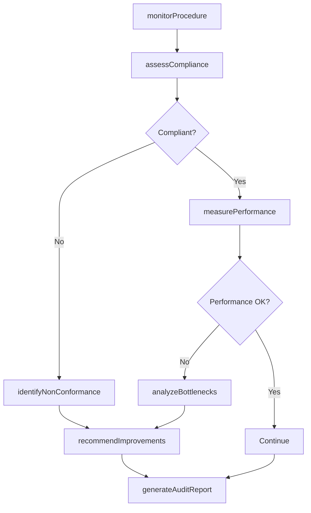
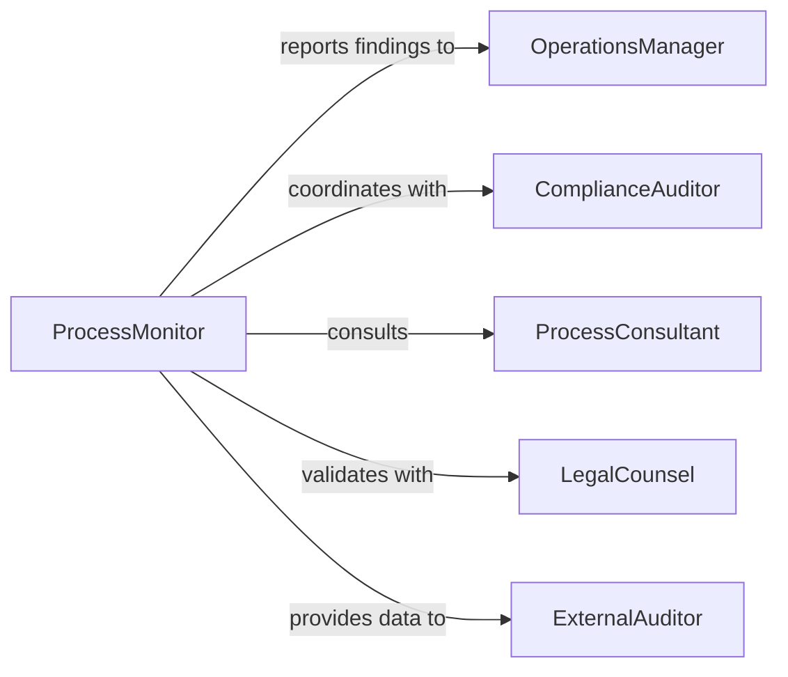

# Monitor Organizational Procedures Ensure Proper

> Business-as-Code definition for monitoring organizational procedures to ensure proper functioning. Tracks procedure compliance, identifies process inefficiencies, and ensures operational standards are maintained across the organization.

## Overview

Monitoring organizational procedures involves systematic observation of business processes, workflows, and operational protocols to verify they are being followed correctly and functioning as designed. This definition exposes monitoring actions, process compliance tracking, and analytics to identify bottlenecks, non-compliance, and opportunities for improvement.

## Actors

| Actor | Description |
|-------|-------------|
| ComplianceAuditor | Reviews procedures for regulatory and policy adherence |
| ProcessConsultant | Advises on procedure optimization and best practices |
| LegalCounsel | Ensures procedures comply with legal requirements |
| ITGovernance | Validates technology-related procedures and controls |
| ExternalAuditor | Conducts independent procedure assessments |
| IndustryAssociation | Provides benchmarks and standards for procedures |

## Roles

| Role | Description |
|------|-------------|
| ProcessMonitor | Continuously observes and reports on procedure execution |
| OperationsManager | Oversees procedure adherence across teams |
| QualityAnalyst | Evaluates procedure effectiveness and quality outcomes |
| ComplianceOfficer | Ensures procedures meet organizational and regulatory standards |

## Entities

| Entity | Description |
|--------|-------------|
| OrganizationalProcedure | A documented business process or workflow |
| MonitoringPlan | A schedule and scope for procedure observation |
| ProcedureExecution | A recorded instance of procedure completion |
| NonConformance | A documented deviation from established procedure |
| PerformanceMetric | A measurable indicator of procedure effectiveness |
| ImprovementRecommendation | A suggested change to enhance procedure performance |

## Actions

| Action | Description |
|--------|-------------|
| monitorProcedure | Observe and track execution of organizational procedure |
| assessCompliance | Evaluate procedure adherence to standards and policies |
| identifyNonConformance | Flag instances where procedures are not followed |
| measurePerformance | Calculate effectiveness metrics for procedures |
| analyzeBottlenecks | Identify process inefficiencies and delays |
| recommendImprovements | Suggest procedure optimizations based on findings |
| generateAuditReport | Create formal documentation of procedure monitoring |

## Events

| Event | Description |
|-------|-------------|
| procedureMonitored | Procedure execution has been observed and recorded |
| complianceAssessed | Procedure adherence evaluation completed |
| nonConformanceIdentified | Procedure deviation has been documented |
| performanceMeasured | Effectiveness metrics have been calculated |
| bottlenecksAnalyzed | Process inefficiencies have been identified |
| improvementsRecommended | Optimization suggestions have been generated |
| auditReportGenerated | Formal procedure monitoring report created |

## Searches

| Search | Description |
|--------|-------------|
| findProcedures | List organizational procedures by department or category |
| getNonConformances | Retrieve procedure deviations by severity or date |
| getPerformanceMetrics | Find effectiveness measures for specific procedures |
| getImprovementRecommendations | Retrieve optimization suggestions by procedure |

## Workflow



## Actor Relationships



## Usage

### Calling Actions

```typescript
import { monitorOrganizationalProceduresEnsureProper } from '@headlessly/monitor-organizational-procedures-ensure-proper'

const procedures = monitorOrganizationalProceduresEnsureProper()

// Start monitoring an organizational procedure
await procedures.monitorProcedure({
  procedureId: 'PRC-HR-003',
  procedureName: 'Employee Onboarding Process',
  department: 'Human Resources',
  monitoringPeriod: { start: '2026-02-01', end: '2026-02-28' }
})

// Assess compliance of a procedure
const assessment = await procedures.assessCompliance({
  procedureId: 'PRC-HR-003',
  criteria: ['timeliness', 'completeness', 'accuracy'],
  executionsSampled: 50
})

// Recommend improvements based on monitoring
await procedures.recommendImprovements({
  procedureId: 'PRC-HR-003',
  findings: assessment,
  recommendations: [
    'Automate form submission steps',
    'Reduce approval routing from 4 to 2 levels',
    'Implement digital signature collection'
  ]
})
```

### Event-Driven Automation

```typescript
// Auto-escalate significant non-conformances
procedures.nonConformanceIdentified(async ({ procedureId, severity, deviation }) => {
  if (severity === 'high' || deviation.frequency > 5) {
    await notify({
      to: 'operations-manager',
      message: `High-severity non-conformance in ${procedureId}: ${deviation.description}`
    })
    await procedures.analyzeBottlenecks({ procedureId })
  }
})

// Trigger improvement review when performance degrades
procedures.performanceMeasured(async ({ procedureId, metrics }) => {
  if (metrics.efficiency < 0.70 || metrics.errorRate > 0.10) {
    await procedures.recommendImprovements({
      procedureId,
      triggeredBy: 'automated-performance-threshold'
    })
  }
})
```
