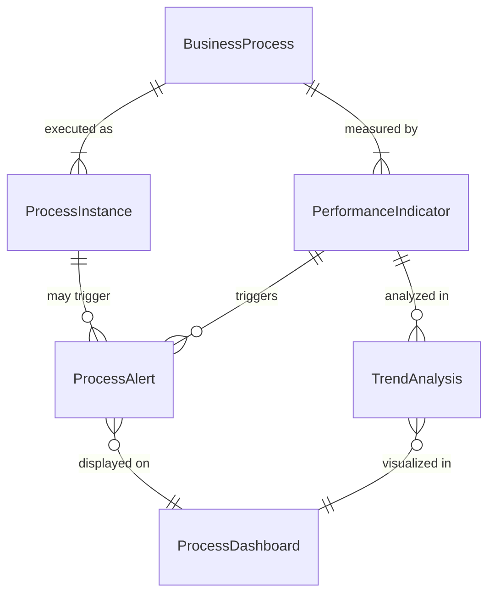
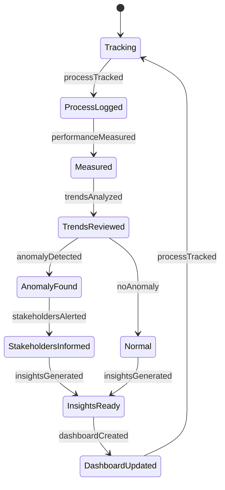
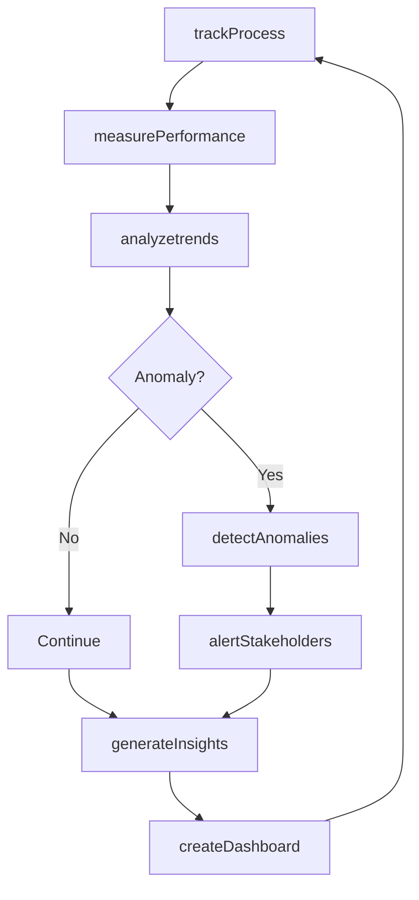
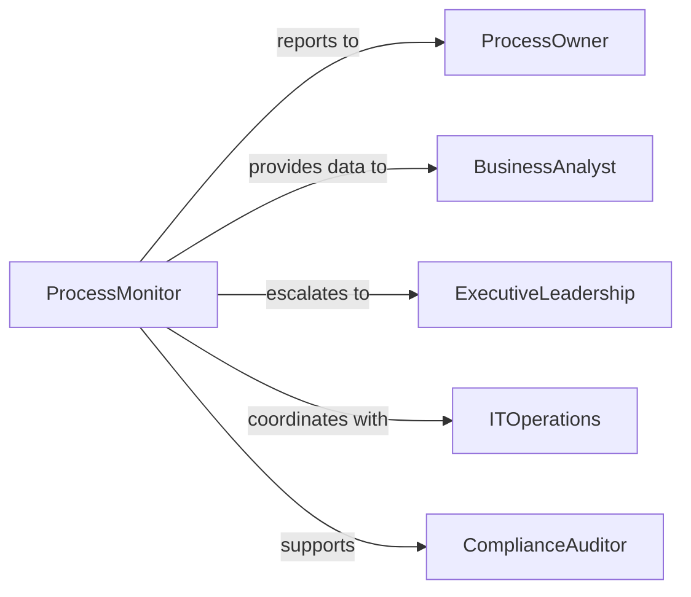

# Monitor Organizational Processes

> Business-as-Code definition for monitoring organizational processes. Provides comprehensive process visibility, performance tracking, and operational intelligence across all business functions and workflows.

## Overview

Monitoring organizational processes involves real-time observation and analysis of end-to-end business operations, tracking key performance indicators, and identifying opportunities for operational excellence. This definition exposes process monitoring actions, performance analytics, and event-driven insights to maintain operational effectiveness and drive continuous improvement.

## Actors

| Actor | Description |
|-------|-------------|
| ProcessOwner | Accountable for specific business process performance |
| BusinessAnalyst | Analyzes process data and identifies improvement opportunities |
| ExecutiveLeadership | Reviews process performance metrics and strategic initiatives |
| ITOperations | Provides technical infrastructure for process automation |
| ExternalConsultant | Advises on process optimization and best practices |
| ComplianceAuditor | Verifies processes meet regulatory and policy requirements |

## Roles

| Role | Description |
|------|-------------|
| ProcessMonitor | Tracks real-time process execution and performance |
| DataAnalyst | Interprets process metrics and generates insights |
| PerformanceManager | Oversees process KPIs and improvement initiatives |
| BusinessOperationsLead | Coordinates cross-functional process monitoring |

## Entities

| Entity | Description |
|--------|-------------|
| BusinessProcess | An end-to-end workflow or operational procedure |
| ProcessInstance | A single execution of a business process |
| PerformanceIndicator | A metric measuring process effectiveness or efficiency |
| ProcessAlert | A notification triggered by process performance threshold |
| TrendAnalysis | Statistical analysis of process performance over time |
| ProcessDashboard | A visualization of real-time process metrics |

## Actions

| Action | Description |
|--------|-------------|
| trackProcess | Monitor real-time execution of business process |
| measurePerformance | Calculate and record process performance metrics |
| analyzetrends | Identify patterns and trends in process data |
| detectAnomalies | Flag unusual process behavior or performance degradation |
| generateInsights | Create actionable recommendations from process data |
| createDashboard | Build visualization of process monitoring metrics |
| alertStakeholders | Notify relevant parties of process performance issues |

## Events

| Event | Description |
|-------|-------------|
| processTracked | Business process execution has been recorded |
| performanceMeasured | Process metrics have been calculated and stored |
| trendsAnalyzed | Process performance patterns have been identified |
| anomalyDetected | Unusual process behavior has been flagged |
| insightsGenerated | Actionable recommendations have been created |
| dashboardCreated | Process monitoring visualization has been built |
| stakeholdersAlerted | Process performance notification has been sent |

## Searches

| Search | Description |
|--------|-------------|
| findProcesses | List business processes by function or status |
| getPerformanceIndicators | Retrieve KPIs for specific processes or periods |
| getAnomalies | Find unusual process behaviors by type or severity |
| getTrendAnalyses | Retrieve historical process performance patterns |

## Entity Relationships



## State Diagram



## Workflow



## Actor Relationships



## Usage

### Calling Actions

```typescript
import { monitorOrganizationalProcesses } from '@headlessly/monitor-organizational-processes'

const processes = monitorOrganizationalProcesses()

// Start tracking a business process
await processes.trackProcess({
  processId: 'BPR-SALES-001',
  processName: 'Lead to Cash',
  department: 'Sales',
  trackingInterval: 'real-time'
})

// Measure performance metrics
const performance = await processes.measurePerformance({
  processId: 'BPR-SALES-001',
  metrics: ['cycleTime', 'throughput', 'errorRate', 'customerSatisfaction'],
  period: { start: '2026-01-01', end: '2026-01-31' }
})

// Create monitoring dashboard
await processes.createDashboard({
  dashboardName: 'Sales Process Performance',
  processes: ['BPR-SALES-001', 'BPR-SALES-002'],
  widgets: ['kpiCards', 'trendCharts', 'alertsPanel'],
  refreshInterval: 'every-5-minutes'
})
```

### Event-Driven Automation

```typescript
// Alert on performance degradation
processes.anomalyDetected(async ({ processId, anomaly, severity }) => {
  if (severity === 'high') {
    await processes.alertStakeholders({
      processId,
      recipients: ['process-owner', 'operations-manager'],
      message: `Process anomaly detected: ${anomaly.description}`,
      priority: 'urgent'
    })
  }
})

// Auto-generate insights from trend analysis
processes.trendsAnalyzed(async ({ processId, trends }) => {
  if (trends.some(t => t.direction === 'declining' && t.impactLevel === 'significant')) {
    await processes.generateInsights({
      processId,
      focus: 'performance-improvement',
      trends
    })
  }
})
```
