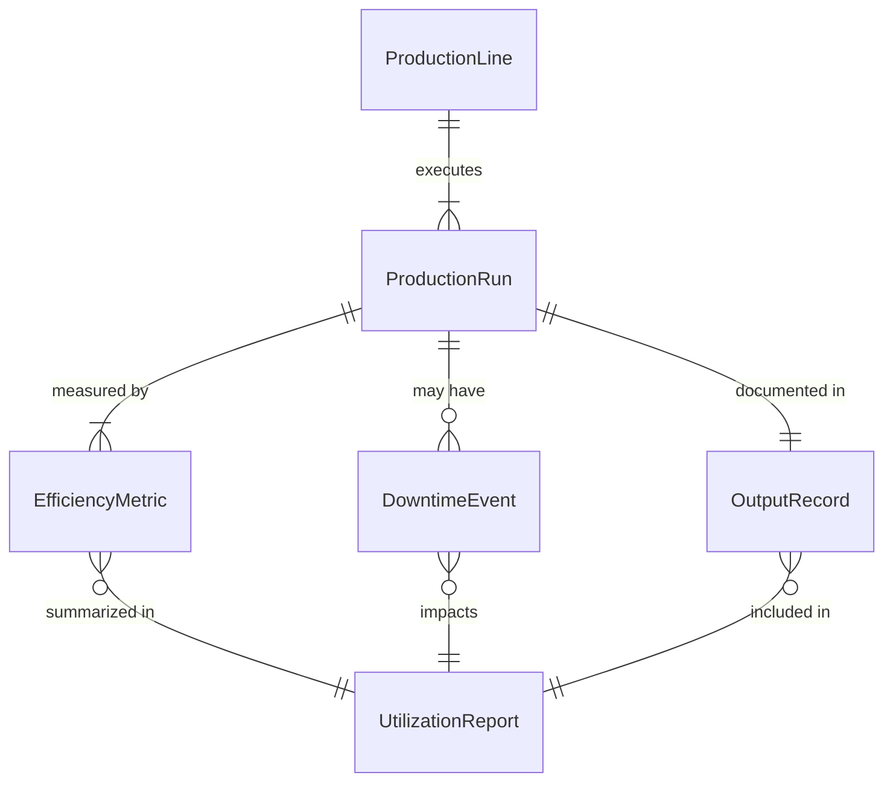
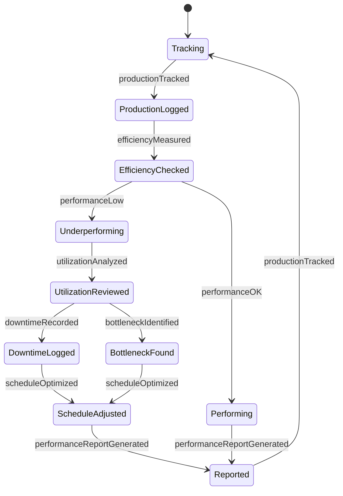
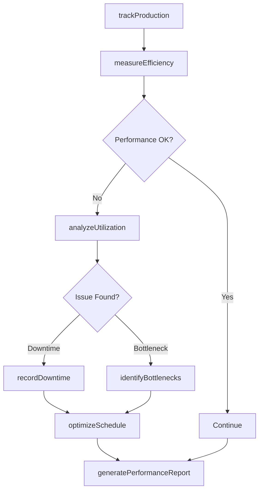
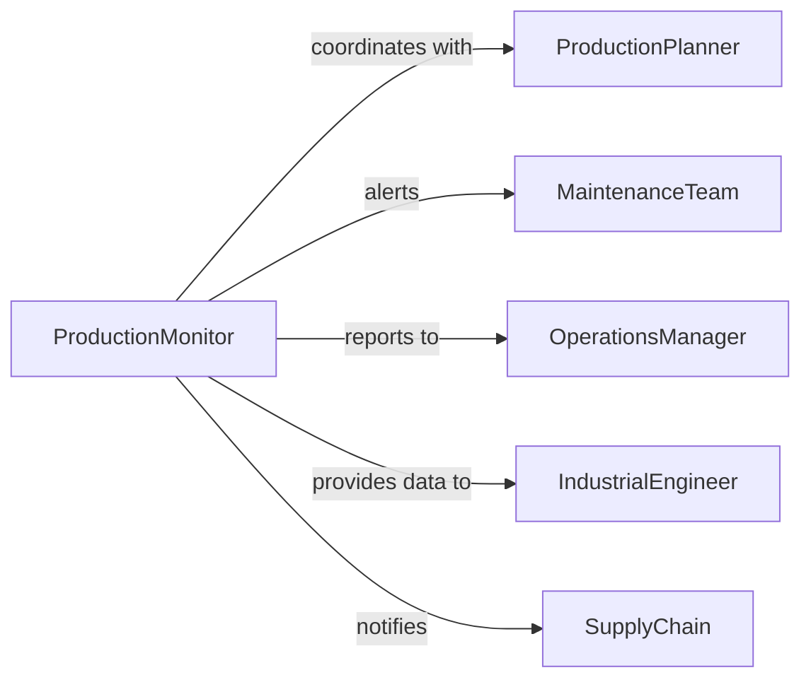

# Monitor Productivity Efficiency Industrial Operations

> Business-as-Code definition for monitoring productivity and efficiency of industrial operations. Tracks production metrics, equipment utilization, and operational performance to optimize manufacturing and industrial processes.

## Overview

Monitoring industrial productivity and efficiency involves real-time tracking of production output, equipment performance, labor utilization, and resource consumption to maximize operational effectiveness. This definition exposes monitoring actions for production metrics, efficiency analysis, and event-driven alerts to maintain optimal industrial performance.

## Actors

| Actor | Description |
|-------|-------------|
| ProductionPlanner | Schedules manufacturing operations and resource allocation |
| MaintenanceTeam | Performs equipment maintenance and repairs |
| QualityControl | Ensures production output meets quality standards |
| SupplyChain | Coordinates materials and logistics for operations |
| IndustrialEngineer | Optimizes production processes and layouts |
| EnergyProvider | Supplies utilities for manufacturing operations |

## Roles

| Role | Description |
|------|-------------|
| ProductionMonitor | Tracks real-time manufacturing metrics and KPIs |
| EfficiencyAnalyst | Analyzes productivity data and identifies improvements |
| OperationsManager | Oversees overall industrial operations performance |
| PlantSupervisor | Manages daily production activities and workforce |

## Entities

| Entity | Description |
|--------|-------------|
| ProductionLine | A manufacturing assembly or processing system |
| ProductionRun | A specific period of manufacturing activity |
| EfficiencyMetric | A measurable indicator of operational performance |
| DowntimeEvent | A recorded period of production stoppage |
| OutputRecord | Documentation of production volume and quality |
| UtilizationReport | Analysis of equipment and labor capacity usage |

## Actions

| Action | Description |
|--------|-------------|
| trackProduction | Monitor real-time output from production lines |
| measureEfficiency | Calculate productivity metrics and performance ratios |
| recordDowntime | Document production stoppages and their causes |
| analyzeUtilization | Evaluate equipment and labor capacity usage |
| identifyBottlenecks | Flag process constraints limiting productivity |
| optimizeSchedule | Adjust production schedule for improved efficiency |
| generatePerformanceReport | Create documentation of productivity and efficiency |

## Events

| Event | Description |
|-------|-------------|
| productionTracked | Production output has been recorded and analyzed |
| efficiencyMeasured | Productivity metrics have been calculated |
| downtimeRecorded | Production stoppage has been documented |
| utilizationAnalyzed | Capacity usage evaluation has been completed |
| bottleneckIdentified | Process constraint has been flagged |
| scheduleOptimized | Production schedule has been adjusted |
| performanceReportGenerated | Formal productivity documentation created |

## Searches

| Search | Description |
|--------|-------------|
| findProductionRuns | Retrieve production activities by line or date |
| getEfficiencyMetrics | List productivity measures by facility or period |
| getDowntimeEvents | Find production stoppages by cause or duration |
| getUtilizationReports | Retrieve capacity usage analyses |

## Entity Relationships



## State Diagram



## Workflow



## Actor Relationships



## Usage

### Calling Actions

```typescript
import { monitorProductivityEfficiencyIndustrialOperations } from '@headlessly/monitor-productivity-efficiency-industrial-operations'

const industrial = monitorProductivityEfficiencyIndustrialOperations()

// Track production output
await industrial.trackProduction({
  productionLineId: 'LINE-A-03',
  shift: 'day-shift',
  targetOutput: 5000,
  actualOutput: 4750,
  startTime: new Date('2026-02-05T08:00:00'),
  endTime: new Date('2026-02-05T16:00:00')
})

// Measure efficiency metrics
const efficiency = await industrial.measureEfficiency({
  productionLineId: 'LINE-A-03',
  metrics: ['oee', 'cycleTime', 'throughput', 'yieldRate'],
  period: { start: '2026-02-01', end: '2026-02-05' }
})

// Record and analyze downtime
await industrial.recordDowntime({
  productionLineId: 'LINE-A-03',
  startTime: new Date('2026-02-05T10:30:00'),
  duration: 45,
  cause: 'equipment-failure',
  affectedEquipment: 'conveyor-belt-02'
})
```

### Event-Driven Automation

```typescript
// Alert on efficiency degradation
industrial.efficiencyMeasured(async ({ productionLineId, metrics }) => {
  if (metrics.oee < 0.75) {
    await notify({
      to: 'operations-manager',
      message: `Production line ${productionLineId} OEE below threshold: ${metrics.oee}`,
      priority: 'high'
    })
    await industrial.identifyBottlenecks({ productionLineId })
  }
})

// Auto-schedule maintenance after downtime events
industrial.downtimeRecorded(async ({ productionLineId, cause, affectedEquipment }) => {
  if (cause === 'equipment-failure') {
    await scheduleMaintenanceTask({
      equipment: affectedEquipment,
      priority: 'urgent',
      type: 'corrective-maintenance'
    })
  }
})
```
