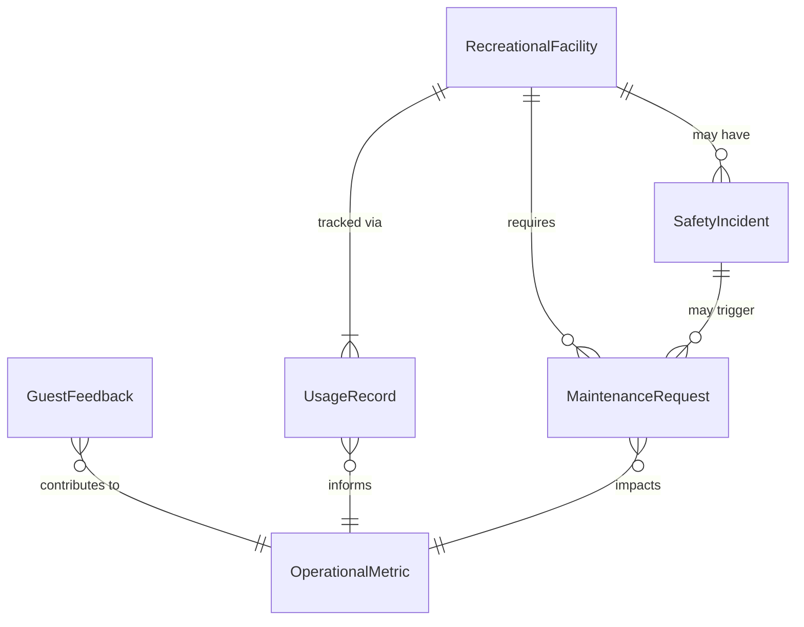
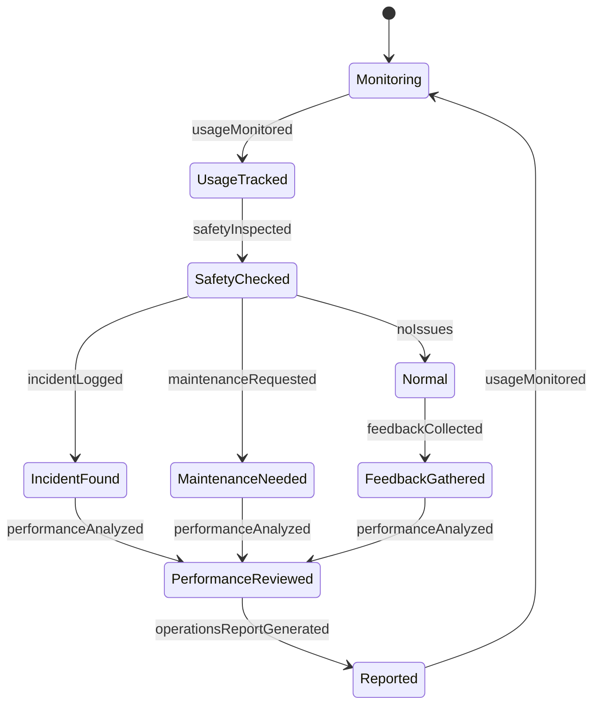
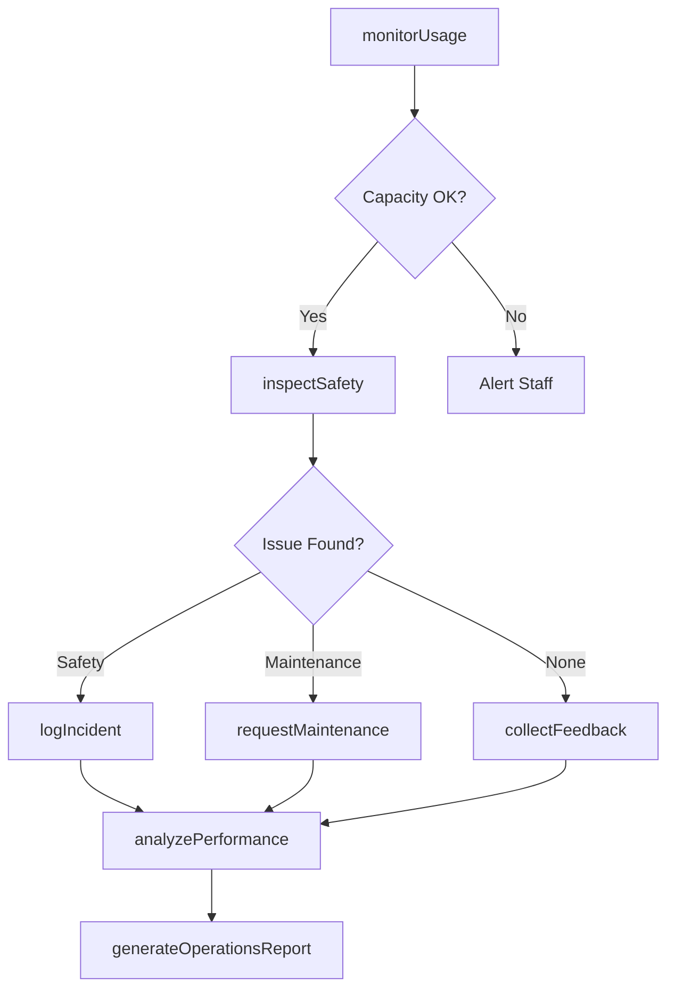
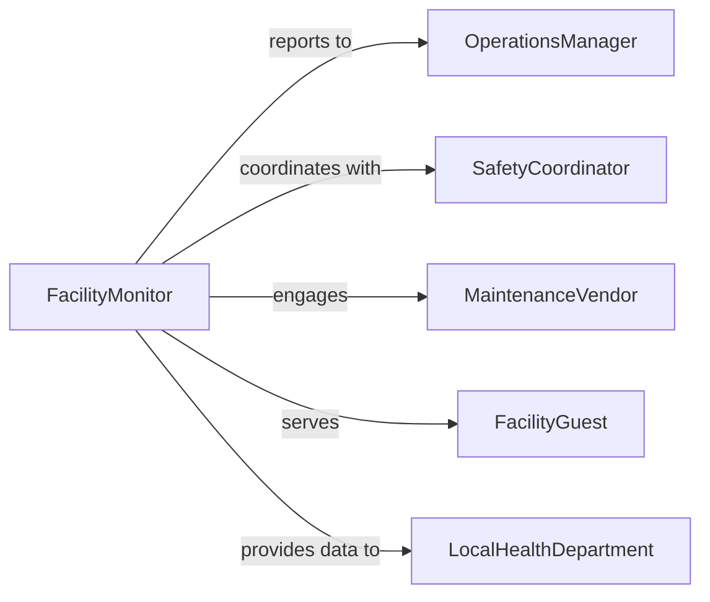

# Monitor Recreational Facility Operations

> Business-as-Code definition for monitoring recreational facility operations. Tracks facility usage, guest safety, maintenance needs, and operational performance to ensure optimal guest experience and facility management.

## Overview

Monitoring recreational facility operations involves real-time observation of facility usage patterns, safety conditions, equipment status, and guest satisfaction to maintain high-quality recreational services. This definition exposes monitoring actions for facility performance, safety tracking, and event-driven alerts to ensure safe and enjoyable recreational experiences.

## Actors

| Actor | Description |
|-------|-------------|
| FacilityGuest | Uses recreational amenities and services |
| SafetyInspector | Conducts safety audits and compliance reviews |
| MaintenanceVendor | Provides repair and upkeep services |
| LocalHealthDepartment | Enforces health and safety regulations |
| InsuranceProvider | Reviews risk management and safety protocols |
| CommunityBoard | Represents community interests in facility operations |

## Roles

| Role | Description |
|------|-------------|
| FacilityMonitor | Tracks real-time facility usage and conditions |
| SafetyCoordinator | Oversees guest safety and emergency response |
| OperationsManager | Manages daily facility operations and staff |
| GuestServicesLead | Ensures positive guest experience and satisfaction |

## Entities

| Entity | Description |
|--------|-------------|
| RecreationalFacility | A location providing recreational amenities and services |
| UsageRecord | Documentation of facility utilization and capacity |
| SafetyIncident | A recorded safety event or concern |
| MaintenanceRequest | A documented need for facility repair or upkeep |
| GuestFeedback | Customer satisfaction and experience input |
| OperationalMetric | A measurable indicator of facility performance |

## Actions

| Action | Description |
|--------|-------------|
| monitorUsage | Track real-time facility occupancy and utilization |
| inspectSafety | Conduct safety assessment of facility and equipment |
| logIncident | Document safety events or operational issues |
| requestMaintenance | Submit facility repair or upkeep needs |
| collectFeedback | Gather guest satisfaction and experience input |
| analyzePerformance | Evaluate facility operational effectiveness |
| generateOperationsReport | Create documentation of facility performance |

## Events

| Event | Description |
|-------|-------------|
| usageMonitored | Facility utilization data has been recorded |
| safetyInspected | Safety assessment has been completed |
| incidentLogged | Safety event or operational issue documented |
| maintenanceRequested | Facility repair need has been submitted |
| feedbackCollected | Guest satisfaction input has been gathered |
| performanceAnalyzed | Operational effectiveness evaluation completed |
| operationsReportGenerated | Formal facility performance report created |

## Searches

| Search | Description |
|--------|-------------|
| findUsageRecords | Retrieve facility utilization by date or amenity |
| getIncidents | List safety events by type, severity, or location |
| getMaintenanceRequests | Find repair needs by status or facility area |
| getFeedback | Retrieve guest satisfaction data by period or rating |

## Entity Relationships



## State Diagram



## Workflow



## Actor Relationships



## Usage

### Calling Actions

```typescript
import { monitorRecreationalFacilityOperations } from '@headlessly/monitor-recreational-facility-operations'

const facility = monitorRecreationalFacilityOperations()

// Monitor facility usage
await facility.monitorUsage({
  facilityId: 'POOL-MAIN',
  amenity: 'Olympic Swimming Pool',
  currentOccupancy: 45,
  maxCapacity: 100,
  timestamp: new Date()
})

// Log a safety incident
const incident = await facility.logIncident({
  facilityId: 'POOL-MAIN',
  type: 'minor-injury',
  description: 'Guest slipped on pool deck',
  location: 'Main Pool Deck, North Side',
  severity: 'low',
  actionTaken: 'First aid provided, incident report filed'
})

// Request maintenance
await facility.requestMaintenance({
  facilityId: 'POOL-MAIN',
  area: 'Pool Deck',
  issue: 'Cracked tile creating slip hazard',
  priority: 'high',
  requestedBy: 'safety-coordinator'
})
```

### Event-Driven Automation

```typescript
// Alert on capacity limits
facility.usageMonitored(async ({ facilityId, currentOccupancy, maxCapacity }) => {
  const utilizationRate = currentOccupancy / maxCapacity

  if (utilizationRate > 0.90) {
    await notify({
      to: 'facility-staff',
      message: `${facilityId} approaching capacity: ${currentOccupancy}/${maxCapacity}`,
      action: 'prepare-guest-queue-management'
    })
  }
})

// Auto-inspect after incident
facility.incidentLogged(async ({ facilityId, type, location }) => {
  if (type === 'injury' || type === 'equipment-failure') {
    await facility.inspectSafety({
      facilityId,
      focus: location,
      priority: 'immediate'
    })
  }
})
```
